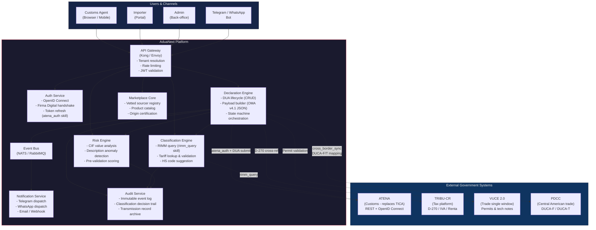
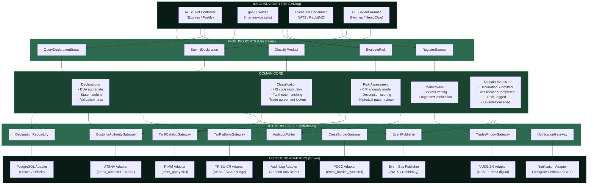
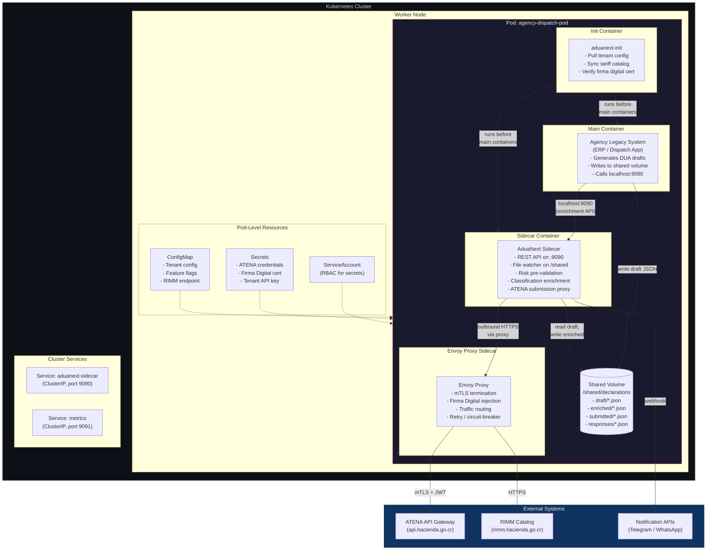
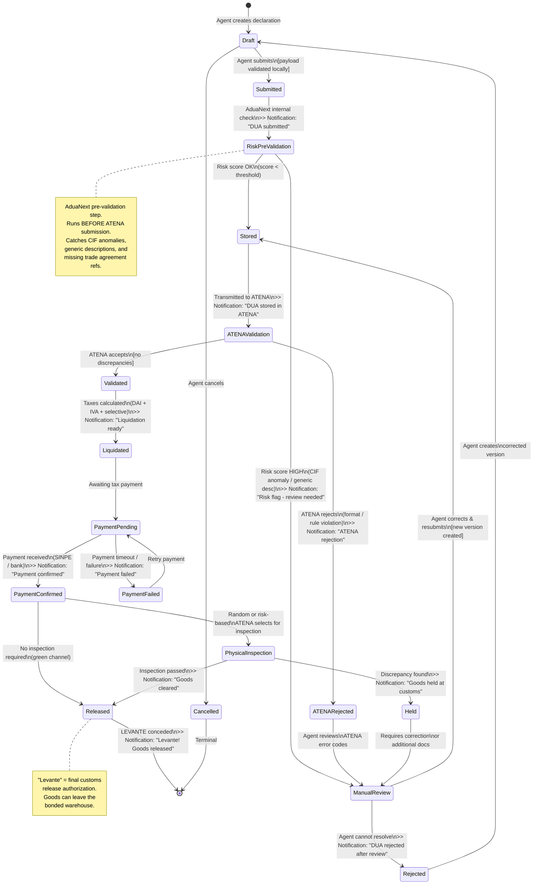
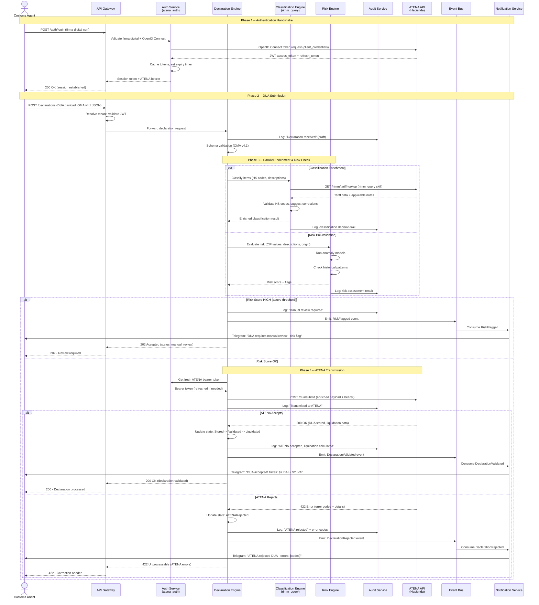
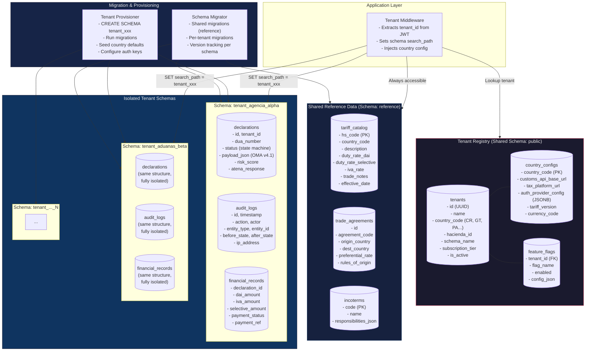
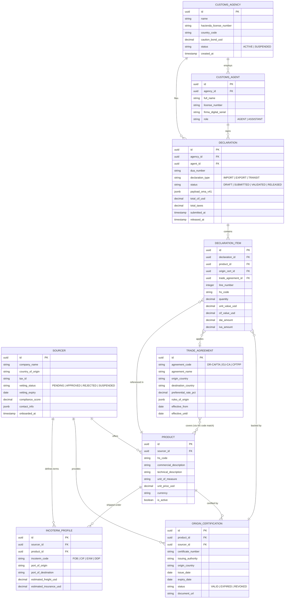
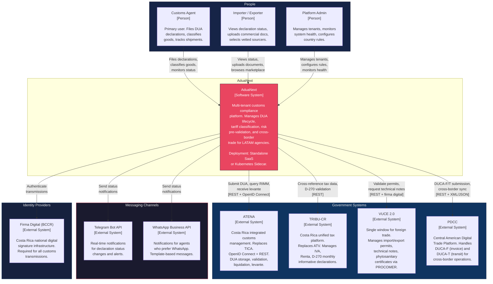

# AduaNext -- Architecture Diagrams

> Multi-tenant customs compliance platform for LATAM, starting with Costa Rica.
> Generated 2026-04-03 as part of the technical spike.

---

## Diagram 1: Modular Architecture (C4 Container Level)

This diagram shows AduaNext decomposed into its primary service containers and their relationships with external government systems. The architecture follows a modular monolith-ready design: each service can start as a module inside a single deployable and be extracted into an independent microservice when scale demands it.

Key decisions:
- **API Gateway** is the single entry point, enforcing rate limits, tenant resolution, and JWT validation before any request reaches an internal service.
- **Declaration Engine** is the heaviest module -- it owns the DUA lifecycle and orchestrates calls to Classification, Risk, and external adapters.
- **Marketplace Core** is intentionally decoupled from the declaration path so it can evolve on its own release cadence.
- External systems (ATENA, TRIBU-CR, VUCE 2.0, PDCC) are accessed exclusively through dedicated adapter services, never directly from business logic.

---

## Diagram 2: Hexagonal Architecture (Ports and Adapters)

This diagram enforces the Dependency Rule: all arrows point inward. The domain core knows nothing about HTTP, gRPC, databases, or external APIs. Every interaction passes through a port (interface) that the domain defines and an adapter (implementation) that the infrastructure provides.

Key decisions:
- **Inbound ports** are defined as use-case interfaces (e.g., `SubmitDeclaration`, `ClassifyProduct`). REST controllers and gRPC handlers are adapters that call these ports.
- **Outbound ports** are repository and gateway interfaces. The domain says "I need to persist a declaration" or "I need to query ATENA" -- adapters decide how.
- The **Event Bus port** allows the domain to emit events without knowing whether NATS, RabbitMQ, or Kafka is underneath.
- This pattern makes the system testable: every adapter can be swapped for an in-memory stub during unit tests.

---

## Diagram 3: Kubernetes Sidecar Pattern

This diagram shows the "Sidecar / Plugin" deployment mode. Many customs agencies already run their own ERP or legacy dispatch system. Instead of replacing that system, AduaNext deploys as a sidecar container inside the same Kubernetes Pod. The sidecar intercepts outbound customs calls, enriches them with risk pre-validation and classification, and proxies them to ATENA.

Key decisions:
- **Shared volume** (`/shared/declarations`) allows the agency system to drop JSON declaration files that the sidecar picks up, enriches, and transmits.
- **Envoy proxy sidecar** handles mTLS termination and traffic splitting so the agency system does not need to implement firma digital directly.
- **Init container** bootstraps tenant configuration and pulls the latest tariff catalog on pod startup.
- The sidecar exposes a local-only API on `localhost:9090` so the agency system can call AduaNext features without any network hop.

---

## Diagram 4: Declaration Lifecycle State Machine

This state machine models the full lifecycle of a DUA (Declaracion Unica Aduanera) in ATENA. Each transition triggers audit logging and, where indicated, notifications to the customs agent via Telegram/WhatsApp.

Key decisions:
- **Draft** is the only state where edits are unrestricted. Once submitted, the declaration is immutable from the agent's perspective.
- **Risk Pre-Validation** is an AduaNext-internal step that runs before the official ATENA validation, catching CIF anomalies and description issues early.
- **Manual Review** is a holding state entered when the risk score exceeds a threshold or ATENA flags the declaration.
- **Rejected** is not terminal -- the agent can correct and resubmit, creating a new version linked to the original.
- **Levante (Released)** is the terminal success state, meaning the goods are cleared for release.

---

## Diagram 5: Sequence Diagram -- Agent to Gateway to ATENA

This sequence diagram traces the full lifecycle of a DUA submission, from the customs agent's browser through AduaNext's internal services to ATENA and back. It shows the auth handshake, risk pre-validation, ATENA transmission, and notification dispatch.

Key decisions:
- Authentication happens once and tokens are cached; the `atena_auth` skill handles refresh transparently.
- Risk pre-validation runs in parallel with classification enrichment to minimize latency.
- All interactions are logged to the Audit Service for regulatory compliance.
- Notifications are dispatched asynchronously via the Event Bus so they never block the main flow.

---

## Diagram 6: Multi-Tenant Data Architecture

This diagram shows how AduaNext isolates tenant data while sharing infrastructure. The hybrid approach uses a shared database with schema-per-tenant for strong isolation of sensitive customs data, plus a shared schema with tenant discriminator for cross-cutting concerns like the tariff catalog.

Key decisions:
- **Tenant Registry** is the single source of truth for tenant metadata. It lives in a shared schema and maps each tenant to its country, hacienda, auth configuration, and feature flags.
- **Schema-per-tenant** is used for declarations, audit logs, and financial data because Costa Rican law requires strict data isolation between agencies (the caution bond of $20,000 USD means one agency's error must never leak into another's records).
- **Shared schema with discriminator** is used for reference data (tariff catalog, trade agreements, HS codes) because this data is country-specific but not agency-specific.
- **Country configuration** is a first-class concept: when AduaNext expands to Guatemala or Panama, a new country config is added without code changes.

---

## Diagram 7: Vetted Sourcers Marketplace -- Entity Relationship

This ER diagram models the marketplace where pre-vetted international suppliers (sourcers) offer products to customs agencies and importers. The marketplace is integrated into the declaration flow: when an importer selects a sourcer's product, the origin certification and trade agreement data auto-populate the DUA.

Key decisions:
- **Sourcer** has a vetting status that must be APPROVED before products are visible in the marketplace. Vetting includes document verification, trade reference checks, and compliance screening.
- **OriginCertification** is a first-class entity because proof of origin determines preferential tariff rates under trade agreements like DR-CAFTA or the EU-Central America Association Agreement.
- **INCOTERMProfile** is attached to the Sourcer-Product relationship because the same sourcer may offer different INCOTERM conditions for different products or destinations.
- **Declaration** links back to products, creating a traceable chain from supplier to customs release.

---

## Diagram 8: System Context (C4 Level 1)

This is the highest-level view of AduaNext. It shows who uses the system, what it does at the boundary level, and which external systems it depends on. This diagram is intended for stakeholders who need to understand scope without implementation details.

Key decisions:
- **Three user personas** reflect the Costa Rican customs ecosystem: the Customs Agent (primary power user), the Importer (limited self-service portal), and the Admin (platform operator for multi-tenant management).
- **Messaging channels** (Telegram/WhatsApp) are shown as external systems because AduaNext does not own them -- it integrates via their APIs for notification dispatch.
- **ATENA** is the most critical external dependency. AduaNext cannot function without it because ATENA is the system of record for all customs declarations in Costa Rica.
- **PDCC** enables the cross-border expansion strategy: once AduaNext supports DUCA-F/T through PDCC, it can handle transit declarations across all Central American countries.

---

## Summary of Architectural Decisions

| Decision | Rationale |
|---|---|
| Hexagonal (Ports & Adapters) core | Isolates domain logic from infrastructure. Enables testing without ATENA connectivity. Adapters can be swapped per deployment mode (SaaS vs Sidecar). |
| Schema-per-tenant for sensitive data | Costa Rican law requires strict isolation between customs agencies. The $20,000 USD caution bond creates legal liability that cannot tolerate data leakage. |
| Shared schema for reference data | Tariff catalogs, trade agreements, and INCOTERM definitions are country-level, not agency-level. Sharing avoids duplication and ensures consistency. |
| Kubernetes Sidecar deployment option | Many agencies already have dispatch systems. The sidecar pattern lets AduaNext add value without requiring a full system replacement, reducing adoption friction. |
| Risk pre-validation before ATENA | Catching CIF anomalies and generic descriptions before transmission prevents ATENA rejections, which are costly (time, reputation, potential fines). |
| Event-driven notifications | Decouples the critical declaration path from notification delivery. If Telegram is down, declarations still process. |
| Agent skills as named capabilities | `atena_auth`, `rimm_query`, and `cross_border_sync` are reusable skills that can be invoked by both the SaaS platform and the sidecar runtime. |
| Immutable audit log | Regulatory requirement under Costa Rican customs law. Every classification decision and transmission must be traceable for post-clearance audits. |
