# Modelo de Ingresos (Revenue Model) — AduaNext Importer-Led

## Modelos de Referencia Investigados

| Competidor | Modelo | Precio | Mercado |
|-----------|--------|--------|---------|
| Aduanasoft (Mexico) | SaaS suscripcion + por pedimento | ~$300-800/mes | Mexico (SAT) |
| CargoWise (WiseTech) | ERP enterprise, licencia anual | $50K+/ano | Global, grandes operadores |
| Agencias CR tradicionales | Honorarios por despacho | $200-1,200/despacho | Costa Rica (TICA/ATENA) |

**Ninguno opera en Centroamerica ni se integra con ATENA.** AduaNext es first-mover.

## Modelo Seleccionado: Hibrido (Suscripcion + Transaccional + Revenue Share)

### Pricing Ladder — Pymes Importadoras

| Tier | Precio | Quien califica | Duracion |
|------|--------|----------------|----------|
| **Beta** | $0/mes + $0/DUA | Vertivo + 2-3 pymes piloto | Meses 1-3 |
| **Early Adopter** | $60/mes + $3/DUA | Primeros 50 clientes. **Locked-in rate permanente.** | Desde M4 |
| **Standard** | $120/mes + $5/DUA | Precio publico | Desde M7 |
| **Premium** | $200/mes + $5/DUA | Exportadores grandes (50+ DUAs/mes) | Desde M7 |

### Pricing — Agentes Freelance

| Componente | Precio | Notas |
|-----------|--------|-------|
| Base mensual | **$20/mes** | Cubre cuenta activa, RIMM search, risk validation, portfolio dashboard |
| Revenue share | **10% del honorario** por firma | AduaNext retiene 10% de lo que el agente cobra a la pyme por firmar cada DUA |

**Ejemplo:** Agente cobra $180/firma a la pyme.
- AduaNext retiene: $18 (10%)
- Agente recibe: $162
- Agente con 10 firmas/mes: $20 base + $180 revenue share = **$200/mes para AduaNext** por agente activo
- Agente gana: $1,620/mes (vs. $800-1,200 como empleado de agencia)

### Pricing — Universidades

| Tipo | Precio | Incluye |
|------|--------|---------|
| Licencia academica | $800/mes (~200 estudiantes) | Sandbox ATENA, ejercicios, metricas por alumno |
| Certificacion individual | $15/estudiante (one-time) | "AduaNext Certificado Nivel 1" al completar |

## Pasos hacia el Ingreso (Steps to Revenue)

```mermaid
flowchart LR
    A[Pyme descubre AduaNext<br>via referido/blog] --> B[Registra cuenta<br>trial 14 dias]
    B --> C[Completa primera DUA<br>en sandbox]
    C --> D[Invita agente freelance<br>al workspace]
    D --> E[Agente acepta +<br>conecta Firma Digital]
    E --> F[Primera DUA real<br>transmitida a ATENA]
    F --> G[Pyme paga suscripcion<br>Stripe auto-cobro]
    G --> H[AduaNext retiene<br>10% honorario agente]
    H --> I[Dinero en cuenta<br>bancaria AduaNext]

    style A fill:#E8F5E9
    style F fill:#FFF3E0
    style I fill:#C8E6C9
```

### Detalle de cada paso:

| # | Paso | Tiempo | Conversion |
|---|------|--------|------------|
| 1 | Descubrimiento (referido, blog, caso Vertivo) | Dia 0 | — |
| 2 | Registro trial (cedula juridica + email) | Dia 0 | 15% de visitantes |
| 3 | Primera DUA sandbox (ejercicio guiado) | Dia 1-3 | 60% de registros |
| 4 | Invitar agente freelance | Dia 3-7 | 50% de activados |
| 5 | Agente acepta y conecta Firma Digital | Dia 7-14 | 80% de invitados |
| 6 | Primera DUA real transmitida | Dia 14-30 | 70% de matched |
| 7 | Conversion a plan pagado (auto al dia 15) | Dia 15 | 30% de trials |
| 8 | Revenue share del agente (mensual) | Dia 30+ | Automatico |
| 9 | Deposito en cuenta bancaria | Dia 45 | Stripe T+2 |

**Conversion funnel total:** Visitante → Cliente pagando = **~4.7%**
(15% × 60% × 50% × 80% × 70% × 30% ÷ 100 = 4.7%)

Con 1,000 visitas/mes → ~47 nuevos clientes/mes en estado estable.

## Proyeccion de Revenue con Pricing Ladder

| Mes | Betas | Early Adopter | Standard | Premium | Agentes | Univ | DUAs | MRR |
|-----|-------|--------------|----------|---------|---------|------|------|-----|
| M1 | 1 | 0 | 0 | 0 | 0 | 0 | 0 | $0 |
| M2 | 3 | 0 | 0 | 0 | 0 | 0 | 0 | $0 |
| M3 | 3 | 0 | 0 | 0 | 2 | 0 | 5 | $55 |
| M4 | 0 | 15 | 0 | 0 | 8 | 1 | 60 | $2,130 |
| M5 | 0 | 35 | 15 | 0 | 18 | 2 | 250 | $6,310 |
| M6 | 0 | 45 | 40 | 5 | 30 | 3 | 600 | $14,250 |
| M7 | 0 | 50 | 80 | 10 | 45 | 4 | 1,200 | $27,100 |
| M8 | 0 | 50 | 140 | 20 | 60 | 5 | 2,000 | $44,200 |
| M9 | 0 | 50 | 200 | 30 | 70 | 5 | 2,800 | $56,100 |

**Notas de calculo:**
- Early Adopter MRR: cuentas × $60 + DUAs × $3
- Standard MRR: cuentas × $120 + DUAs × $5
- Premium MRR: cuentas × $200 + DUAs × $5
- Agente MRR: cuentas × $20 + (DUAs × honorario_promedio × 10%)
- Honorario promedio agente: $150/firma
- Univ MRR: cuentas × $800
- $50K MRR se alcanza entre M8 y M9 (vs. M7 en SRD original — mas conservador con pricing ladder)

## Modelo seleccionado: 2 modelos a testear

| Modelo | Precio competitivo | Precio $1M en 18 meses |
|--------|-------------------|----------------------|
| **A: Hybrid (suscripcion + transaccional)** | $60/mes + $3/DUA (early) | $120/mes + $5/DUA (standard) |
| **B: Revenue share puro** | 5% del valor CIF declarado | 10% del valor CIF |

**Decision:** Modelo A es el primario. Modelo B se evalua si el volumen de DUAs de alto valor (>$50K CIF) justifica el revenue share sobre valor.
