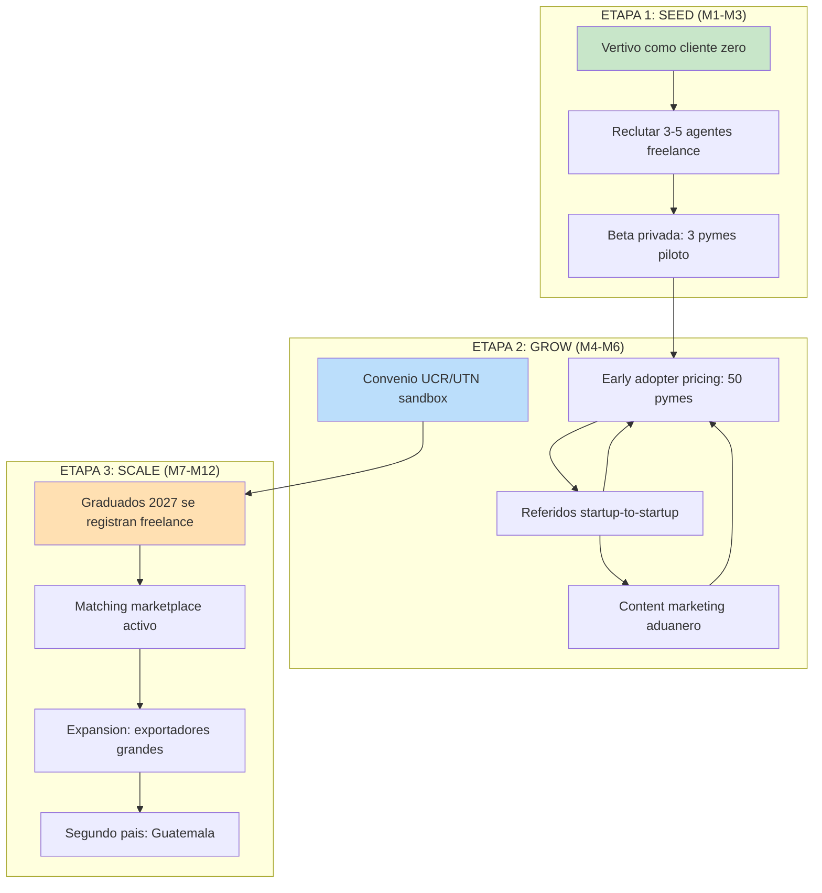
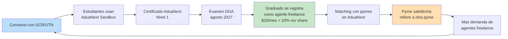

# Go-to-Market (GTM) — AduaNext Importer-Led

## Estrategia GTM: Flywheel de 3 etapas

## Etapa 1: SEED (M1-M3) — Validacion con cliente zero

### Objetivo: 1 importacion real exitosa + 3 pymes piloto + 5 agentes freelance

| Accion | Responsable | Timeline | Costo |
|--------|-------------|----------|-------|
| Vertivo importa luces LED desde Shenzhen usando AduaNext | Fundador | S6 (fin M3) | $0 (importacion pagaria igual) |
| Reclutar 3-5 agentes freelance via CCECR y LinkedIn | Fundador | M2-M3 | $0 (outreach directo) |
| Invitar 3 pymes del ecosistema startup Heredia | Fundador | M3 | $0 (referidos personales) |
| Documentar caso de exito Vertivo (blog + video) | Fundador | M3 | $50 (edicion basica) |

### Canales de reclutamiento de agentes freelance:

1. **CCECR (Colegio de Ciencias Economicas)** — lista de colegiados recientes en Admin Aduanera
2. **LinkedIn** — buscar "agente aduanero" + "independiente" + "Costa Rica"
3. **UTN San Carlos / UCR Facio** — contactar coordinadores de carrera para referir graduados recientes
4. **Oferta**: "Usa AduaNext gratis durante la beta. Recibe pymes pre-matched que ya prepararon su DUA. Solo verifica, firma, cobra."

## Etapa 2: GROW (M4-M6) — Early adopters + flywheel universitario

### Objetivo: 50 pymes + 20 agentes + 1 convenio universitario + $15K MRR

| Accion | Timeline | Costo/mes |
|--------|----------|-----------|
| Lanzar early adopter pricing ($60/mes + $3/DUA) | M4 | $0 |
| Publicar caso de exito Vertivo en blog + LinkedIn | M4 | $50 |
| Negociar convenio sandbox con UCR o UTN | M4-M5 | $0-500 |
| Iniciar content marketing: 2 posts/semana | M4 | $200 |
| Asistir a evento CRECEX o AmCham | M5 | $500 (inscripcion) |
| Activar programa de referidos (pyme refiere pyme) | M5 | $0 |

### Flywheel Universitario — El Growth Engine

**Metricas del flywheel:**

| Metrica | M4 | M6 | M12 | M18 |
|---------|-----|-----|------|------|
| Estudiantes en sandbox | 30 | 200 | 500 | 1,000 |
| Universidades con convenio | 1 | 2 | 4 | 6 |
| Graduados → agentes freelance | 0 | 0 | 5 | 30 |
| Pymes servidas por freelance ex-estudiantes | 0 | 0 | 15 | 120 |

**Time-to-impact:** El flywheel tarda 12-18 meses en madurar (ciclo universitario). Es un **long game** que crea moat competitivo. Mientras tanto, los agentes freelance vienen de LinkedIn/CCECR.

### Programa de Contenido Aduanero

| Formato | Frecuencia | Tema ejemplo | Canal |
|---------|-----------|--------------|-------|
| Blog post | 2/semana | "Como clasificar luces LED para importacion desde China" | aduanext.com/blog |
| Video YouTube | 1/semana | "Tutorial: tu primera DUA de exportacion en AduaNext" | YouTube |
| LinkedIn post | 3/semana | Tip aduanero + insight de ATENA | LinkedIn |
| Webinar | 1/mes | "ATENA para importadores: lo que tu agencia no te explica" | Zoom + replay |

**El content marketing es el segundo canal mas importante** (18% de conversiones). Los importadores buscan en Google "como importar desde China a Costa Rica" — AduaNext debe ser el resultado #1.

## Etapa 3: SCALE (M7-M12) — Expansion + marketplace + segundo pais

### Objetivo: $50K MRR + marketplace activo + piloto Guatemala

| Accion | Timeline | Inversion |
|--------|----------|-----------|
| Lanzar matching marketplace (agente ↔ pyme) | M7 | $0 (feature built-in) |
| Activar tier Premium para exportadores grandes | M7 | $0 |
| Reclutar 10 sourcers para Vetted Sourcers alpha | M8 | $500 (outreach China) |
| Piloto Guatemala (SAT-GT + nuevo adapter) | M10 | $5,000 (viaje + liaison) |
| Contratar 1 customer success person | M8 | $1,500/mes |
| Aplicar a grant MICITT o PROCOMER para tech aduanero | M9 | $0 |

## Metricas GTM por Etapa

| KPI | SEED (M3) | GROW (M6) | SCALE (M12) |
|-----|-----------|-----------|-------------|
| MRR | $55 | $14,250 | $65,000 |
| Pymes activas | 3 | 120 | 400 |
| Agentes freelance | 5 | 30 | 80 |
| DUAs/mes | 5 | 600 | 3,500 |
| NPS | — | 55 | 60+ |
| Churn mensual | — | <6% | <5% |
| Universidades | 0 | 2 | 4 |
| Paises | 1 (CR) | 1 (CR) | 2 (CR + GT) |

## Canales de Distribucion Ranked

| # | Canal | % nuevos clientes | CAC | Escalabilidad |
|---|-------|-------------------|-----|---------------|
| 1 | Referido startup → startup | 35% | $0 | Media (depende de NPS) |
| 2 | Convenio universitario → graduado → pyme | 20% | $50 | Alta (cada cohorte) |
| 3 | Content marketing (blog + YouTube) | 18% | $200 | Alta (compounding SEO) |
| 4 | Caso Vertivo como PR | 12% | $0 | Baja (one-time) |
| 5 | Camaras (CRECEX, AmCham) | 10% | $400 | Baja (networking) |
| 6 | LinkedIn outbound | 5% | $600 | Media |
