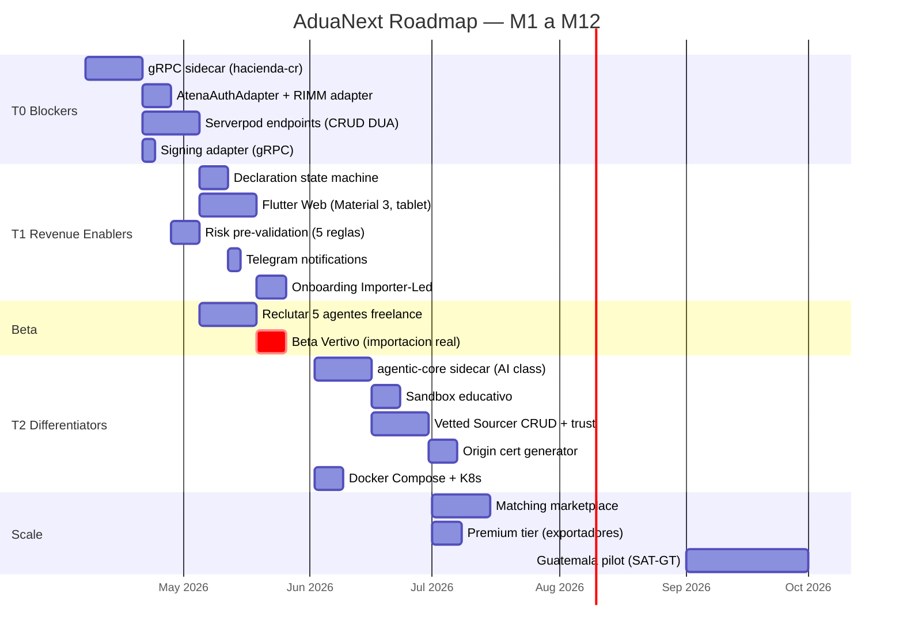
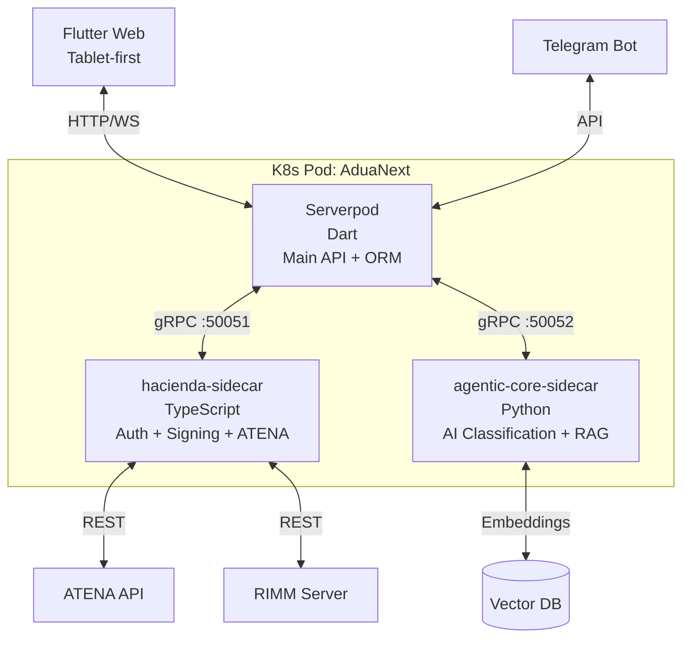

# Product Roadmap — AduaNext

## Roadmap derivado del SRD Gap Audit (T0 → T2)

## Versionamiento (Semver)

| Version | Sprint | Contenido | Gate |
|---------|--------|-----------|------|
| **v0.1.0** | S1-S4 | T0 complete: auth + DUA + RIMM + signing + sandbox transmission | "Puede transmitir 1 DUA a ATENA sandbox?" |
| **v0.2.0** | S5-S6 | T1 complete: state machine + Flutter Web + risk + notifications + onboarding | "Puede un agente y una pyme completar el flujo end-to-end?" |
| **v0.3.0** | S7-S8 | Beta: Vertivo importacion real + 5 agentes + 3 pymes | "Funciona con datos reales?" |
| **v0.4.0** | S9-S12 | T2: AI classification + sandbox edu + vetted sourcers + K8s | "Tiene diferenciadores vs. manual ATENA?" |
| **v0.5.0** | S13-S16 | Scale: marketplace + premium + expansion prep | "$50K MRR?" |
| **v1.0.0** | S17+ | Guatemala pilot + multi-pais + production hardening | "Funciona en 2 paises?" |

## 3 Sidecars Architecture (desde v0.4.0)

