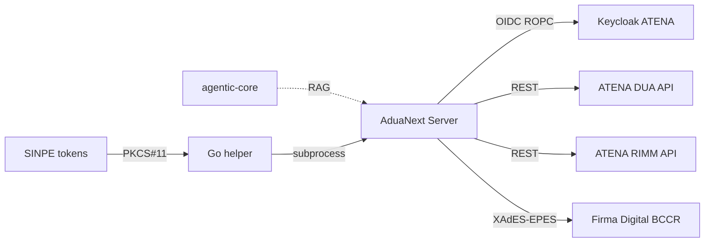

# Arquitectura

AduaNext sigue **Explicit Architecture** (Herberto Graca) — variante de Hexagonal/Clean con bounded contexts explicitos por feature.

## Flujo de Dependencias

```
apps/mobile (Flutter Web)  →  apps/server (REST)  →  libs/application (Use Cases)
                                                              ↓
                                                      libs/domain (Ports, Entities)
                                                              ↑
                            libs/adapters (gRPC, Postgres, Filesystem, Keycloak)

apps/hacienda-sidecar (TS)  ↔  libs/adapters (via gRPC)  ↔  ATENA / RIMM
apps/pkcs11-helper (Go)     ↔  libs/adapters (via subprocess)  ↔  SINPE tokens
```

**Regla inviolable:** las flechas apuntan hacia `libs/domain`. Domain NO importa de adapters ni application.

## Paquetes

### libs/domain (Dart puro, zero I/O)

- **Entidades:** `Declaration`, `Tenant`, `User`, `ClassificationDecision`, `AuditEvent`, `LegalHold`
- **Value Objects:** `HsCode`, `Incoterm`, `CountryCode`, `DeclarationStatus`, `Role`
- **Puertos:** `AuditLogPort`, `AuthorizationPort`, `CustomsGatewayPort`, `SigningPort`, `Pkcs11SigningPort`, `TariffCatalogPort`, `RetentionPurgeablePort`, `LegalHoldPort`, `StorageBackendPort`
- **Reglas:** estrictamente puro Dart + `meta`. Tests: 13.

### libs/application (CQRS + Result)

Convenciones en [CLAUDE.md -> Application Layer Conventions](https://github.com/vertivolatam/aduanext/blob/main/CLAUDE.md#application-layer-conventions):

- **Vertical slices** bajo `lib/src/<feature>/`:
  - Command + Handler + Failure + domain entity
- **Shared:** `Command<TResult>`, `CommandHandler`, `Result<T>` (sealed Ok/Err), `Failure`
- **Hybrid error model:** `Result<T>` para errores de negocio, typed exceptions para infra failures
- **Use cases implementados:** RecordClassification, SubmitDeclaration, PreValidateDeclaration, RetentionPurge
- Tests: 80+.

### libs/adapters (Implementaciones)

- `audit/` — InMemory + SQLite + Postgres (hash-chained per-entity, VRTV-52)
- `authorization/` — InMemory + Keycloak (VRTV-55, 60)
- `atena/` — gRPC stubs para ATENA DUA API (VRTV-36)
- `rimm/` — gRPC stub para RIMM tariff catalog (VRTV-36)
- `signing/` — HaciendaSigningAdapter (software cert) + SubprocessPkcs11SigningAdapter (hardware token, VRTV-70)
- `retention/` — FilesystemArchive + PostgresLegalHold + PostgresAuditRetention (VRTV-57, 73, 74, 75)
- `grpc/` — GrpcChannelManager singleton con shutdown/terminate lifecycle
- Tests: 186 Dart + 9 Go (helper).

### apps/server (Shelf, Dart)

- **No Serverpod** — se eligio `shelf` por simplicidad (1/10 del footprint)
- Endpoints: `/livez`, `/readyz`, `/metrics` (pendiente VRTV-78), `/api/v1/dispatches/*`
- Middleware: auth (VRTV-61), rate limiting, error mapping
- Workers: RetentionWorker (cron diario 03:00 UTC)
- Tests: 60.

### apps/mobile (Flutter Web)

**Stack:** Material 3 + Riverpod + GoRouter + Style Dictionary.

**NO se usa Air Framework** — decision reversed 2026-04-16 en favor de Riverpod plain.

Features implementados:
- Onboarding agente freelance (7 pasos) con PKCS#11 hardware detection
- Dashboard con KpiCards, StatusSemaphore, SSE streaming, filtros
- Clasificador RIMM drawer con HITL + risk score
- **DUA Form wizard** (7 pasos, stepper semaforo, autosave localStorage)

Tests: 205.

### apps/hacienda-sidecar (TypeScript)

gRPC wrapper para `@dojocoding/hacienda-sdk`. 4 servicios: HaciendaAuth, HaciendaSigner, HaciendaApi, HaciendaOrchestrator (VRTV-35).

### apps/pkcs11-helper (Go)

Subprocess helper binario wrapping `github.com/miekg/pkcs11`. Stdio JSON protocol. Multi-platform cross-compile (VRTV-69, pipeline pendiente VRTV-81).

## Integracion con Sistemas Externos



## Persistencia

- **PostgreSQL 16 + pgvector** — audit_events, legal_holds, (futuro: declarations, classifications)
- **Redis 6.2** — rate limiting, caches
- **Filesystem** — cold storage archive (temporal, migrara a S3/MinIO en VRTV-77)

Migrations: idempotent `ensureSchema()` pattern actualmente. Migracion a dbmate pendiente (VRTV-80).

## Ver Tambien

- [Compliance Audit](../compliance/audit-2026-04-12.md) — status de implementacion vs normativa
- [Security](../security/index.md) — defensa en profundidad
- [API](../api/index.md) — REST contract
