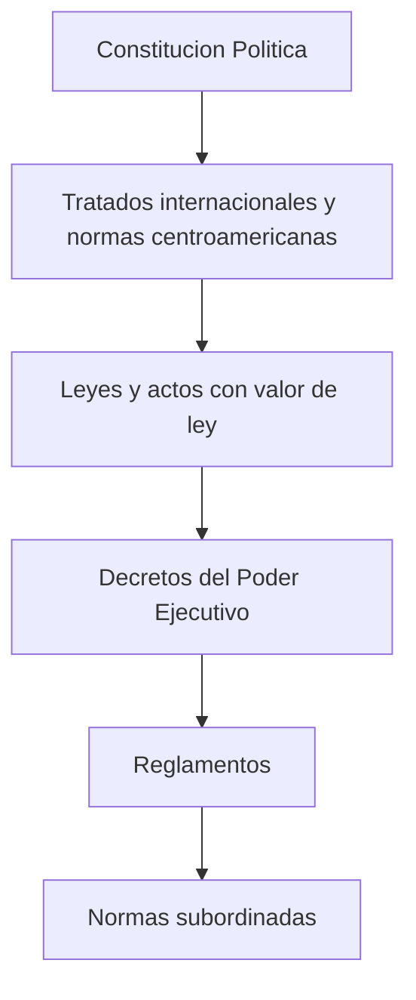

# Normativa y Jurisprudencia Aduanera

Marco legal aplicable a AduaNext — las tres normas que forman la piramide regulatoria aduanera de Costa Rica.

---

## Jerarquia de Fuentes (LGA Art. 4)

## Documentos

| Norma | Tipo | Articulos | Aplicacion en AduaNext |
|-------|------|-----------|----------------------|
| [Ley 7557 — LGA](ley-7557-lga.md) | Ley | 250+ | Marco base nacional de aduanas |
| [Decreto 25270 — RLGA](decreto-25270-rlga.md) | Decreto | Titulos II-III vigentes | Estructura organizativa del SNA |
| [Ley 8360 — CAUCA](ley-8360-cauca.md) | Ley | 110 | Marco supranacional centroamericano |

!!! info "Decreto 44051 (2023)"
    El nuevo Reglamento a la LGA (Decreto 44051) derogo el Titulo I del RLGA original y rige los procedimientos modernos incluyendo ATENA. Pendiente de incorporar a esta documentacion.

## Fuente

Textos descargados de la [Procuraduria General de la Republica](https://www.pgrweb.go.cr/) — versiones vigentes consolidadas al 12 de abril de 2026.
