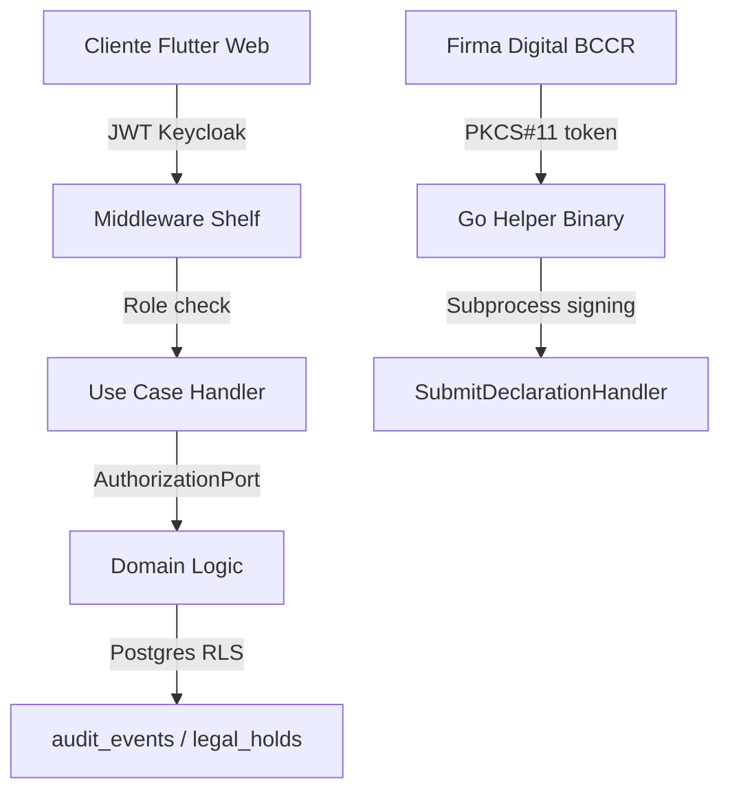

# Seguridad

Controles de seguridad tecnicos implementados en AduaNext. Cada documento mapea a un bloqueador del [Compliance Audit](../compliance/audit-2026-04-12.md) y a articulos especificos de la normativa costarricense.

## Documentos

| Documento | Bloqueador audit | Base legal | Estado |
|-----------|------------------|-----------|--------|
| [RBAC + Tenant Isolation](rbac.md) | P0.5 | LGA Art. 28-30, CAUCA Art. 22 | DONE |
| [Verificacion Criptografica de Firma](signature-verification.md) | P1.8 | LGA Art. 86, Ley 8454, CAUCA Art. 23 | PARCIAL (contract only) |

## Arquitectura de Defensa en Profundidad

AduaNext aplica 5 capas defensivas:

**Capa 1 — Autenticacion (VRTV-60):** Keycloak RS256 JWTs con JWKS cache + TTL.

**Capa 2 — Autorizacion (VRTV-61):** Middleware shelf + role guards + route table declarativa.

**Capa 3 — Tenant isolation (VRTV-55):** AuthorizationPort enforcado en handlers (domain layer).

**Capa 4 — Database RLS (VRTV-62):** Postgres row-level security en audit_events. Si el middleware falla, la base de datos misma rechaza queries cross-tenant.

**Capa 5 — Firma digital (VRTV-71):** PIN zeroizacion, no-logging, sin command injection surface, hardware tokens via subprocess Go helper.

## Pendientes

- **VRTV-63** — XAdES-EPES full implementation (actualmente en "degraded mode" — solo verificacion estructural, no criptografica)
- **Hardware QA manual** — VRTV-56 requiere tokens BCCR fisicos
- **Prometheus metrics** de auth denials y signing failures (VRTV-78)
