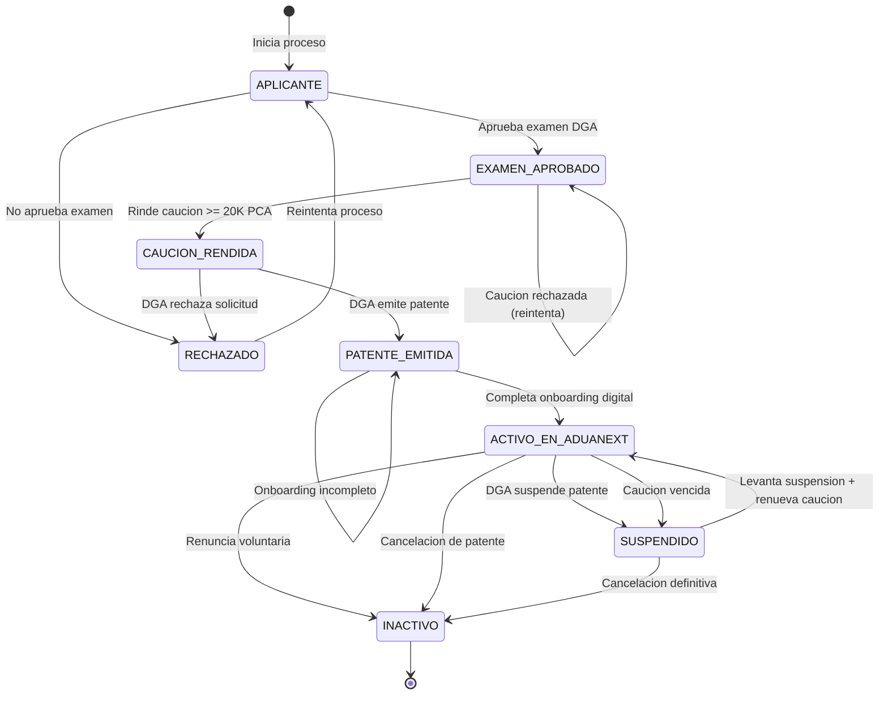
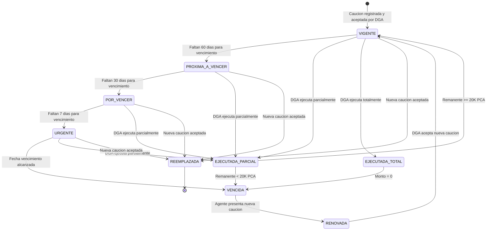
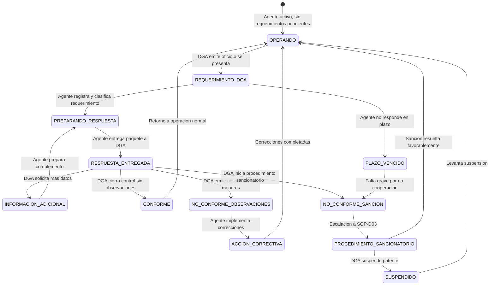

# Categoria A: Ciclo del Agente

Procedimientos que cubren el ciclo de vida del agente aduanero freelance como auxiliar de la funcion publica aduanera, desde su registro inicial hasta el control permanente por parte de DGA.

| Campo | Valor |
|---|---|
| Version | 1.0 |
| Fecha | 2026-04-12 |
| Categoria | A - Ciclo del Agente |
| Cantidad de SOPs | 3 |
| Marco Legal Principal | LGA Art. 28-34; CAUCA Art. 11-14 |

---

## SOP-A01: Registro y Autorizacion del Agente Freelance

| Campo | Valor |
|---|---|
| Codigo | SOP-A01 |
| Version | 1.0 |
| Fecha | 2026-04-12 |
| Base Legal | LGA Art. 28-29, 33-34; CAUCA Art. 11-14; RLGA Art. 178-185 |
| Roles | Agente Aduanero Freelance, DGA, AduaNext, SINPE/Firma Digital |
| Tipo | Digital + Presencial |

> **Problema que resuelve:** Un agente aduanero recien graduado (perfil P02: Carlos Jimenez, 26 anos, recien aprobo el examen DGA) necesita obtener su autorizacion y comenzar a operar. Sin una plataforma digital, debe navegar procesos burocraticos manuales entre multiples instituciones (DGA, bancos, Registro Tributario, BCCR) sin guia clara, arriesgando demoras de semanas o meses y errores en requisitos que pueden bloquear su habilitacion.

### Objetivo

Guiar al agente aduanero freelance a traves de cada paso necesario para obtener su autorizacion de DGA y quedar operativo en AduaNext, cubriendo tanto los tramites presenciales ante instituciones publicas como la configuracion digital en la plataforma.

### Datos Requeridos

#### Datos personales del agente

| Campo | Tipo | Obligatorio | Fuente | Validacion |
|---|---|---|---|---|
| Nombre completo | texto | Si | Cedula de identidad | Coincide con Registro Civil |
| Cedula de identidad | texto | Si | TSE | Formato X-XXXX-XXXX |
| Titulo universitario | documento | Si | Universidad acreditada | Licenciatura en Aduanas o afin |
| Numero de colegiatura | texto | Si | Colegio profesional | Vigente y verificable |
| Direccion fisica | texto | Si | Agente | Canton y distrito |
| Correo electronico | texto | Si | Agente | Formato valido, verificado |
| Telefono | texto | Si | Agente | Formato +506 XXXX-XXXX |

#### Datos de autorizacion DGA

| Campo | Tipo | Obligatorio | Fuente | Validacion |
|---|---|---|---|---|
| Numero de patente DGA | texto | Si | DGA | Emitido tras aprobacion |
| Fecha de emision de patente | fecha | Si | DGA | No futura |
| Resultado examen DGA | documento | Si | DGA | Aprobado |
| Caucion rendida | documento | Si | Entidad financiera | Monto >= 20,000 pesos CA |
| Inscripcion Registro Tributario | texto | Si | Ministerio de Hacienda | RUT activo |

#### Datos de firma digital

| Campo | Tipo | Obligatorio | Fuente | Validacion |
|---|---|---|---|---|
| Certificado de firma digital | certificado X.509 | Si | BCCR / CA autorizada | Vigente, tipo persona fisica |
| Numero de serie del token | texto | Si | Token PKCS#11 | Formato valido |
| PIN del token | secreto | Si | Agente | No almacenado, solo validado en uso |

### Procedimiento

!!! info "Convenciones"
    Los pasos marcados como **[PRESENCIAL]** requieren la presencia fisica del agente. Los pasos marcados como **[DIGITAL]** se ejecutan en AduaNext o sistemas conectados. Los pasos marcados como **[MIXTO]** combinan ambas modalidades.

#### Fase 1: Preparacion Academica y Examen (Presencial)

**Paso 1 [PRESENCIAL]: Obtener titulo universitario**

El aspirante a agente aduanero debe contar con un titulo de Licenciatura en Aduanas, Comercio Internacional, o carrera afin de una universidad reconocida por CONESUP. Debe asegurarse de que el titulo este debidamente inscrito en el Colegio Profesional correspondiente.

- Requisito: Licenciatura (Art. 29.a LGA)
- Documento: Titulo original y copia certificada
- Validacion: Verificacion ante CONESUP y colegio profesional

**Paso 2 [PRESENCIAL]: Inscribirse en el examen de competencia DGA**

El aspirante debe presentar solicitud formal ante la Direccion General de Aduanas para rendir el examen de competencia tecnica. La solicitud se presenta en las oficinas centrales de DGA en San Jose.

- Documentos requeridos: cedula, titulo universitario, constancia de colegiatura, antecedentes penales
- Plazo: DGA programa examenes periodicamente (consultar calendario vigente)
- Costo: segun tarifa DGA vigente

**Paso 3 [PRESENCIAL]: Rendir y aprobar el examen DGA**

El examen evalua conocimientos en legislacion aduanera (LGA, RLGA, CAUCA, RECAUCA), clasificacion arancelaria (SAC), valoracion aduanera (OMC), procedimientos de despacho y regimenes aduaneros.

- Formato: escrito, presencial, supervisado por DGA
- Nota minima: segun reglamento vigente de DGA
- Resultado: DGA notifica por oficio al aspirante
- Documento: Certificacion de aprobacion del examen

**Paso 4 [PRESENCIAL]: Obtener antecedentes penales limpios**

Solicitar constancia de antecedentes penales ante el Poder Judicial. El documento debe estar vigente al momento de presentar la solicitud de patente (Art. 29.c LGA).

- Entidad: Poder Judicial, Oficina de Antecedentes Penales
- Vigencia: 3 meses desde la emision
- Requisito: sin antecedentes por delitos dolosos

#### Fase 2: Caucion y Registro Tributario (Presencial)

**Paso 5 [PRESENCIAL]: Rendir caucion ante entidad financiera**

El agente debe constituir una garantia (caucion) de al menos 20,000 pesos centroamericanos ante una entidad autorizada. Las modalidades aceptadas son:

- Cheque certificado de un banco del Sistema Bancario Nacional
- Garantia bancaria de banco estatal o privado autorizado
- Fideicomiso de garantia
- Poliza de seguros del INS (Instituto Nacional de Seguros)

El documento de caucion debe especificar que esta a favor de la Direccion General de Aduanas de Costa Rica y debe tener vigencia minima de un ano.

- Monto: >= 20,000 pesos centroamericanos (Art. 34 LGA)
- Beneficiario: Direccion General de Aduanas
- Vigencia: 1 ano, renovable

**Paso 6 [PRESENCIAL]: Inscribirse en el Registro Tributario**

El agente debe registrarse como contribuyente ante el Ministerio de Hacienda (Direccion General de Tributacion) para obtener su numero de inscripcion tributaria (RUT).

- Entidad: Ministerio de Hacienda, Administracion Tributaria
- Actividad economica: Servicios de agenciamiento aduanero
- Regimen: Tributacion simplificada o regimen general segun corresponda
- Documento: Constancia de inscripcion tributaria

**Paso 7 [PRESENCIAL]: Presentar solicitud formal de patente a DGA**

El aspirante presenta ante DGA el expediente completo con todos los documentos requeridos para la emision de la patente de agente aduanero.

- Documentos del expediente:
    - Solicitud formal dirigida al Director General de Aduanas
    - Cedula de identidad (original y copia)
    - Titulo universitario (original y copia certificada)
    - Constancia de colegiatura vigente
    - Certificacion de aprobacion del examen DGA
    - Antecedentes penales vigentes
    - Documento de caucion rendida
    - Constancia de inscripcion tributaria
    - Fotografia reciente tamano pasaporte
    - Declaracion jurada de no tener impedimentos legales
- Plazo de resolucion: segun Ley de la Administracion Publica

**Paso 8 [PRESENCIAL]: Recibir patente de agente aduanero**

DGA revisa el expediente, verifica el cumplimiento de todos los requisitos y emite la resolucion de autorizacion. Si es aprobada, se emite la patente con su numero unico.

- Documento: Resolucion de autorizacion + patente numerada
- Publicacion: La Gaceta (Diario Oficial)
- Efecto: Desde la notificacion al agente

#### Fase 3: Adquisicion de Firma Digital (Presencial + Digital)

**Paso 9 [PRESENCIAL]: Adquirir token de Firma Digital BCCR**

El agente debe acudir personalmente a una Autoridad de Registro (AR) autorizada por el BCCR para solicitar su certificado de firma digital.

- Entidades: Bancos del Sistema Bancario Nacional (Banco Nacional, BCR, BAC, etc.)
- Requisitos: cedula de identidad vigente, presencia personal
- Producto: Token USB criptografico (PKCS#11) con certificado X.509
- Costo: segun tarifa de la entidad emisora
- Vigencia del certificado: 2-4 anos segun entidad

**Paso 10 [DIGITAL]: Verificar funcionamiento del token**

Antes de proceder con el registro en AduaNext, el agente debe verificar que el token funciona correctamente en su equipo de computo.

- Instalar drivers del token (proporcionados por la entidad emisora)
- Verificar que el sistema operativo reconoce el dispositivo
- Probar acceso al certificado con el PIN
- Verificar fecha de vigencia del certificado

#### Fase 4: Registro en AduaNext (Digital)

**Paso 11 [DIGITAL]: Crear cuenta en AduaNext**

El agente accede a AduaNext (web) y crea su cuenta proporcionando datos basicos de identificacion.

- Datos: nombre completo, cedula, correo electronico, telefono
- Verificacion: correo electronico (enlace de activacion) + SMS
- Autenticacion: contrasena segura (minimo 12 caracteres, con mayusculas, numeros y simbolos)
- MFA: configuracion obligatoria de segundo factor (TOTP o token fisico)

**Paso 12 [DIGITAL]: Completar perfil profesional**

AduaNext guia al agente a completar su perfil profesional con los datos requeridos para operar.

- Numero de patente DGA
- Fecha de emision de patente
- Numero de colegiatura
- Titulo universitario (carga de documento digitalizado)
- Certificacion de aprobacion de examen DGA (carga de documento)
- Direccion de oficina
- Aduanas de operacion habitual (seleccion multiple)
- Especialidades (exportacion, importacion, zonas francas, etc.)

**Paso 13 [DIGITAL]: Verificar numero de patente DGA**

AduaNext valida el numero de patente contra los registros disponibles de DGA para confirmar que el agente esta efectivamente autorizado.

- Validacion: consulta a registros DGA (via ATENA si disponible)
- Estado esperado: ACTIVO
- Si la verificacion falla: el agente debe contactar a DGA para resolver discrepancias
- Registro: AduaNext almacena el resultado de la verificacion con timestamp

**Paso 14 [DIGITAL]: Conectar token de Firma Digital (PKCS#11)**

AduaNext guia al agente para conectar su token de firma digital y verificar que la plataforma puede acceder al certificado.

- El agente conecta el token USB a su equipo
- AduaNext detecta el token via la interfaz PKCS#11 del navegador
- El agente ingresa su PIN para autorizar el acceso al certificado
- AduaNext lee los datos del certificado (nombre, cedula, CA emisora, vigencia)
- Validacion: nombre y cedula del certificado coinciden con el perfil del agente
- AduaNext NO almacena el PIN; solo valida que puede firmar

!!! warning "Seguridad del PIN"
    AduaNext nunca almacena, transmite ni registra el PIN del token de firma digital. El PIN se solicita unicamente en el momento de firmar y se procesa localmente en el equipo del agente a traves de la interfaz PKCS#11.

**Paso 15 [DIGITAL]: Configurar credenciales ATENA (Keycloak)**

El agente configura su acceso al sistema ATENA del SNA a traves de las credenciales de Keycloak (protocolo OIDC).

- El agente ingresa su usuario y contrasena de ATENA
- AduaNext realiza autenticacion ROPC (Resource Owner Password Credentials) contra el Keycloak de ATENA
- AduaNext almacena de forma segura el refresh token (encriptado at rest)
- Validacion: login exitoso, se obtienen tokens de acceso y refresh
- AduaNext verifica los roles y permisos del agente en ATENA

**Paso 16 [DIGITAL]: Registrar datos de caucion en AduaNext**

El agente registra los datos de su caucion vigente para que AduaNext pueda monitorear el vencimiento y alertar oportunamente.

- Tipo de caucion (cheque certificado, garantia bancaria, fideicomiso, poliza INS)
- Entidad emisora
- Numero de documento/poliza
- Monto en pesos centroamericanos
- Fecha de emision
- Fecha de vencimiento
- Carga del documento digitalizado (PDF)
- AduaNext calcula automaticamente las fechas de alerta (60, 30, 15, 7 dias antes del vencimiento)

**Paso 17 [DIGITAL]: Completar tutorial de onboarding**

AduaNext presenta un tutorial interactivo que guia al agente por las funcionalidades principales de la plataforma.

- Navegacion del dashboard principal
- Creacion de un despacho de prueba (sandbox)
- Proceso de clasificacion arancelaria con HITL
- Firma digital de un documento de prueba
- Transmision simulada a ATENA (ambiente de prueba)
- Consulta de historial y trazabilidad
- Configuracion de notificaciones y alertas
- Gestion de mandatos

**Paso 18 [DIGITAL]: Pasar verificacion de compliance inicial**

AduaNext ejecuta una verificacion automatica de compliance para confirmar que el agente cumple todos los requisitos para operar.

- Lista de verificacion:
    - Patente DGA verificada y activa
    - Caucion vigente y registrada
    - Firma digital conectada y funcional
    - Credenciales ATENA configuradas y validas
    - Perfil profesional completo
    - Tutorial de onboarding completado
    - MFA configurado
- Resultado: APROBADO o PENDIENTE (con lista de items faltantes)

**Paso 19 [DIGITAL]: Activacion de la cuenta**

Una vez aprobada la verificacion de compliance, AduaNext activa la cuenta del agente y habilita todas las funcionalidades de produccion.

- Estado de cuenta cambia a ACTIVO
- Se genera el registro de activacion en el audit trail (SHA-256)
- Se envia notificacion de bienvenida al agente (correo + notificacion in-app)
- El agente puede comenzar a recibir mandatos y operar despachos reales
- AduaNext registra la fecha de activacion para calcular la facturacion de la suscripcion

#### Fase 5: Verificacion Post-Activacion (Digital)

**Paso 20 [DIGITAL]: Realizar primer despacho supervisado (recomendado)**

AduaNext recomienda que el agente realice su primer despacho real con el modo de supervision activado, que proporciona validaciones adicionales y guias paso a paso.

- Modo supervision: activado automaticamente para los primeros 3 despachos
- Validaciones adicionales en cada paso del flujo
- Alertas proactivas sobre errores comunes
- Sugerencias contextuales de la base de conocimiento
- Al completar 3 despachos exitosos, el modo supervision se desactiva automaticamente

**Paso 21 [DIGITAL]: Verificar primer ciclo de facturacion**

AduaNext genera la primera factura de suscripcion del agente y verifica que el metodo de pago este configurado correctamente.

- Verificacion del metodo de pago (tarjeta de credito/debito o transferencia SINPE)
- Generacion de factura electronica
- Confirmacion de cobro exitoso
- Registro en el sistema contable

### Reglas de Negocio

| No. | Regla | Base Legal | Implementacion AduaNext |
|---|---|---|---|
| RN-A01-01 | El agente aduanero debe ser **persona natural** (no juridica) | LGA Art. 28 | Validacion en registro: solo se aceptan cedulas de persona fisica |
| RN-A01-02 | Debe tener titulo de **Licenciatura** como minimo | LGA Art. 29.a | Campo obligatorio de titulo, verificacion de grado academico |
| RN-A01-03 | Debe aprobar el **examen de competencia** de DGA | LGA Art. 29.b | Verificacion de certificacion de aprobacion |
| RN-A01-04 | La caucion debe ser de al menos **20,000 pesos centroamericanos** | LGA Art. 34 | Validacion de monto minimo en registro de caucion |
| RN-A01-05 | La caucion debe renovarse **anualmente** | LGA Art. 34 | Alertas automaticas de vencimiento (60/30/15/7 dias) |
| RN-A01-06 | No debe tener antecedentes penales por **delitos dolosos** | LGA Art. 29.c | Declaracion jurada + documento de antecedentes penales |
| RN-A01-07 | Debe estar inscrito en el **Registro Tributario** | LGA Art. 29 | Campo obligatorio de RUT |
| RN-A01-08 | La firma digital debe ser de **persona fisica** (no juridica) | Ley 8454 | Validacion del tipo de certificado X.509 |
| RN-A01-09 | No puede operar sin caucion **vigente** | LGA Art. 34 | Bloqueo automatico de operaciones si caucion vence |
| RN-A01-10 | Debe mantener **domicilio conocido** para notificaciones | LGA Art. 29 | Campo obligatorio de direccion, verificado |

### Maquina de Estados

### Criterios de Validacion

- [ ] El agente tiene titulo de Licenciatura verificado
- [ ] El agente aprobo el examen de competencia DGA
- [ ] Los antecedentes penales estan limpios y vigentes
- [ ] La caucion esta rendida por >= 20,000 PCA y vigente
- [ ] La patente DGA esta emitida y el numero es verificable
- [ ] El agente esta inscrito en el Registro Tributario
- [ ] La cuenta AduaNext esta creada con MFA habilitado
- [ ] El numero de patente DGA esta verificado en AduaNext
- [ ] El token de firma digital esta conectado y funcional
- [ ] El certificado X.509 es de persona fisica y coincide con la cedula
- [ ] Las credenciales ATENA (Keycloak) estan configuradas y validas
- [ ] Los datos de caucion estan registrados con fechas de alerta
- [ ] El tutorial de onboarding esta completado
- [ ] La verificacion de compliance inicial resulto APROBADA
- [ ] La cuenta esta en estado ACTIVO
- [ ] El registro de activacion existe en el audit trail con hash SHA-256

---

## SOP-A02: Gestion de Caucion y Garantias

| Campo | Valor |
|---|---|
| Codigo | SOP-A02 |
| Version | 1.0 |
| Fecha | 2026-04-12 |
| Base Legal | LGA Art. 34, 65-66; CAUCA Art. 71; RLGA Art. 186-192 |
| Roles | Agente Aduanero Freelance, DGA, Entidad Financiera (Banco/INS), AduaNext |
| Tipo | Digital + Presencial |

> **Problema que resuelve:** La caucion de 20,000 pesos centroamericanos es una de las mayores barreras de entrada para agentes aduaneros freelance. Si la caucion vence o es ejecutada, el agente queda **inmediatamente inhabilitado** para operar, perdiendo clientes y generando incumplimientos con mandantes activos. Sin un sistema de monitoreo proactivo, agentes han perdido su patente por descuidos administrativos en la renovacion. AduaNext debe rastrear y alertar automaticamente sobre el estado de la caucion en todo momento.

### Objetivo

Garantizar la vigencia continua de la caucion del agente aduanero mediante monitoreo automatizado, alertas escalonadas y bloqueo preventivo de operaciones cuando la caucion esta vencida o por vencer, incluyendo la gestion presencial de renovacion ante entidades financieras y DGA.

### Datos Requeridos

#### Datos de la caucion

| Campo | Tipo | Obligatorio | Fuente | Validacion |
|---|---|---|---|---|
| Tipo de caucion | seleccion | Si | Agente | Valores: cheque_certificado, garantia_bancaria, fideicomiso, poliza_ins |
| Entidad emisora | texto | Si | Agente | Entidad financiera autorizada |
| Numero de documento/poliza | texto | Si | Documento | Formato segun tipo |
| Monto (pesos centroamericanos) | numerico | Si | Documento | >= 20,000 PCA |
| Fecha de emision | fecha | Si | Documento | No futura |
| Fecha de vencimiento | fecha | Si | Documento | Posterior a emision |
| Documento digitalizado | archivo PDF | Si | Agente | PDF legible, tamano <= 10MB |
| Numero de resolucion DGA (aceptacion) | texto | Si | DGA | Formato valido |

#### Datos de riesgo

| Campo | Tipo | Obligatorio | Fuente | Validacion |
|---|---|---|---|---|
| Monto acumulado de operaciones | numerico | No | AduaNext (calculado) | Suma de DUAs en periodo |
| Ratio riesgo/caucion | porcentaje | No | AduaNext (calculado) | Alerta si > 80% |
| Historial de ejecuciones | lista | No | DGA / Agente | Registro de ejecuciones anteriores |

### Procedimiento

#### Fase 1: Registro Inicial de la Caucion (Digital)

**Paso 1 [DIGITAL]: Registrar caucion en AduaNext**

Al completar el SOP-A01 o al renovar una caucion existente, el agente registra los datos completos de la caucion en AduaNext.

- Ingreso de todos los campos de la tabla de datos requeridos
- Carga del documento de caucion digitalizado (PDF)
- AduaNext valida el monto minimo (>= 20,000 PCA)
- AduaNext calcula automaticamente las fechas de alerta escalonadas

**Paso 2 [DIGITAL]: Validacion automatica de la caucion**

AduaNext ejecuta validaciones automaticas sobre los datos ingresados.

- Verificacion de que la entidad emisora es una entidad autorizada
- Verificacion de que la fecha de vencimiento es al menos 365 dias posterior a la emision
- Verificacion de que el monto cumple con el minimo legal
- Verificacion de que el documento PDF es legible y contiene la informacion requerida
- Registro del resultado de validacion en el audit trail

**Paso 3 [DIGITAL]: Calcular fechas de alerta escalonadas**

AduaNext genera automaticamente el calendario de alertas basado en la fecha de vencimiento:

- Alerta informativa: **60 dias** antes del vencimiento
- Alerta de atencion: **30 dias** antes del vencimiento
- Alerta urgente: **15 dias** antes del vencimiento
- Alerta critica: **7 dias** antes del vencimiento
- Bloqueo preventivo: **dia del vencimiento** (00:00 horas)

**Paso 4 [DIGITAL]: Activar monitoreo continuo**

AduaNext inicia el monitoreo continuo de la caucion, ejecutando verificaciones diarias.

- Verificacion diaria del estado de la caucion (vigente/por vencer/vencida)
- Calculo diario del ratio riesgo/caucion
- Evaluacion de umbrales de alerta
- Registro de cada verificacion en el log de compliance

#### Fase 2: Monitoreo y Alertas (Digital)

**Paso 5 [DIGITAL]: Emitir alerta a 60 dias (informativa)**

AduaNext envia notificacion informativa al agente cuando faltan 60 dias para el vencimiento.

- Canal: correo electronico + notificacion in-app
- Contenido: fecha de vencimiento, tipo de caucion, entidad emisora, instrucciones de renovacion
- Accion requerida: ninguna inmediata, informativo
- Estado de la caucion: VIGENTE
- Color en dashboard: verde con indicador informativo

**Paso 6 [DIGITAL]: Emitir alerta a 30 dias (atencion)**

AduaNext intensifica las alertas cuando faltan 30 dias.

- Canal: correo electronico + notificacion in-app + SMS
- Contenido: recordatorio urgente, lista de pasos para renovacion, documentos necesarios
- Accion requerida: iniciar proceso de renovacion
- Estado de la caucion: PROXIMA_A_VENCER
- Color en dashboard: amarillo
- AduaNext muestra banner persistente en el dashboard

**Paso 7 [DIGITAL]: Emitir alerta a 15 dias (urgente)**

AduaNext emite alerta de alta prioridad.

- Canal: correo electronico + notificacion in-app + SMS + llamada telefonica automatizada (si configurado)
- Contenido: aviso de que operaciones pueden ser bloqueadas pronto, guia de renovacion express
- Accion requerida: renovar caucion de forma inmediata
- Estado de la caucion: POR_VENCER
- Color en dashboard: naranja
- Banner rojo en todas las pantallas de AduaNext

**Paso 8 [DIGITAL]: Emitir alerta a 7 dias (critica)**

AduaNext emite alerta de maxima prioridad.

- Canal: todos los canales disponibles (correo, in-app, SMS, llamada)
- Contenido: aviso de bloqueo inminente, impacto en mandatos activos, contacto de emergencia
- Accion requerida: renovacion inmediata o cesion temporal de mandatos
- Estado de la caucion: URGENTE
- Color en dashboard: rojo
- AduaNext comienza a notificar a los mandantes activos que el agente tiene caucion por vencer
- Se bloquea la aceptacion de nuevos mandatos

**Paso 9 [DIGITAL]: Bloquear operaciones por caucion vencida**

Si la caucion vence sin renovacion, AduaNext bloquea automaticamente todas las operaciones del agente.

- Estado de la caucion: VENCIDA
- Acciones bloqueadas:
    - No puede aceptar nuevos mandatos
    - No puede crear nuevas DUAs
    - No puede firmar digitalmente
    - No puede transmitir a ATENA
- Acciones permitidas:
    - Consultar historial
    - Descargar documentos
    - Registrar nueva caucion
- Notificacion a mandantes activos: el agente no puede operar temporalmente
- Registro del bloqueo en el audit trail con hash SHA-256

#### Fase 3: Renovacion de la Caucion (Presencial + Digital)

**Paso 10 [PRESENCIAL]: Solicitar renovacion ante entidad financiera**

El agente acude a la entidad financiera (banco o INS) que emitio la caucion original, o a una nueva entidad, para solicitar la renovacion o emision de una nueva caucion.

- Documentos a presentar:
    - Cedula de identidad
    - Patente de agente aduanero vigente
    - Caucion anterior (si es renovacion)
    - Constancia de DGA de no ejecucion de caucion (si aplica)
- Solicitar que el nuevo documento tenga vigencia de al menos 1 ano
- Verificar que el monto sea >= 20,000 PCA

**Paso 11 [PRESENCIAL]: Obtener nuevo documento de caucion**

La entidad financiera emite el nuevo documento de caucion (cheque certificado, garantia bancaria, poliza, o fideicomiso).

- Verificar que el documento contenga:
    - Nombre completo del agente y numero de cedula
    - Beneficiario: Direccion General de Aduanas
    - Monto en pesos centroamericanos
    - Fecha de emision y fecha de vencimiento
    - Firma autorizada de la entidad financiera
    - Sello de la entidad

**Paso 12 [PRESENCIAL]: Presentar nueva caucion ante DGA**

El agente presenta el nuevo documento de caucion ante la Direccion General de Aduanas para su aceptacion.

- Oficina: Departamento de Registro de Auxiliares, DGA central
- Documentos:
    - Nuevo documento de caucion (original)
    - Copia certificada del documento
    - Nota de solicitud de aceptacion de nueva caucion
    - Patente de agente aduanero
- Plazo: DGA debe resolver sobre la aceptacion segun Ley de la Administracion Publica

**Paso 13 [PRESENCIAL]: Recibir resolucion de aceptacion de DGA**

DGA revisa el documento de caucion, verifica que cumple con los requisitos legales y emite resolucion de aceptacion.

- Si es aceptada: se emite resolucion con numero, fecha y firma del funcionario
- Si es rechazada: DGA indica los motivos; el agente debe corregir y re-presentar
- DGA devuelve la caucion anterior (si aplica y no fue ejecutada)

**Paso 14 [DIGITAL]: Registrar nueva caucion en AduaNext**

El agente registra los datos de la nueva caucion en AduaNext.

- Ingreso de datos del nuevo documento
- Carga del PDF del nuevo documento + resolucion de aceptacion de DGA
- AduaNext marca la caucion anterior como REEMPLAZADA
- AduaNext calcula nuevas fechas de alerta
- Si el agente estaba bloqueado, AduaNext desbloquea las operaciones automaticamente
- Estado de la caucion: VIGENTE
- Registro de la renovacion en el audit trail

**Paso 15 [DIGITAL]: Verificar desbloqueo de operaciones**

AduaNext verifica que todas las operaciones estan desbloqueadas y el agente puede operar normalmente.

- Verificacion de estado: ACTIVO
- Notificacion a mandantes activos: el agente puede operar nuevamente
- Restauracion de banner y colores normales en dashboard
- Registro del desbloqueo en el audit trail

#### Fase 4: Control de Riesgo (Digital)

**Paso 16 [DIGITAL]: Calcular ratio riesgo/caucion**

AduaNext calcula periodicamente el ratio entre el monto acumulado de operaciones en tramite y el monto de la caucion.

- Formula: ratio = (monto_operaciones_activas / monto_caucion) * 100
- Umbrales:
    - < 50%: riesgo bajo (verde)
    - 50-80%: riesgo medio (amarillo) - alerta informativa
    - 80-100%: riesgo alto (naranja) - alerta de atencion
    - > 100%: riesgo critico (rojo) - alerta urgente, considerar aumento de caucion

**Paso 17 [DIGITAL]: Alertar sobre exposicion de riesgo**

Si el ratio riesgo/caucion supera el 80%, AduaNext alerta al agente sobre la conveniencia de aumentar el monto de la caucion.

- Alerta incluye: ratio actual, monto de caucion, monto de operaciones activas
- Recomendacion: aumentar caucion o reducir operaciones simultaneas
- Esta alerta es informativa y no bloquea operaciones (la ley no lo requiere)
- Registro de la alerta en el historial de compliance

**Paso 18 [DIGITAL]: Registrar ejecucion parcial o total de caucion**

Si DGA ejecuta parcial o totalmente la caucion del agente, se debe registrar en AduaNext.

- Datos: numero de resolucion DGA, monto ejecutado, motivo, fecha
- Impacto: el monto remanente debe seguir siendo >= 20,000 PCA
- Si el remanente < 20,000 PCA: bloqueo automatico de operaciones hasta reposicion
- Alerta critica inmediata al agente
- Registro en audit trail con hash SHA-256

#### Fase 5: Reportes y Trazabilidad (Digital)

**Paso 19 [DIGITAL]: Generar reporte de estado de caucion**

AduaNext permite al agente generar reportes del estado de su caucion en cualquier momento.

- Reporte incluye:
    - Datos de la caucion vigente
    - Historial de cauciones anteriores
    - Calendario de alertas
    - Ratio riesgo/caucion actual e historico
    - Historial de ejecuciones (si aplica)
    - Registro de renovaciones
- Formato: PDF descargable con firma digital de AduaNext

**Paso 20 [DIGITAL]: Exportar datos para auditoria DGA**

Si DGA solicita informacion sobre la caucion del agente, AduaNext genera un paquete de auditoria.

- Paquete incluye:
    - Datos de todas las cauciones (vigentes y anteriores)
    - Historial de alertas emitidas
    - Historial de bloqueos y desbloqueos
    - Ratio riesgo/caucion historico
    - Documentos digitalizados de cauciones
- Formato: ZIP con indice y verificacion SHA-256

**Paso 21 [DIGITAL]: Archivar caucion reemplazada**

Cuando una caucion es reemplazada por una nueva, AduaNext la archiva automaticamente.

- Estado: REEMPLAZADA
- Retencion: 5 anos minimo (Art. 30 LGA)
- Los documentos asociados se mantienen accesibles para consulta y auditoria
- Registro de archivo en el audit trail

**Paso 22 [DIGITAL]: Notificacion anual de cumplimiento**

AduaNext genera una notificacion anual de cumplimiento de caucion para el agente.

- Resumen del ano: renovaciones, alertas, ratios, ejecuciones
- Recomendaciones para el proximo periodo
- Comparacion con mejores practicas del sector
- Indicador de cumplimiento: porcentaje del ano con caucion vigente

### Reglas de Negocio

| No. | Regla | Base Legal | Implementacion AduaNext |
|---|---|---|---|
| RN-A02-01 | La caucion debe ser de al menos **20,000 pesos centroamericanos** | LGA Art. 34 | Validacion de monto minimo al registrar |
| RN-A02-02 | La caucion debe renovarse **cada ano** como minimo | LGA Art. 34 | Alertas escalonadas 60/30/15/7 dias |
| RN-A02-03 | Sin caucion vigente, el agente **no puede operar** | LGA Art. 34 | Bloqueo automatico de todas las operaciones |
| RN-A02-04 | Modalidades aceptadas: cheque certificado, garantia bancaria, fideicomiso, poliza INS | LGA Art. 65 | Lista de seleccion con opciones validas |
| RN-A02-05 | La caucion debe estar a favor de la **Direccion General de Aduanas** | LGA Art. 34 | Validacion del beneficiario en el documento |
| RN-A02-06 | Si la caucion es ejecutada y el remanente < 20,000 PCA, se bloquean operaciones | LGA Art. 66 | Calculo automatico de remanente post-ejecucion |
| RN-A02-07 | Los registros de caucion deben conservarse **5+ anos** | LGA Art. 30 | Retencion automatica con eliminacion bloqueada |
| RN-A02-08 | DGA puede exigir **aumento de caucion** si el riesgo lo justifica | LGA Art. 34 | Monitoreo de ratio riesgo/caucion con alertas |
| RN-A02-09 | La caucion anterior se devuelve al agente **solo** si no fue ejecutada y hay nueva aceptada | LGA Art. 65 | Registro de devolucion en historial |
| RN-A02-10 | El bloqueo por caucion vencida es **inmediato** (a las 00:00 del dia de vencimiento) | LGA Art. 34 | Cron job diario a las 00:00 UTC-6 |

### Maquina de Estados

### Criterios de Validacion

- [ ] La caucion esta registrada con todos los campos obligatorios completos
- [ ] El monto es >= 20,000 pesos centroamericanos
- [ ] El tipo de caucion es una modalidad legal aceptada
- [ ] La entidad emisora es una entidad financiera autorizada
- [ ] El documento digitalizado esta cargado y es legible
- [ ] Las fechas de alerta escalonadas estan calculadas correctamente (60/30/15/7 dias)
- [ ] El monitoreo continuo esta activo y ejecutando verificaciones diarias
- [ ] Las alertas se envian puntualmente en cada umbral
- [ ] El bloqueo automatico se activa el dia del vencimiento a las 00:00
- [ ] El ratio riesgo/caucion se calcula y muestra en el dashboard
- [ ] La renovacion desbloquea automaticamente las operaciones
- [ ] El historial completo de cauciones se conserva por 5+ anos
- [ ] Todas las transiciones de estado estan registradas en el audit trail con hash SHA-256
- [ ] Los mandantes activos reciben notificacion cuando el agente tiene caucion por vencer o vencida
- [ ] Se bloquea la aceptacion de nuevos mandatos cuando faltan 7 dias o menos

---

## SOP-A03: Control Permanente del Auxiliar

| Campo | Valor |
|---|---|
| Codigo | SOP-A03 |
| Version | 1.0 |
| Fecha | 2026-04-12 |
| Base Legal | LGA Art. 24, 30; CAUCA Art. 14; RLGA Art. 34-38 |
| Roles | Agente Aduanero Freelance, Fiscalizador (DGA), AduaNext |
| Tipo | Digital + Presencial |

> **Problema que resuelve:** La Direccion General de Aduanas puede auditar al agente aduanero en **cualquier momento** y sin previo aviso (control permanente, Art. 24 LGA). El agente debe tener todos sus registros disponibles de forma inmediata: expedientes de despacho, clasificaciones arancelarias, mandatos, cauciones, facturas. Sin un sistema centralizado, el agente pierde horas o dias buscando documentos en archivos fisicos, arriesgando sanciones por no entregar informacion en el plazo establecido. Un incumplimiento en la cooperacion con la autoridad puede resultar en multas de hasta 500 pesos centroamericanos o suspension de la patente.

### Objetivo

Asegurar que el agente aduanero pueda responder de forma inmediata y completa a cualquier requerimiento de informacion de DGA, mediante un sistema centralizado de trazabilidad, exportacion de registros y alertas, que cubra tanto la respuesta presencial como la preparacion digital del expediente.

### Datos Requeridos

#### Datos del requerimiento DGA

| Campo | Tipo | Obligatorio | Fuente | Validacion |
|---|---|---|---|---|
| Numero de oficio DGA | texto | Si | Oficio DGA | Formato valido |
| Fecha del requerimiento | fecha | Si | Oficio DGA | No futura |
| Funcionario solicitante | texto | Si | Oficio DGA | Nombre y cargo |
| Dependencia DGA | seleccion | Si | Oficio DGA | Fiscalizacion, Normativa, Aduana Especifica |
| Tipo de control | seleccion | Si | Oficio DGA | ordinario, extraordinario, a_posteriori, inmediato |
| Periodo solicitado | rango de fechas | Si | Oficio DGA | Formato valido, maximo 5 anos atras |
| Operaciones especificas | lista de DUA | Condicional | Oficio DGA | Numeros de DUA validos |
| Plazo de respuesta | fecha/hora | Si | Oficio DGA | Minimo 24 horas, segun tipo |
| Documentos solicitados | lista | Si | Oficio DGA | Tipos definidos |

#### Tipos de documentos que DGA puede solicitar

| Documento | Descripcion | Retencion Minima |
|---|---|---|
| Expedientes de despacho | DUAs con documentos de soporte | 5 anos |
| Mandatos de representacion | Poderes otorgados por mandantes | 5 anos |
| Clasificaciones arancelarias | Historial de clasificaciones con justificacion | 5 anos |
| Valoraciones aduaneras | Calculos y documentos de soporte | 5 anos |
| Facturas comerciales | Facturas de los mandantes | 5 anos |
| Documentos de transporte | B/L, AWB, cartas de porte | 5 anos |
| Registros de caucion | Cauciones vigentes e historicas | 5 anos |
| Libro de operaciones | Registro cronologico de todas las operaciones | 5 anos |
| Correspondencia con DGA | Oficios, resoluciones, notificaciones | 5 anos |
| Registros contables | Facturas de servicios al mandante | 5 anos |

### Procedimiento

#### Fase 1: Preparacion Preventiva (Digital)

**Paso 1 [DIGITAL]: Configurar dashboard de compliance en AduaNext**

El agente configura su dashboard de compliance para tener visibilidad permanente del estado de sus obligaciones.

- Indicadores del dashboard:
    - Total de operaciones activas y cerradas
    - Caucion vigente con dias restantes
    - Clasificaciones pendientes de confirmacion
    - Mandatos vigentes y vencidos
    - Alertas activas
    - Ultimo backup de documentos
    - Porcentaje de completitud de expedientes
- El dashboard se actualiza en tiempo real

**Paso 2 [DIGITAL]: Verificar completitud de expedientes**

AduaNext ejecuta verificaciones periodicas (semanales) de la completitud de todos los expedientes de despacho.

- Por cada despacho cerrado, verifica que existan:
    - DUA transmitida y aceptada
    - Mandato firmado
    - Factura comercial
    - Documento de transporte
    - Clasificacion arancelaria con justificacion
    - Valoracion aduanera
    - Resultado de selectividad
    - Levante (si aplica)
- Expedientes incompletos: alerta al agente con lista de documentos faltantes
- Porcentaje de completitud: debe ser >= 95% para estado verde

**Paso 3 [DIGITAL]: Mantener audit trail integro**

AduaNext mantiene un audit trail completo e inmutable de todas las operaciones del agente.

- Cada accion relevante genera un registro en el audit trail:
    - Creacion, modificacion, firma y transmision de DUAs
    - Clasificaciones arancelarias (todas las versiones, patron append-only)
    - Aceptacion y finalizacion de mandatos
    - Conexiones a ATENA (login, consultas, transmisiones)
    - Alertas emitidas y acciones tomadas
- Cada registro incluye:
    - Timestamp (UTC-6, Costa Rica)
    - Usuario (cedula del agente)
    - Accion realizada
    - Datos antes y despues (si es modificacion)
    - Hash SHA-256 enlazado al registro anterior (cadena de integridad)
    - IP de origen
- La cadena SHA-256 permite verificar que ningun registro ha sido alterado

**Paso 4 [DIGITAL]: Configurar alertas de requerimiento DGA**

AduaNext permite al agente configurar alertas proactivas para estar preparado ante requerimientos.

- Alerta por correo electronico de DGA no respondido en 24 horas
- Alerta por expediente incompleto detectado en verificacion semanal
- Alerta por documento con retencion proxima a vencer (4.5 anos)
- Alerta por inconsistencia detectada en audit trail
- Todas las alertas quedan registradas en el historial

**Paso 5 [DIGITAL]: Realizar backup periodico de documentos**

AduaNext realiza backups automaticos de todos los documentos del agente.

- Frecuencia: diaria (incremental), semanal (completa)
- Contenido: todos los expedientes, mandatos, cauciones, correspondencia
- Almacenamiento: cifrado AES-256, redundancia geografica
- Verificacion: hash SHA-256 de cada archivo, verificacion de integridad mensual
- Retencion: 5 anos minimo desde la fecha del ultimo documento del expediente

#### Fase 2: Recepcion del Requerimiento (Presencial + Digital)

**Paso 6 [PRESENCIAL]: Recibir notificacion de DGA**

DGA puede notificar al agente de un requerimiento de informacion de las siguientes formas:

- Oficio entregado personalmente en la oficina del agente
- Notificacion electronica al correo registrado ante DGA
- Notificacion a traves del sistema ATENA
- Funcionario de DGA que se presenta en la oficina sin previo aviso (control inmediato)

!!! warning "Control inmediato"
    En el caso de control inmediato (funcionario se presenta sin previo aviso), el agente debe cooperar de forma inmediata. Cualquier resistencia u obstruccion constituye falta grave (Art. 30.n LGA) que puede resultar en suspension de la patente.

**Paso 7 [DIGITAL]: Registrar requerimiento en AduaNext**

Inmediatamente al recibir el requerimiento, el agente lo registra en AduaNext.

- Datos del oficio: numero, fecha, funcionario, dependencia, tipo de control
- Periodo solicitado
- Operaciones especificas (si aplica)
- Plazo de respuesta
- Documentos solicitados (seleccion de lista)
- Carga del oficio digitalizado (PDF)
- AduaNext calcula automaticamente la fecha limite de respuesta
- Se genera alerta con cuenta regresiva

**Paso 8 [DIGITAL]: Clasificar tipo de requerimiento**

AduaNext clasifica automaticamente el tipo de requerimiento para determinar el flujo de respuesta adecuado.

- **Ordinario**: solicitud rutinaria de informacion, plazo tipico 5-10 dias habiles
- **Extraordinario**: solicitud por sospecha de irregularidad, plazo tipico 3-5 dias habiles
- **A posteriori**: fiscalizacion de operaciones ya despachadas, plazo tipico 10-15 dias habiles
- **Inmediato**: funcionario presente en oficina, respuesta debe ser en el acto

Cada tipo activa un workflow diferente en AduaNext.

#### Fase 3: Preparacion de la Respuesta (Digital)

**Paso 9 [DIGITAL]: Identificar documentos solicitados**

AduaNext cruza los documentos solicitados por DGA con los expedientes disponibles del agente.

- Busqueda por periodo solicitado
- Busqueda por numeros de DUA especificos (si aplica)
- Busqueda por tipo de documento
- Resultado: lista de documentos disponibles vs. documentos solicitados
- Alerta si algun documento no esta disponible en el sistema

**Paso 10 [DIGITAL]: Generar paquete de respuesta**

AduaNext genera automaticamente el paquete de documentos para la respuesta.

- Compilacion de todos los documentos solicitados
- Organizacion por expediente de despacho (un folder por DUA)
- Indice general con lista de documentos incluidos
- Verificacion de integridad: hash SHA-256 de cada documento
- Verificacion de completitud: todos los documentos solicitados estan presentes
- Generacion de manifiesto de entrega

**Paso 11 [DIGITAL]: Generar reporte de audit trail**

AduaNext genera un reporte del audit trail para el periodo solicitado.

- Reporte cronologico de todas las acciones del agente en el periodo
- Cadena de hashes SHA-256 verificable
- Firma digital de AduaNext sobre el reporte (garantia de integridad)
- Formato: PDF con tabla de registros + archivo JSON con datos raw

**Paso 12 [DIGITAL]: Generar reporte de clasificaciones arancelarias**

Si DGA solicita informacion sobre clasificaciones, AduaNext genera un reporte especifico.

- Historial completo de clasificaciones (patron append-only)
- Cada clasificacion incluye:
    - Partida SAC/HS asignada
    - Justificacion tecnica
    - Fuentes consultadas (notas explicativas, dictamenes, consultas previas)
    - Agente que confirmo (HITL)
    - Timestamp y hash SHA-256
- Si hubo cambios de clasificacion: cada version con su justificacion

**Paso 13 [DIGITAL]: Revisar paquete de respuesta**

El agente revisa el paquete generado por AduaNext antes de entregarlo a DGA.

- Verificar que todos los documentos solicitados estan incluidos
- Verificar que los documentos son legibles y completos
- Verificar que el audit trail esta integro (hashes validos)
- Agregar notas aclaratorias si es necesario
- Firmar digitalmente el paquete de respuesta
- Registrar la revision en el audit trail

**Paso 14 [DIGITAL]: Generar nota de respuesta formal**

AduaNext genera una nota de respuesta formal dirigida al funcionario de DGA.

- Formato: oficio formal con membrete del agente
- Contenido:
    - Referencia al numero de oficio de DGA
    - Lista de documentos entregados (con referencia al manifiesto)
    - Aclaraciones o notas (si aplica)
    - Declaracion de cooperacion y buena fe
    - Firma digital del agente
- AduaNext genera el borrador, el agente revisa y aprueba

#### Fase 4: Entrega de la Respuesta (Presencial + Digital)

**Paso 15 [MIXTO]: Entregar respuesta a DGA**

El agente entrega la respuesta al requerimiento de DGA dentro del plazo establecido.

- **Entrega presencial**: el agente se presenta en la oficina de DGA con el paquete impreso y digital (USB o CD)
    - Obtener acuse de recibo con sello de DGA, fecha y hora
    - Digitalizar el acuse de recibo
- **Entrega electronica**: a traves de ATENA o correo electronico institucional (si DGA lo permite)
    - Conservar confirmacion de recepcion electronica
- **Control inmediato**: mostrar los documentos en pantalla al funcionario presente
    - Imprimir si el funcionario lo solicita
    - Obtener constancia de la visita firmada por el funcionario

**Paso 16 [DIGITAL]: Registrar entrega en AduaNext**

El agente registra la entrega de la respuesta en AduaNext.

- Fecha y hora de entrega
- Medio de entrega (presencial, electronico, en oficina)
- Numero de acuse de recibo o confirmacion
- Carga del acuse de recibo digitalizado
- Estado del requerimiento: RESPUESTA_ENTREGADA
- Registro en audit trail con hash SHA-256

#### Fase 5: Seguimiento Post-Entrega (Digital + Presencial)

**Paso 17 [DIGITAL]: Monitorear respuesta de DGA**

AduaNext ayuda al agente a dar seguimiento a la respuesta de DGA.

- Alerta si DGA no responde en plazo razonable (30 dias habiles)
- Alerta si DGA solicita informacion adicional
- Registro de toda la correspondencia posterior

**Paso 18 [PRESENCIAL]: Atender requerimiento adicional (si aplica)**

Si DGA solicita informacion adicional o aclaraciones, el agente debe responder dentro del nuevo plazo establecido.

- Repetir Fase 3 y Fase 4 para la informacion adicional
- Cada entrega adicional se registra como continuacion del requerimiento original
- AduaNext mantiene el historial completo de intercambios

**Paso 19 [DIGITAL]: Registrar resultado del control**

Cuando DGA emite su resolucion sobre el control, el agente registra el resultado en AduaNext.

- Resultados posibles:
    - **CONFORME**: DGA no encontro irregularidades
    - **NO CONFORME CON OBSERVACIONES**: DGA encontro observaciones menores que no ameritan sancion
    - **NO CONFORME CON SANCION**: DGA encontro irregularidades que ameritan procedimiento sancionatorio
- Datos: numero de resolucion, fecha, resultado, observaciones
- Carga del documento de resolucion de DGA
- Registro en audit trail

**Paso 20 [DIGITAL]: Ejecutar plan de accion correctiva (si aplica)**

Si el resultado es NO CONFORME, AduaNext ayuda al agente a crear y dar seguimiento a un plan de accion correctiva.

- Identificar las observaciones o irregularidades senaladas por DGA
- Definir acciones correctivas para cada observacion
- Asignar plazos y responsables
- Registrar el avance de cada accion
- Generar evidencia de cumplimiento
- Notificar a DGA cuando las acciones esten completadas (si es requerido)

**Paso 21 [DIGITAL]: Activar procedimiento de defensa (si aplica - SOP-D03)**

Si DGA inicia un procedimiento sancionatorio, AduaNext activa el workflow del SOP-D03 (Gestion de Incidentes y Sanciones).

- Enlace al SOP-D03 con los datos del requerimiento y la resolucion
- Alerta de alta prioridad al agente
- Recomendacion de buscar asesoria legal especializada
- Registro de la escalacion en audit trail

#### Fase 6: Analisis y Mejora Continua (Digital)

**Paso 22 [DIGITAL]: Analizar tendencias de requerimientos**

AduaNext analiza el historial de requerimientos de DGA para identificar patrones.

- Frecuencia de requerimientos por periodo
- Tipos de documentos mas solicitados
- Resultados (conforme vs. no conforme)
- Tiempo promedio de respuesta
- Areas de mejora identificadas

**Paso 23 [DIGITAL]: Actualizar checklist preventivo**

Basado en el analisis de tendencias, AduaNext actualiza el checklist preventivo del agente.

- Nuevos tipos de documentos a conservar (si DGA los solicito y no estaban contemplados)
- Ajuste de frecuencia de verificacion de completitud
- Nuevas alertas configuradas
- Actualizacion de templates de respuesta

**Paso 24 [DIGITAL]: Generar reporte de compliance anual**

AduaNext genera un reporte anual de compliance para el agente.

- Resumen de requerimientos recibidos y respondidos
- Resultados de los controles
- Estado de acciones correctivas
- Indicador de compliance: porcentaje de respuestas oportunas y conformes
- Comparacion con el ano anterior
- Recomendaciones para el proximo periodo

**Paso 25 [DIGITAL]: Verificar integridad del audit trail**

AduaNext ejecuta una verificacion completa de la integridad del audit trail.

- Recalculo de la cadena SHA-256 completa
- Verificacion de que ningun registro ha sido alterado o eliminado
- Verificacion de la secuencia temporal (no hay registros fuera de orden)
- Resultado: INTEGRO o ANOMALIA_DETECTADA
- Si se detecta anomalia: alerta critica al agente y registro del incidente
- Esta verificacion se ejecuta automaticamente cada mes y puede ejecutarse manualmente

### Reglas de Negocio

| No. | Regla | Base Legal | Implementacion AduaNext |
|---|---|---|---|
| RN-A03-01 | DGA puede auditar al agente **en cualquier momento** sin previo aviso | LGA Art. 24 | Dashboard de compliance permanente, datos siempre disponibles |
| RN-A03-02 | El agente debe conservar registros por **minimo 5 anos** | LGA Art. 30.b | Retencion automatica, eliminacion bloqueada antes de 5 anos |
| RN-A03-03 | El agente debe **cooperar** con la autoridad aduanera | LGA Art. 30.n | Workflow de respuesta inmediata, nota de cooperacion automatica |
| RN-A03-04 | La falta de cooperacion es **falta grave** que puede resultar en suspension | LGA Art. 30.n | Alerta critica si no se responde en plazo, escalacion automatica |
| RN-A03-05 | Toda clasificacion arancelaria debe ser **trazable** (patron append-only) | LGA Art. 89 | Historial de clasificaciones inmutable, hash SHA-256 por version |
| RN-A03-06 | El agente es **responsable solidario** por las operaciones que gestiona | LGA Art. 33 | Registro completo de cada operacion con evidencia de diligencia |
| RN-A03-07 | Los registros deben estar disponibles en **formato accesible** para DGA | LGA Art. 30 | Exportacion en PDF + JSON, indices, hashes verificables |
| RN-A03-08 | El audit trail debe ser **inmutable** (no se pueden borrar ni modificar registros) | LGA Art. 30 | Cadena SHA-256, verificacion mensual de integridad |
| RN-A03-09 | Las sanciones por incumplimiento van de **multa hasta cancelacion de patente** | LGA Art. 230-245 | Dashboard de riesgo, alertas proactivas, enlace a SOP-D03 |
| RN-A03-10 | El agente debe permitir el acceso a sus **instalaciones y registros** | LGA Art. 30.n | Paquete de auditoria generado con un clic, disponible 24/7 |

### Maquina de Estados

### Criterios de Validacion

- [ ] El dashboard de compliance muestra indicadores en tiempo real
- [ ] La verificacion semanal de completitud de expedientes se ejecuta automaticamente
- [ ] El audit trail registra todas las acciones relevantes con hash SHA-256
- [ ] La cadena SHA-256 es integra y verificable en cualquier momento
- [ ] Los requerimientos de DGA se pueden registrar en menos de 5 minutos
- [ ] El paquete de respuesta se genera automaticamente con un clic
- [ ] El manifiesto de entrega incluye indice y hashes de cada documento
- [ ] El reporte de audit trail incluye cadena SHA-256 verificable
- [ ] Las clasificaciones arancelarias muestran historial completo (append-only)
- [ ] El acuse de recibo de DGA queda registrado con fecha y hora
- [ ] El resultado del control se registra con resolucion y observaciones
- [ ] El plan de accion correctiva tiene seguimiento de avance
- [ ] Los registros se conservan por minimo 5 anos sin posibilidad de eliminacion
- [ ] La verificacion mensual de integridad del audit trail se ejecuta automaticamente
- [ ] El reporte anual de compliance se genera con indicadores y tendencias
- [ ] El agente puede responder a un control inmediato mostrando documentos en pantalla en menos de 2 minutos
