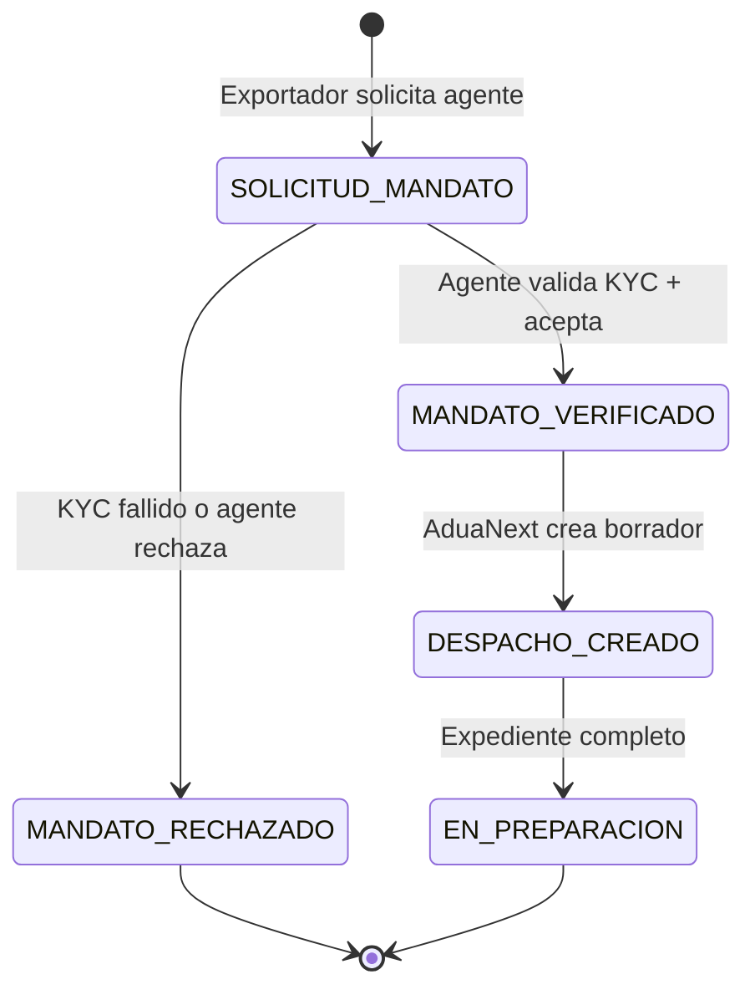
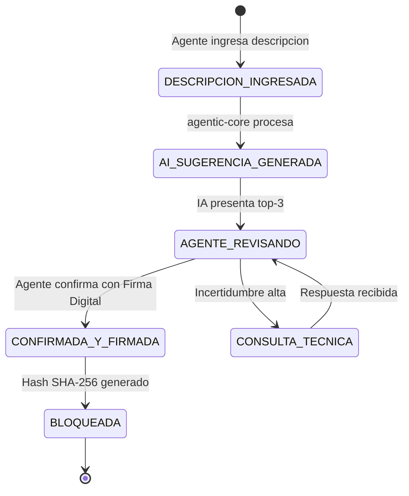
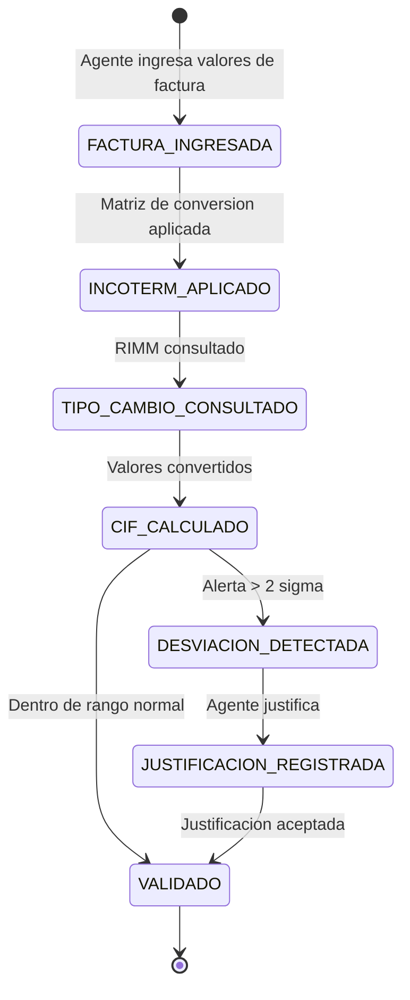
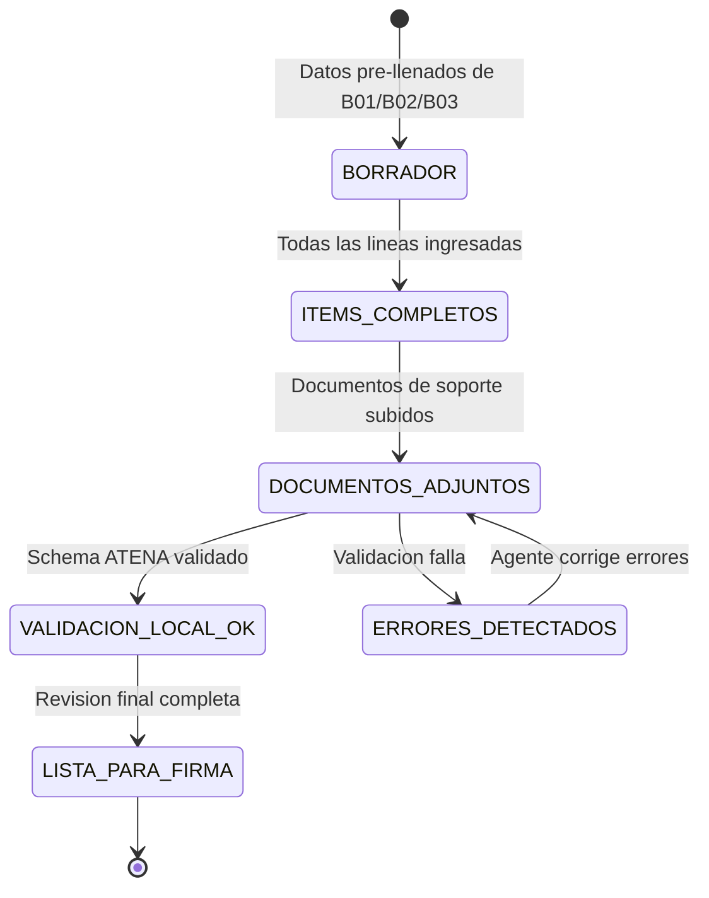
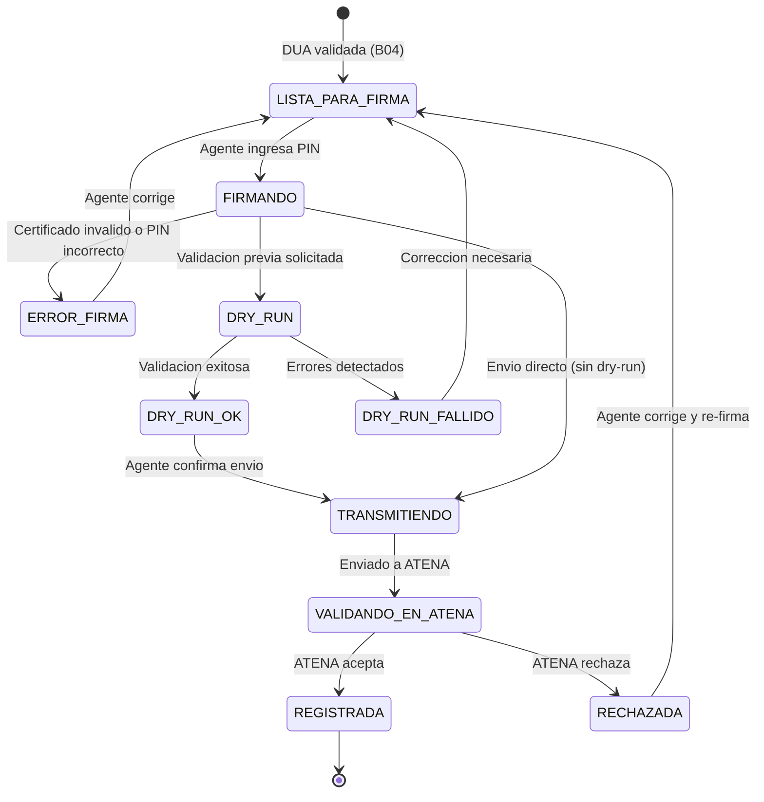
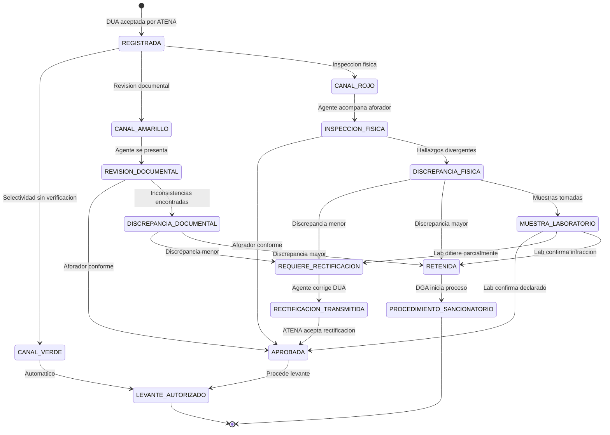
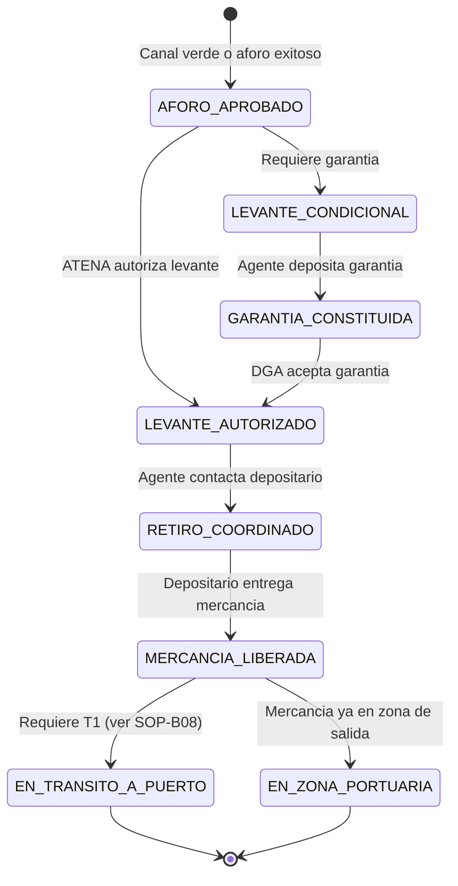
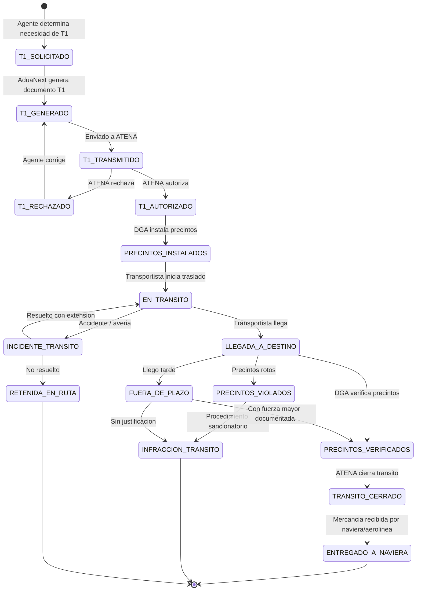

# Categoria B: Despacho de Exportacion

Esta categoria cubre el ciclo completo de un despacho de exportacion en Costa Rica, desde la recepcion del mandato del exportador hasta la movilizacion de la mercancia al puerto o aeropuerto de salida. Los ocho procedimientos operativos estandar (SOPs) describen tanto los pasos digitales en AduaNext como los pasos fisicos y presenciales que el agente aduanero debe realizar ante funcionarios de la DGA, depositarios, transportistas y navieras.

**Marco legal vigente:**

| Norma | Referencia |
|---|---|
| Ley General de Aduanas | Ley 7557 (LGA) |
| Reglamento a la LGA | Decreto 25270 (RLGA), Titulos II-III vigentes |
| Codigo Aduanero Uniforme Centroamericano | Ley 8360 (CAUCA) |
| Sistema informatico | ATENA (Ministerio de Hacienda) |

!!! warning "TICA esta deprecado"
    Todas las referencias en este documento corresponden a ATENA, el sistema vigente de la Direccion General de Aduanas. TICA no debe usarse como referencia para ningun procedimiento.

---

## SOP-B01: Intake del Despacho (KYC + Mandato) {#sop-b01}

| Campo | Valor |
|---|---|
| **Version** | 1.0 |
| **Base legal** | LGA Art. 33, 37-38; CAUCA Art. 16-17 |
| **Personas** | P01 Maria (agente freelance), P03 Andrea (pyme exportadora) |
| **Revenue tag** | Onboarding fee + per-dispatch fee |

> **Problema que resuelve:** El agente necesita un mandato valido del exportador para actuar en su representacion legal ante la DGA. Sin un KYC adecuado, el agente asume responsabilidad solidaria personal (Art. 33 LGA). En el modo Importer-Led (P03 Andrea), la pyme crea el despacho y el agente freelance revisa y firma.

### Objetivo

Establecer el vinculo juridico entre el exportador y el agente aduanero mediante la verificacion de identidad del exportador, la validacion de su existencia legal, la firma del mandato aduanero y la creacion del despacho como borrador en AduaNext.

### Datos requeridos

| Seccion | Campo | Fuente | Obligatorio |
|---|---|---|---|
| Exportador | Cedula juridica / fisica | Cliente | Si |
| Exportador | Razon social | Registro Mercantil / RIMM | Si |
| Exportador | Direccion fiscal | Cliente | Si |
| Exportador | Representante legal | Registro Mercantil | Si |
| Exportador | Telefono y correo electronico | Cliente | Si |
| Consignatario | Nombre completo | Cliente | Si |
| Consignatario | Direccion en destino | Cliente | Si |
| Consignatario | Pais de destino | Cliente | Si |
| Mercancia | Descripcion comercial general | Factura comercial | Si |
| Transaccion | Incoterm pactado | Contrato / factura | Si |
| Transaccion | Modo de transporte | Cliente | Si |
| Documentos | Factura comercial | Cliente | Si |
| Documentos | Lista de empaque (packing list) | Cliente | Si |
| Documentos | Conocimiento de embarque (B/L, AWB, carta porte) | Naviera / aerolinea / transportista | Si |
| Mandato | Documento de mandato firmado | Agente + Cliente | Si |

### Pasos del procedimiento

**Fase 1 -- Contacto inicial y recopilacion (presencial/remoto)**

1. El exportador contacta al agente aduanero (telefono, correo, WhatsApp) o, en modo Importer-Led, crea directamente una solicitud de despacho en AduaNext.
2. El agente solicita al exportador los documentos base: factura comercial, packing list, conocimiento de embarque o booking confirmation, y cualquier certificado especial (fitosanitario, de origen, permisos VUCE).
3. El agente se reune con el exportador (presencial o videoconferencia) para revisar la naturaleza de la mercancia, confirmar el incoterm pactado, el pais de destino, y el modo de transporte.
4. El agente verifica la existencia legal de la empresa exportadora consultando el Registro Nacional (Registro Mercantil) para confirmar que la cedula juridica esta activa y la personeria juridica vigente.
5. El agente verifica que el representante legal que firma el mandato tiene poder suficiente segun la personeria juridica inscrita.
6. El agente revisa que la factura comercial contiene los elementos minimos: descripcion de la mercancia, cantidad, valor unitario, valor total, moneda, incoterm, datos del comprador y vendedor.
7. El agente verifica que el packing list coincide con la factura en cantidad y descripcion de bultos.
8. El agente solicita al exportador firmar el documento de mandato aduanero, que establece la representacion legal del agente ante la DGA para este despacho especifico.

**Fase 2 -- Registro y validacion digital (AduaNext)**

9. Si el exportador no tiene cuenta en AduaNext, se crea el perfil del exportador con los datos de la cedula juridica, razon social, direccion fiscal, representante legal, telefono y correo.
10. AduaNext consulta el endpoint RIMM `/company/search` con la cedula juridica para validar que el exportador esta registrado como operador de comercio exterior ante la DGA.
11. Si el exportador no esta registrado en RIMM, AduaNext alerta al agente y genera una guia de los pasos necesarios para la inscripcion ante la DGA (requisito previo ineludible).
12. El agente recibe la solicitud de mandato en su bandeja de AduaNext (notificacion push + Telegram/WhatsApp).
13. El agente revisa los datos del exportador en el dashboard: cedula validada, razon social confirmada, representante legal verificado.
14. El agente acepta el mandato digitalmente en AduaNext. La plataforma registra la aceptacion con marca de tiempo, hash SHA-256 y referencia al documento fisico del mandato.
15. AduaNext crea el despacho como borrador (estado `DESPACHO_CREADO`) y asigna un numero interno de referencia unico.
16. El agente sube los documentos digitalizados (factura, packing list, B/L) al expediente digital del despacho.
17. AduaNext ejecuta validaciones basicas automaticas: formato de cedula, coherencia de fechas, campos obligatorios completos.

**Fase 3 -- Preparacion del expediente**

18. El agente clasifica los documentos adjuntos por tipo (comercial, transporte, certificados, mandato) en la estructura del expediente digital.
19. El agente revisa que todos los documentos esten legibles y completos. Si falta algun documento, AduaNext genera una solicitud automatica al exportador via correo electronico.
20. El agente verifica si la mercancia requiere permisos especiales de VUCE (fitosanitarios, SENASA, COMEX) y, de ser asi, verifica que esten vigentes y adjuntos.
21. AduaNext genera un resumen del despacho (exportador, consignatario, tipo de mercancia, incoterm, modo de transporte) para revision final del agente.
22. El agente confirma que el expediente esta completo y cambia el estado del despacho a `EN_PREPARACION`.
23. AduaNext registra en la traza de auditoria la transicion de estado, incluyendo el usuario, la marca de tiempo, la IP de origen y el hash SHA-256 del estado anterior.
24. En modo Importer-Led (P03 Andrea), la pyme recibe notificacion de que el agente ha aceptado el mandato y puede monitorear el progreso del despacho en tiempo real desde su dashboard.
25. El agente revisa las tarifas de honorarios pactadas con el exportador y las registra en AduaNext para facturacion posterior.

### Reglas de negocio

| # | Regla | Base legal |
|---|---|---|
| RN-B01-01 | El mandato no puede ser sustituido ni transferido a otro agente sin consentimiento expreso del exportador | LGA Art. 38 |
| RN-B01-02 | El agente es representante legal del exportador durante todo el despacho y asume responsabilidad solidaria | LGA Art. 33 |
| RN-B01-03 | El exportador debe estar inscrito como operador de comercio exterior ante la DGA para poder declarar | LGA Art. 29 |
| RN-B01-04 | El mandato debe especificar el alcance de la representacion (despacho especifico o general) | LGA Art. 37 |
| RN-B01-05 | La documentacion del mandato debe conservarse por un minimo de cinco anios | LGA Art. 30 |
| RN-B01-06 | En modo Importer-Led, la pyme crea el despacho pero solo el agente con mandato puede firmar y transmitir | LGA Art. 33, CAUCA Art. 16 |
| RN-B01-07 | El agente debe verificar la autenticidad de los documentos comerciales antes de aceptar el mandato | LGA Art. 36 |

### Maquina de estados

### Criterios de validacion

- [ ] Cedula juridica del exportador validada contra RIMM `/company/search`
- [ ] Representante legal con personeria juridica vigente
- [ ] Documento de mandato firmado por ambas partes (exportador y agente)
- [ ] Factura comercial con todos los campos minimos (descripcion, cantidad, valor, moneda, incoterm)
- [ ] Packing list consistente con la factura comercial
- [ ] Conocimiento de embarque o booking confirmation adjunto
- [ ] Exportador registrado como operador de comercio exterior en DGA
- [ ] Despacho creado con numero de referencia interno unico
- [ ] Traza de auditoria con hash SHA-256 para la aceptacion del mandato
- [ ] Notificaciones enviadas a todas las partes (agente, exportador)
- [ ] Documentos clasificados por tipo en el expediente digital
- [ ] Estado del despacho transicionado correctamente a EN_PREPARACION

---

## SOP-B02: Clasificacion Arancelaria con HITL {#sop-b02}

| Campo | Valor |
|---|---|
| **Version** | 1.0 |
| **Base legal** | LGA Art. 35.d, 36; RLGA Art. 21; CAUCA Art. 30, 103 |
| **Personas** | P01 Maria (agente freelance), P02 Carlos (aforador DGA) |
| **Revenue tag** | Classification fee (per item line) |

> **Problema que resuelve:** Los errores de clasificacion arancelaria son la causa numero uno de sanciones y multas. El agente es PERSONALMENTE responsable por el codigo SAC declarado (Art. 36, responsabilidad solidaria). La inteligencia artificial puede sugerir clasificaciones, pero NUNCA debe auto-enviar un codigo sin confirmacion humana explicita -- este principio es innegociable.

### Objetivo

Clasificar cada linea de mercancia del despacho segun el Sistema Arancelario Centroamericano (SAC) vigente, utilizando la asistencia de IA como herramienta de apoyo pero garantizando la decision final del agente humano, con trazabilidad completa y firma digital de la decision.

### Datos requeridos

| Seccion | Campo | Fuente | Obligatorio |
|---|---|---|---|
| Mercancia | Descripcion comercial | Factura comercial | Si |
| Mercancia | Descripcion tecnica | Cliente / ficha tecnica | Si |
| Mercancia | Composicion / material | Cliente / ficha tecnica | Condicional |
| Mercancia | Uso o funcion | Cliente | Si |
| Mercancia | Fotos del producto | Cliente | Recomendado |
| Mercancia | Pais de origen | Certificado de origen / factura | Si |
| Mercancia | Marca y modelo | Factura comercial | Si |
| Arancelaria | Codigo SAC sugerido por IA | agentic-core | Automatico |
| Arancelaria | Tasa arancelaria (DAI) | RIMM | Automatico |
| Arancelaria | Notas legales de seccion/capitulo | SAC vigente | Referencia |

### Modelo de puntuacion de riesgo (Risk Score)

| Factor | Peso | Descripcion |
|---|---|---|
| Desviacion CIF | 0.25 | Diferencia porcentual respecto al CIF historico para la misma subpartida + origen |
| Especificidad de la descripcion | 0.20 | Granularidad y detalle de la descripcion comercial vs. generica |
| Mercancia de bandera roja | 0.20 | Presencia en lista de mercancias sensibles (quimicos, dual-use, armas) |
| Riesgo por origen | 0.15 | Pais de origen con historial de subvaloracion o mercancias riesgosas |
| KYC del importador/exportador | 0.10 | Historial del operador, primera vez vs. operador recurrente |
| Override de clasificacion | 0.10 | Si el agente cambia la sugerencia de IA, se incrementa el escrutinio |

### Pasos del procedimiento

**Fase 1 -- Analisis de la mercancia (presencial/documental)**

1. El agente revisa la factura comercial para obtener la descripcion comercial de cada linea de mercancia: nombre del producto, marca, modelo, cantidad, valor unitario.
2. El agente solicita al exportador la ficha tecnica del producto cuando la descripcion comercial es insuficiente para determinar la composicion, funcion o uso del producto.
3. El agente examina fotografias del producto proporcionadas por el exportador. Si es posible y la mercancia esta disponible, inspecciona muestras fisicas.
4. El agente identifica el material de composicion predominante de cada producto (metal, plastico, textil, organico, quimico, electronico, etc.) porque las Reglas Generales de Interpretacion (RGI) del SAC dependen fundamentalmente del material y la funcion.
5. El agente determina la funcion principal del producto (RGI 1 y 3) y, en caso de productos compuestos o surtidos, aplica las RGI correspondientes (RGI 3.a: partida mas especifica, RGI 3.b: caracter esencial, RGI 3.c: ultima partida en orden numerico).
6. El agente consulta las Notas Legales de la Seccion y del Capitulo correspondiente del SAC para confirmar inclusiones y exclusiones especificas.
7. Si la mercancia es compleja o novedosa, el agente consulta las Notas Explicativas del Sistema Armonizado (NESA) de la Organizacion Mundial de Aduanas (OMA) para criterios interpretativos.
8. Si persiste incertidumbre, el agente consulta resoluciones anticipadas y criterios previos del Departamento de Tecnica Aduanera de la DGA.
9. Si la incertidumbre es alta y el riesgo fiscal es significativo, el agente solicita una consulta de clasificacion arancelaria formal al Departamento de Tecnica Aduanera (resolucion vinculante con plazo de respuesta legal).

**Fase 2 -- Asistencia de IA y decision humana (AduaNext)**

10. El agente ingresa la descripcion comercial y tecnica de cada linea de mercancia en AduaNext.
11. AduaNext envia la descripcion al modulo agentic-core (Python), que ejecuta una busqueda semantica contra el SAC vigente y contra el historial de clasificaciones previas del agente.
12. AduaNext consulta el endpoint RIMM `/commodity/search` para obtener las subpartidas arancelarias candidatas con sus tasas (DAI, selectivo de consumo, IVA, otros).
13. La IA presenta al agente las tres mejores sugerencias de codigo SAC (top-3), cada una con: codigo a 10 digitos, descripcion oficial de la subpartida, notas legales relevantes, tasa arancelaria, nivel de confianza (porcentaje), y justificacion textual.
14. El agente revisa cada sugerencia comparandola con su analisis manual previo (pasos 1-9).
15. El agente selecciona el codigo SAC que considera correcto. Si ninguna sugerencia de la IA es adecuada, el agente ingresa manualmente un codigo diferente y registra la justificacion.
16. Cuando el agente selecciona un codigo diferente al de mayor confianza de la IA (override), AduaNext registra la divergencia y aumenta el factor de riesgo `classification_override` en el score compuesto.
17. AduaNext calcula el score de riesgo compuesto (6 factores) para la linea de mercancia clasificada y lo muestra al agente.
18. Si el score de riesgo supera el umbral configurado (por defecto > 0.70), AduaNext muestra una advertencia al agente y le solicita confirmacion adicional con justificacion escrita.

**Fase 3 -- Confirmacion y bloqueo (AduaNext)**

19. El agente confirma la clasificacion arancelaria firmando la decision con su certificado de Firma Digital (BCCR).
20. AduaNext crea un registro inmutable (append-only) de la decision de clasificacion que incluye: codigo SAC, descripcion, agente que clasifico, timestamp, firma digital, score de riesgo, sugerencias de IA, justificacion del agente.
21. AduaNext genera un hash SHA-256 del registro de clasificacion y lo encadena al hash anterior (cadena de auditoria).
22. La clasificacion queda en estado `BLOQUEADA` -- no puede ser modificada. Si es necesario cambiar la clasificacion, se debe crear un nuevo registro (evento) que referencia al anterior, manteniendo el historial completo.
23. AduaNext notifica al exportador (en modo Importer-Led) que la clasificacion de la linea ha sido confirmada.
24. El agente repite el proceso (pasos 10-23) para cada linea de mercancia adicional del despacho.
25. Una vez clasificadas todas las lineas, AduaNext genera un resumen de clasificacion con el riesgo agregado del despacho.
26. El agente revisa el resumen final y confirma que todas las lineas estan correctamente clasificadas antes de proceder a la valoracion.

### Reglas de negocio

| # | Regla | Base legal |
|---|---|---|
| RN-B02-01 | El agente debe clasificar segun el SAC vigente a la fecha de aceptacion de la declaracion | LGA Art. 35.d |
| RN-B02-02 | La clasificacion es inmutable una vez firmada -- patron append-only, nunca mutar | Politica AduaNext |
| RN-B02-03 | La IA NUNCA puede auto-enviar un codigo SAC sin confirmacion explicita del agente humano (HITL) | Politica AduaNext, SRD Rule 3 |
| RN-B02-04 | El Comite Arancelario de la DGA es la autoridad final para disputas de clasificacion | CAUCA Art. 103 |
| RN-B02-05 | El agente tiene responsabilidad solidaria por la exactitud de la clasificacion | LGA Art. 36 |
| RN-B02-06 | Cada decision de clasificacion debe llevar hash SHA-256 en cadena de auditoria | Politica AduaNext, SRD Rule 4 |
| RN-B02-07 | Si el score de riesgo supera 0.70, el agente debe proporcionar justificacion escrita adicional | Politica AduaNext |
| RN-B02-08 | Las resoluciones anticipadas de Tecnica Aduanera tienen caracter vinculante | LGA Art. 35 bis |

### Maquina de estados

### Criterios de validacion

- [ ] Descripcion comercial y tecnica ingresada para cada linea de mercancia
- [ ] Consulta a RIMM `/commodity/search` ejecutada exitosamente
- [ ] IA presento top-3 sugerencias con nivel de confianza
- [ ] Agente reviso y confirmo manualmente el codigo SAC seleccionado
- [ ] Ninguna clasificacion fue auto-enviada por la IA sin confirmacion humana
- [ ] Firma Digital del agente aplicada a la decision de clasificacion
- [ ] Registro append-only creado con hash SHA-256 encadenado
- [ ] Score de riesgo compuesto calculado (6 factores)
- [ ] Si score > 0.70, justificacion escrita adicional registrada
- [ ] Override de IA (si aplica) registrado con incremento de factor de riesgo
- [ ] Todas las lineas del despacho clasificadas antes de proceder a valoracion
- [ ] Resumen de clasificacion generado con riesgo agregado del despacho

---

## SOP-B03: Valoracion Aduanera (CIF/FOB) {#sop-b03}

| Campo | Valor |
|---|---|
| **Version** | 1.0 |
| **Base legal** | LGA Art. 57; RLGA Art. 22-23; CAUCA Art. 30; Acuerdo de Valoracion de la OMC (Art. VII GATT) |
| **Personas** | P01 Maria (agente freelance), P03 Andrea (pyme exportadora) |
| **Revenue tag** | Incluido en per-dispatch fee |

> **Problema que resuelve:** El valor en aduana determina la base imponible de los tributos aduaneros. El ONVVA (Organo Nacional de Valoracion y Verificacion Aduanera) puede ajustar el valor declarado si detecta subvaloracion o sobrevaloracion. La declaracion incorrecta del valor constituye infraccion administrativa o tributaria con multas que van del 100% al 300% de los tributos dejados de percibir.

### Objetivo

Determinar el valor en aduana de las mercancias del despacho de exportacion, convirtiendo el valor de transaccion segun el incoterm pactado al valor CIF (o FOB para exportaciones), aplicando el tipo de cambio oficial vigente, y validando que el valor declarado sea razonable comparado con valores historicos para la misma mercancia y origen.

### Datos requeridos

| Seccion | Campo | Fuente | Obligatorio |
|---|---|---|---|
| Factura | Valor FOB por linea | Factura comercial | Si |
| Factura | Moneda de transaccion | Factura comercial | Si |
| Factura | Condiciones de venta (incoterm) | Factura / contrato | Si |
| Factura | Relacion entre comprador y vendedor | Declaracion del exportador | Si |
| Flete | Costo del flete | B/L / cotizacion naviera | Condicional |
| Seguro | Costo del seguro | Poliza / cotizacion | Condicional |
| Ajustes | Comisiones de venta | Contrato | Condicional |
| Ajustes | Costo de embalaje | Factura / contrato | Condicional |
| Ajustes | Regalias o canones | Contrato de licencia | Condicional |
| Tipo de cambio | Tipo de cambio oficial | RIMM `/exchangeRate/search` | Si |
| Historico | CIF historico para misma subpartida + origen | AduaNext base de datos | Referencia |

### Matriz de conversion de incoterms

| Incoterm | Para obtener FOB | Para obtener CIF |
|---|---|---|
| EXW | + flete interno + despacho exportacion | + flete interno + despacho + flete internacional + seguro |
| FCA | + flete al puerto de embarque | + flete al puerto + flete internacional + seguro |
| FAS | + carga al buque | + carga + flete internacional + seguro |
| FOB | = valor declarado | + flete internacional + seguro |
| CFR | - flete internacional (ya incluido) | + seguro |
| CIF | - flete - seguro (para FOB) | = valor declarado |
| CPT | - flete (diferente de CFR por multimodal) | + seguro |
| CIP | - flete - seguro | = valor declarado (equivalente CIF multimodal) |
| DAP | - flete - seguro - descarga | - descarga |
| DDP | - flete - seguro - descarga - impuestos destino | - descarga - impuestos destino |

### Pasos del procedimiento

**Fase 1 -- Recopilacion y verificacion documental (presencial/documental)**

1. El agente revisa la factura comercial para extraer el valor de transaccion por linea de mercancia: valor unitario, cantidad, valor total, moneda y condiciones de venta (incoterm).
2. El agente verifica que la factura comercial sea un documento original o copia fiel del original, con los datos completos del vendedor (exportador) y del comprador (consignatario).
3. El agente determina si existe relacion entre el comprador y el vendedor (partes vinculadas) segun la definicion del Art. 15 del Acuerdo de Valoracion de la OMC. Si las partes son vinculadas, debe demostrar que la relacion no influyo en el precio.
4. El agente recopila el conocimiento de embarque (B/L, AWB, carta porte) para obtener el costo del flete internacional.
5. El agente solicita la poliza de seguro o la cotizacion del seguro de transporte internacional. Si no se contrato seguro, se aplica el porcentaje de seguro estimado segun la normativa vigente.
6. El agente revisa si existen costos adicionales que deban sumarse al valor de transaccion: comisiones de venta, costo de embalaje especial, regalias o canones vinculados a la mercancia.
7. El agente verifica que las condiciones de venta (incoterm) de la factura sean consistentes con el B/L y con la realidad de la transaccion (quien paga el flete, quien asume el riesgo).

**Fase 2 -- Calculo del valor en aduana (AduaNext)**

8. El agente ingresa en AduaNext los valores de la factura comercial para cada linea de mercancia: valor unitario, cantidad, valor total, moneda, incoterm.
9. AduaNext identifica el incoterm declarado y aplica la matriz de conversion correspondiente para calcular el valor FOB y el valor CIF.
10. AduaNext consulta el endpoint RIMM `/exchangeRate/search` para obtener el tipo de cambio oficial (colones/USD o colones/otra moneda) a la fecha de la declaracion.
11. AduaNext convierte los valores de la moneda de transaccion a dolares estadounidenses (moneda base de la declaracion) y a colones costarricenses (moneda fiscal) utilizando el tipo de cambio oficial obtenido.
12. AduaNext suma los componentes: valor FOB + flete internacional + seguro = valor CIF. Si el incoterm ya incluye alguno de estos componentes, AduaNext los desagrega automaticamente.
13. AduaNext aplica los ajustes adicionales al valor de transaccion si corresponde: comisiones de venta (sumar), descuentos (restar solo si son descuentos de cantidad habituales en el comercio), regalias (sumar si son condicion de la venta).
14. AduaNext calcula el valor CIF total del despacho sumando el valor CIF de cada linea de mercancia.

**Fase 3 -- Validacion y deteccion de anomalias (AduaNext)**

15. AduaNext consulta la base de datos historica para obtener el rango de valores CIF declarados previamente para la misma subpartida arancelaria (codigo SAC) y el mismo pais de origen.
16. AduaNext calcula la desviacion estadistica del valor CIF declarado respecto al valor CIF historico promedio. Si la desviacion supera 2 sigma (dos desviaciones estandar), el sistema marca la linea con bandera de alerta.
17. Si se detecta una desviacion significativa a la baja (posible subvaloracion), AduaNext muestra al agente una advertencia con la comparacion historica y solicita justificacion escrita.
18. Si se detecta una desviacion significativa al alza (posible sobrevaloracion, que en exportaciones puede indicar lavado de activos), AduaNext alerta al agente con la misma comparacion.
19. El agente revisa las alertas de desviacion y proporciona justificacion si el valor es legitimo (ejemplo: mercancia nueva sin historico, fluctuacion de precios por temporada, contrato especial).
20. AduaNext integra la desviacion CIF como factor (peso 0.25) en el score de riesgo compuesto del despacho.
21. El agente verifica que el tipo de cambio aplicado sea el vigente a la fecha de aceptacion de la declaracion, no a la fecha de emision de la factura.
22. AduaNext presenta al agente un resumen de valoracion por linea: valor FOB, flete, seguro, ajustes, valor CIF, tipo de cambio, equivalente en colones, porcentaje de desviacion historica.

**Fase 4 -- Confirmacion de la valoracion**

23. El agente revisa el resumen de valoracion completo y verifica que todos los valores son correctos y consistentes con la documentacion de soporte.
24. El agente confirma la valoracion en AduaNext. La plataforma registra la confirmacion con marca de tiempo y hash SHA-256.
25. AduaNext calcula los tributos estimados a partir del valor CIF y las tasas arancelarias obtenidas en la clasificacion (SOP-B02): DAI, selectivo de consumo, IVA, Ley 6946, otros.
26. AduaNext muestra al agente el desglose tributario estimado para validacion antes de la preparacion de la DUA.
27. El agente verifica que la declaracion de vinculacion entre partes sea correcta y este documentada.
28. AduaNext actualiza el estado del despacho para reflejar que la valoracion esta completa.

### Reglas de negocio

| # | Regla | Base legal |
|---|---|---|
| RN-B03-01 | El valor de transaccion es la base primaria de valoracion (Metodo 1 del Acuerdo OMC) | Acuerdo Art. VII GATT, LGA Art. 57 |
| RN-B03-02 | Si el Metodo 1 no aplica, se deben aplicar los metodos 2-6 en orden secuencial estricto | Acuerdo de Valoracion OMC |
| RN-B03-03 | El tipo de cambio aplicable es el vigente a la fecha de aceptacion de la declaracion | RLGA Art. 22 |
| RN-B03-04 | Las transacciones entre partes vinculadas requieren documentacion adicional que demuestre que el precio no esta influido por la vinculacion | Acuerdo Art. VII, Art. 1.2 |
| RN-B03-05 | Desviaciones CIF > 2 sigma requieren justificacion escrita del agente | Politica AduaNext |
| RN-B03-06 | El ONVVA puede ajustar el valor declarado y el importador/exportador tiene derecho a impugnar | LGA Art. 57 |
| RN-B03-07 | Los descuentos solo se aceptan si son habituales en el comercio y aplicados a todos los compradores | Acuerdo de Valoracion OMC, Art. 1 Nota Interpretativa |
| RN-B03-08 | Para exportaciones, el valor FOB es la base declarada principal; CIF se usa para efectos estadisticos y cuando aplica | Normativa DGA |

### Maquina de estados

### Criterios de validacion

- [ ] Factura comercial con valor de transaccion, moneda e incoterm
- [ ] Incoterm correctamente identificado y matriz de conversion aplicada
- [ ] Tipo de cambio obtenido de RIMM `/exchangeRate/search` a la fecha correcta
- [ ] Valor CIF calculado correctamente (FOB + flete + seguro + ajustes)
- [ ] Comparacion historica ejecutada contra misma subpartida + origen
- [ ] Desviaciones > 2 sigma marcadas y justificadas por el agente
- [ ] Declaracion de vinculacion entre partes documentada
- [ ] Tributos estimados calculados y mostrados al agente
- [ ] Tipo de cambio correspondiente a la fecha de aceptacion de la declaracion
- [ ] Hash SHA-256 generado para el registro de valoracion
- [ ] Resumen de valoracion revisado y confirmado por el agente

---

## SOP-B04: Preparacion de la DUA de Exportacion {#sop-b04}

| Campo | Valor |
|---|---|
| **Version** | 1.0 |
| **Base legal** | LGA Art. 86, 33; CAUCA Art. 52-54 |
| **Personas** | P01 Maria (agente freelance), P03 Andrea (pyme exportadora) |
| **Revenue tag** | Core per-dispatch fee |

> **Problema que resuelve:** La DUA de exportacion contiene mas de 50 campos que deben coincidir exactamente con el schema OMA v4.1 de ATENA. Un solo campo incorrecto genera rechazo. El agente declara bajo fe de juramento (Art. 33), por lo que la exactitud de la DUA es critica y legalmente vinculante.

### Objetivo

Ensamblar la Declaracion Unica Aduanera (DUA) de exportacion con todos los campos requeridos por el schema de ATENA, validar localmente contra la especificacion JSON antes de la transmision, adjuntar todos los documentos de soporte, y dejar la declaracion en estado listo para firma digital.

### Datos requeridos (campos principales del schema ATENA)

| Seccion | Campo ATENA | Tipo | Obligatorio |
|---|---|---|---|
| General | typeOfDeclaration | String ("EX") | Si |
| General | customsOfficeCode | String | Si |
| General | registrationDate | Date | Automatico |
| Declarante | declarantCode | String (codigo agente) | Si |
| Declarante | declarantName | String | Si |
| Declarante | declarantTaxId | String (cedula agente) | Si |
| Exportador | exporterCode | String | Si |
| Exportador | exporterName | String (razon social) | Si |
| Exportador | exporterTaxId | String (cedula juridica) | Si |
| Exportador | exporterAddress | String | Si |
| Consignatario | consigneeName | String | Si |
| Consignatario | consigneeAddress | String | Si |
| Consignatario | consigneeCountryCode | String (ISO 3166) | Si |
| Transporte | modeOfTransport | String (maritimo/aereo/terrestre) | Si |
| Transporte | meansOfTransportId | String (nombre buque/vuelo) | Condicional |
| Transporte | portOfLoading | String (codigo UN/LOCODE) | Si |
| Transporte | portOfDischarge | String (codigo UN/LOCODE) | Si |
| Transito | countryOfDestination | String (ISO 3166) | Si |
| Transito | transitCountries | Array de String | Condicional |
| Valoracion | totalFobValue | Decimal | Si |
| Valoracion | totalFreight | Decimal | Condicional |
| Valoracion | totalInsurance | Decimal | Condicional |
| Valoracion | totalCifValue | Decimal | Si |
| Valoracion | currencyCode | String (ISO 4217) | Si |
| Valoracion | exchangeRate | Decimal | Si |
| Items | itemNumber | Integer (secuencial) | Si |
| Items | hsCode | String (SAC 10 digitos) | Si |
| Items | goodsDescription | String | Si |
| Items | countryOfOrigin | String (ISO 3166) | Si |
| Items | grossWeight | Decimal (kg) | Si |
| Items | netWeight | Decimal (kg) | Si |
| Items | quantity | Decimal | Si |
| Items | unitOfMeasure | String | Si |
| Items | statisticalQuantity | Decimal | Si |
| Items | fobValue | Decimal | Si |
| Items | cifValue | Decimal | Si |
| Bultos | numberOfPackages | Integer | Si |
| Bultos | packageType | String (codigo OMA) | Si |
| Bultos | packageMarks | String | Condicional |
| Tributos | taxCode | String | Si |
| Tributos | taxRate | Decimal | Si |
| Tributos | taxAmount | Decimal | Si |
| Documentos | documentType | String (codigo tipo) | Si |
| Documentos | documentNumber | String | Si |
| Documentos | documentDate | Date | Si |

### Pasos del procedimiento

**Fase 1 -- Verificacion de documentos de soporte (presencial/documental)**

1. El agente verifica que todos los documentos de soporte necesarios estan reunidos y vigentes: factura comercial definitiva, packing list, conocimiento de embarque (B/L, AWB o carta porte), certificados de origen (si aplica), certificados fitosanitarios (si la mercancia lo requiere), permisos VUCE (si la mercancia es regulada).
2. El agente verifica que la factura comercial es definitiva (no proforma) y contiene: numero de factura, fecha, datos del vendedor, datos del comprador, descripcion de la mercancia, cantidades, valores unitarios, valor total, moneda, incoterm.
3. El agente verifica que el conocimiento de embarque es consistente con la factura: puerto de carga, puerto de descarga, peso bruto, numero de bultos, marcas y numeros.
4. El agente verifica que los certificados de origen (si aplica tratado de libre comercio) cumplen con los criterios de origen del acuerdo correspondiente.
5. El agente confirma si la mercancia requiere permisos de exportacion especiales (COMEX, MAG, SENASA, Ministerio de Salud) y verifica que estan vigentes y correctamente emitidos.
6. Para mercancias sujetas a VUCE (Ventanilla Unica de Comercio Exterior), el agente verifica que el permiso electronico esta aprobado y disponible en el sistema.

**Fase 2 -- Ensamblaje de la DUA (AduaNext)**

7. AduaNext pre-llena los campos generales de la DUA con datos ya capturados en los SOPs anteriores: tipo de declaracion ("EX"), datos del exportador (del intake B01), datos del declarante (perfil del agente), clasificacion arancelaria (de B02), valoracion (de B03).
8. El agente revisa y completa la seccion de transporte: modo de transporte (maritimo, aereo, terrestre), identificacion del medio de transporte (nombre del buque, numero de vuelo), puerto de carga (codigo UN/LOCODE del puerto costarricense), puerto de descarga (codigo UN/LOCODE del puerto de destino).
9. El agente revisa la seccion de transito: pais de destino final (ISO 3166), paises de transito intermedio si los hay.
10. El agente revisa la seccion de valoracion: valor FOB total, flete total, seguro total, valor CIF total, moneda (ISO 4217), tipo de cambio. Estos campos deben coincidir exactamente con lo calculado en SOP-B03.
11. El agente revisa cada linea de item: numero de item secuencial, codigo SAC a 10 digitos (de B02), descripcion de la mercancia (debe ser detallada y especifica, no generica), pais de origen, peso bruto en kg, peso neto en kg, cantidad, unidad de medida, cantidad estadistica, valor FOB, valor CIF.
12. El agente verifica que la suma de los pesos brutos de todas las lineas coincida con el peso bruto total del conocimiento de embarque.
13. El agente verifica que la suma de los valores FOB de todas las lineas coincida con el valor FOB total de la factura.
14. El agente completa la seccion de bultos: numero total de bultos, tipo de bulto (codigo OMA: caja, pallet, contenedor, etc.), marcas y numeros de los bultos.
15. El agente revisa la seccion de tributos: para cada linea de item, AduaNext calcula automaticamente los tributos aplicables (DAI, selectivo de consumo, IVA, Ley 6946) basados en la tasa obtenida de RIMM en SOP-B02.

!!! info "Exportaciones y tributos"
    Para la mayoria de las exportaciones costarricenses, los tributos de exportacion son cero o minimos. Sin embargo, la DUA debe declararlos correctamente. Algunas mercancias pueden tener restricciones o impuestos especificos de exportacion.

16. El agente adjunta los documentos de soporte en formato digital a la declaracion: factura (tipo de documento correspondiente), B/L, packing list, certificados. Cada documento se registra con su tipo (codigo), numero y fecha.
17. AduaNext verifica que todos los documentos obligatorios segun el tipo de mercancia estan adjuntos. Si falta algun documento requerido, bloquea el avance y notifica al agente.

**Fase 3 -- Validacion local (AduaNext)**

18. AduaNext ejecuta la validacion local contra el schema JSON de ATENA (OMA v4.1). Esta validacion incluye: campos obligatorios presentes, tipos de datos correctos (strings, decimales, fechas), longitudes de campos dentro de los limites, codigos ISO validos (paises, monedas, puertos), formato de codigos SAC (10 digitos), consistencia interna (sumas, totales).
19. Si la validacion local detecta errores, AduaNext presenta al agente la lista completa de errores con la ubicacion exacta del campo y la descripcion del error.
20. El agente corrige los errores detectados y ejecuta nuevamente la validacion local hasta que todos los campos pasen.
21. AduaNext ejecuta una segunda capa de validacion: reglas de negocio especificas de la DGA de Costa Rica. Estas incluyen: aduana de despacho valida para el tipo de mercancia, coherencia entre incoterm y componentes de valoracion, peso bruto >= peso neto, numero de bultos > 0, al menos una linea de item.
22. AduaNext calcula el score de riesgo pre-transmision agregando los scores de clasificacion (B02) y valoracion (B03), y anade factores de la DUA completa: coherencia documental, historial del exportador, tipo de mercancia.

**Fase 4 -- Preparacion final para firma**

23. El agente realiza una revision final integral de la DUA completa: datos del exportador, consignatario, transporte, valoracion, items, tributos, documentos adjuntos.
24. AduaNext genera una vista previa (preview) de la DUA en formato legible para que el agente pueda revisar el documento completo antes de firmarlo.
25. El agente verifica que la vista previa coincide con los documentos de soporte fisicos.
26. AduaNext cambia el estado de la DUA a `LISTA_PARA_FIRMA` y notifica al agente que puede proceder con la firma digital.
27. AduaNext registra en la traza de auditoria la validacion local exitosa, el score de riesgo pre-transmision, y la transicion de estado, con hash SHA-256.
28. En modo Importer-Led (P03 Andrea), la pyme recibe notificacion de que la DUA esta lista para firma, junto con un resumen de los tributos estimados.

### Reglas de negocio

| # | Regla | Base legal |
|---|---|---|
| RN-B04-01 | La declaracion se presenta bajo fe de juramento del agente (Art. 33 LGA) | LGA Art. 33 |
| RN-B04-02 | Los nombres de campos deben coincidir con la nomenclatura camelCase de ATENA | SRD Rule 7 |
| RN-B04-03 | No se requieren visas consulares para exportaciones (CAUCA Art. 54) | CAUCA Art. 54 |
| RN-B04-04 | La DUA debe contener al menos una linea de item | Schema ATENA |
| RN-B04-05 | El peso bruto debe ser mayor o igual al peso neto en cada linea | Schema ATENA |
| RN-B04-06 | El valor FOB total de los items debe coincidir con el valor total declarado | Schema ATENA |
| RN-B04-07 | La validacion local debe pasar al 100% antes de habilitar la firma | Politica AduaNext |
| RN-B04-08 | Los codigos de puerto deben ser UN/LOCODE validos | OMA / CEPE-ONU |

### Maquina de estados

### Criterios de validacion

- [ ] Tipo de declaracion configurado como "EX" (exportacion)
- [ ] Datos del exportador completos y consistentes con el intake (B01)
- [ ] Datos del declarante (agente) completos con codigo y cedula
- [ ] Clasificacion arancelaria (SAC) de todas las lineas proveniente de B02
- [ ] Valoracion (FOB, CIF) de todas las lineas proveniente de B03
- [ ] Seccion de transporte completa (modo, medio, puertos)
- [ ] Seccion de bultos completa (numero, tipo, marcas)
- [ ] Tributos calculados para cada linea de item
- [ ] Documentos de soporte adjuntos y catalogados por tipo
- [ ] Validacion local contra schema ATENA exitosa (0 errores)
- [ ] Reglas de negocio DGA validadas (pesos, totales, coherencia)
- [ ] Score de riesgo pre-transmision calculado
- [ ] Vista previa de la DUA generada y revisada por el agente
- [ ] Estado de la DUA transicionado a LISTA_PARA_FIRMA
- [ ] Hash SHA-256 generado para la validacion exitosa

---

## SOP-B05: Firma Digital y Transmision a ATENA {#sop-b05}

| Campo | Valor |
|---|---|
| **Version** | 1.0 |
| **Base legal** | CAUCA Art. 23, 53; LGA Art. 30.e; Ley 8454 (Ley de Certificados, Firmas Digitales y Documentos Electronicos) |
| **Personas** | P01 Maria (agente freelance) |
| **Revenue tag** | Incluido en per-dispatch fee + signing fee |

> **Problema que resuelve:** La firma electronica equivale a la firma autografa (CAUCA Art. 23). El agente DEBE firmar con su certificado personal emitido por una Autoridad Certificadora autorizada por el BCCR (Banco Central de Costa Rica), sea en formato PKCS#12 (archivo .p12) o PKCS#11 (token USB/smart card). Este es el punto de no retorno: una vez transmitida y liquidada, el agente esta legalmente comprometido con el contenido de la declaracion.

### Objetivo

Firmar digitalmente la DUA de exportacion con el certificado del agente aduanero (XAdES-EPES), transmitir la declaracion firmada a ATENA a traves del sidecar gRPC, obtener el numero de registro aduanero y el serial de liquidacion, y registrar todo el proceso en la traza de auditoria inmutable.

### Datos requeridos

| Seccion | Campo | Fuente | Obligatorio |
|---|---|---|---|
| Firma | Certificado digital del agente | BCCR CA (SINPE) | Si |
| Firma | PIN del token/certificado | Agente (ingreso manual) | Si |
| Firma | Algoritmo de firma | Configuracion (RSA-2048, SHA-256) | Automatico |
| Firma | Formato de firma | XAdES-EPES v1.3.2+ | Automatico |
| Transmision | Ambiente ATENA | Configuracion (sandbox/produccion) | Si |
| Transmision | DUA JSON completa | SOP-B04 | Si |
| Respuesta | customsRegistrationNumber | ATENA | Automatico |
| Respuesta | assessmentSerial | ATENA | Automatico |

### Pasos del procedimiento

**Fase 1 -- Preparacion de la firma (presencial)**

1. El agente se asegura de que su dispositivo de firma digital esta disponible y funcional: token USB SINPE Firma Digital insertado en el equipo, o archivo .p12 accesible en el sistema.
2. El agente verifica que su certificado digital esta vigente (no expirado, no revocado) consultando la fecha de vencimiento del certificado.
3. El agente abre la DUA en AduaNext y realiza una revision visual final del contenido completo de la declaracion, incluyendo: datos del exportador, consignatario, transporte, valoracion, items, tributos, documentos adjuntos.
4. El agente confirma expresamente en AduaNext que ha revisado el contenido de la DUA y que esta de acuerdo con declarar bajo fe de juramento la veracidad de la informacion.
5. El agente verifica que el ambiente de ATENA configurado es el correcto: sandbox para pruebas, produccion para transmisiones reales. AduaNext muestra un indicador visual claro del ambiente activo.

**Fase 2 -- Firma digital (AduaNext + gRPC Sidecar)**

6. El agente presiona el boton "Firmar y Transmitir" en AduaNext. La plataforma solicita el PIN del certificado digital.
7. El agente ingresa el PIN de su token USB o certificado .p12. El PIN se transmite de forma segura al sidecar gRPC y NUNCA se almacena en la base de datos ni en logs.
8. AduaNext serializa la DUA completa en formato JSON conforme al schema ATENA.
9. AduaNext envia el JSON de la DUA al sidecar gRPC a traves del servicio `HaciendaSigner.SignAndEncode`.
10. El sidecar gRPC ejecuta la firma digital XAdES-EPES: crea el documento XML de la declaracion, aplica la firma con el certificado del agente (RSA-2048), calcula el digest SHA-256 del contenido, incluye la referencia a la politica de firma, genera la estructura XAdES-EPES v1.3.2+ completa.
11. El sidecar gRPC devuelve el documento firmado en formato Base64 (XML firmado codificado en Base64).
12. AduaNext recibe el documento firmado y lo almacena temporalmente para la transmision.

!!! warning "Punto de no retorno"
    A partir de la firma, el agente asume plena responsabilidad legal por el contenido de la declaracion. La firma digital tiene el mismo valor legal que la firma autografa (CAUCA Art. 23, Ley 8454).

**Fase 3 -- Validacion previa (dry-run) opcional**

13. Si el agente opto por realizar una validacion previa (dry-run), AduaNext envia la DUA al sidecar gRPC a traves del servicio `HaciendaApi` con el metodo de validacion sin liquidacion.
14. ATENA responde con el resultado de la validacion: si la DUA pasa todas las validaciones del sistema, retorna un resultado exitoso sin generar numero de registro. Si hay errores, retorna la lista detallada de rechazos.
15. Si la validacion previa detecta errores, AduaNext presenta los errores al agente. El agente debe corregir los campos rechazados (regresando a SOP-B04) y repetir el proceso de firma.
16. Si la validacion previa es exitosa, el agente procede con la transmision definitiva.

**Fase 4 -- Transmision definitiva a ATENA**

17. AduaNext envia la DUA firmada al sidecar gRPC a traves del servicio `HaciendaOrchestrator.SubmitSignedDeclaration`.
18. El sidecar gRPC se autentica contra ATENA utilizando las credenciales OIDC (OAuth 2.0 ROPC flow contra el Keycloak de Hacienda) a traves del servicio `HaciendaAuth`.
19. Si el token de autenticacion esta expirado, el sidecar lo renueva automaticamente antes de enviar la declaracion.
20. El sidecar transmite la DUA firmada a ATENA a traves del endpoint de liquidacion (submission).
21. ATENA procesa la declaracion y responde con uno de dos resultados: aceptacion (con `customsRegistrationNumber` y `assessmentSerial`) o rechazo (con lista de errores y codigos de rechazo).

**Fase 5 -- Procesamiento de la respuesta**

22. Si ATENA acepta la declaracion, AduaNext almacena el `customsRegistrationNumber` (numero de registro aduanero) y el `assessmentSerial` (serial de liquidacion) en la base de datos del despacho.
23. AduaNext cambia el estado de la DUA a `REGISTRADA` y notifica al agente (push + Telegram/WhatsApp) con el numero de registro.
24. AduaNext notifica al exportador (P03 Andrea en modo Importer-Led) que la DUA fue transmitida exitosamente, incluyendo el numero de registro para sus registros contables.
25. Si ATENA rechaza la declaracion, AduaNext cambia el estado a `RECHAZADA`, almacena los codigos y mensajes de rechazo, y notifica al agente con el detalle de los errores.
26. En caso de rechazo, el agente analiza los errores, corrige los campos necesarios en la DUA (regresando a SOP-B04), y repite el proceso de firma y transmision.
27. AduaNext registra en la traza de auditoria inmutable: DUA JSON transmitida, documento firmado (Base64), timestamp de transmision, respuesta de ATENA (registro o rechazo), hash SHA-256 encadenado.
28. AduaNext genera el recibo de transmision que incluye: numero de referencia interno, numero de registro ATENA, fecha y hora de transmision, nombre del agente, hash de la declaracion firmada.
29. El agente archiva el recibo de transmision en el expediente digital del despacho.
30. AduaNext actualiza el dashboard del despacho con el estado actual y la informacion de registro de ATENA.

### Reglas de negocio

| # | Regla | Base legal |
|---|---|---|
| RN-B05-01 | La firma electronica tiene el mismo valor legal que la firma autografa | CAUCA Art. 23, Ley 8454 |
| RN-B05-02 | El certificado debe ser emitido por una CA autorizada por el BCCR (SINPE Firma Digital) | Ley 8454, DCFD |
| RN-B05-03 | El formato de firma debe ser XAdES-EPES v1.3.2 o superior con RSA-2048 y SHA-256 | Estandar europeo ETSI TS 101 903 |
| RN-B05-04 | El PIN del certificado NUNCA se almacena en base de datos, cache ni logs | Politica AduaNext |
| RN-B05-05 | La transmision de liquidacion es irreversible una vez aceptada por ATENA | LGA Art. 86 |
| RN-B05-06 | El sidecar gRPC (hacienda-cr) se importa como dependencia npm, NUNCA se bifurca | SRD Rule 5 |
| RN-B05-07 | Las URLs de ATENA se configuran via CountryAdapterFactory + variables de entorno, nunca hardcodeadas | SRD Anti-Pattern |
| RN-B05-08 | Toda transmision debe pasar primero por el ambiente sandbox antes de produccion (en fase de desarrollo) | Politica AduaNext |
| RN-B05-09 | El agente debe verificar visualmente la DUA antes de firmar -- no se permite firma ciega automatica | Politica AduaNext |

### Maquina de estados

### Criterios de validacion

- [ ] Certificado digital del agente vigente y no revocado
- [ ] PIN ingresado de forma segura y no almacenado en ningun registro
- [ ] DUA serializada en JSON conforme al schema ATENA
- [ ] Firma XAdES-EPES generada con RSA-2048 y SHA-256
- [ ] Documento firmado codificado en Base64
- [ ] Validacion previa (dry-run) ejecutada exitosamente (si se solicito)
- [ ] Autenticacion OIDC del sidecar contra ATENA exitosa
- [ ] DUA transmitida al endpoint de liquidacion de ATENA
- [ ] Respuesta de ATENA procesada (registro o rechazo)
- [ ] customsRegistrationNumber almacenado (si aceptada)
- [ ] assessmentSerial almacenado (si aceptada)
- [ ] Notificaciones enviadas al agente y al exportador
- [ ] Traza de auditoria completa con hash SHA-256 encadenado
- [ ] Recibo de transmision generado y archivado

---

## SOP-B06: Verificacion y Aforo (Selectividad) {#sop-b06}

| Campo | Valor |
|---|---|
| **Version** | 1.0 |
| **Base legal** | LGA Art. 22-23, 93-100; CAUCA Art. 59-60 |
| **Personas** | P01 Maria (agente freelance), P02 Carlos (aforador DGA), P03 Andrea (pyme exportadora) |
| **Revenue tag** | Incluido en per-dispatch fee + aforo fee (si canal rojo) |

> **Problema que resuelve:** Despues de que ATENA acepta la DUA, el sistema asigna un canal de verificacion (selectividad aleatoria + analisis de riesgo). Canal VERDE = levante automatico. Canal AMARILLO = revision documental. Canal ROJO = inspeccion fisica. El agente DEBE presentarse ante la DGA para los canales amarillo y rojo. Esta es la fase donde el agente interactua cara a cara con los funcionarios de la DGA (aforadores).

### Objetivo

Atender la asignacion de canal de verificacion de ATENA, preparar al agente para la revision documental (amarillo) o la inspeccion fisica (rojo), documentar el proceso de aforo, gestionar discrepancias, y obtener la aprobacion del aforador para proceder al levante.

### Datos requeridos

| Seccion | Campo | Fuente | Obligatorio |
|---|---|---|---|
| Canal | Canal asignado (verde/amarillo/rojo) | ATENA | Automatico |
| Canal | Funcionario aforador asignado | ATENA | Automatico (amarillo/rojo) |
| Canal | Aduana de aforo | ATENA | Automatico |
| Documentos | DUA registrada | AduaNext | Si |
| Documentos | Factura comercial original | Expediente | Si (amarillo/rojo) |
| Documentos | B/L original | Expediente | Si (amarillo/rojo) |
| Documentos | Packing list original | Expediente | Si (amarillo/rojo) |
| Documentos | Certificados especiales | Expediente | Condicional |
| Inspeccion | Ubicacion de la mercancia | Depositario/almacen | Si (rojo) |
| Inspeccion | Acta de aforo | Aforador DGA | Automatico (rojo) |

### Pasos del procedimiento

**Fase 1 -- Recepcion de la asignacion de canal (AduaNext)**

1. Una vez registrada la DUA en ATENA (SOP-B05), el sistema de gestion de riesgos de ATENA ejecuta el analisis de selectividad aleatoria combinada con perfilamiento de riesgo.
2. ATENA asigna el canal de verificacion: verde (sin verificacion, levante automatico), amarillo (revision documental), o rojo (inspeccion fisica).
3. AduaNext consulta el estado de la DUA en ATENA periodicamente (polling) o recibe la notificacion del canal asignado si ATENA expone un mecanismo de notificacion.
4. AduaNext registra el canal asignado en el despacho y notifica inmediatamente al agente via push notification, correo electronico, y mensaje Telegram/WhatsApp.
5. Si el canal es VERDE, AduaNext actualiza el estado del despacho a `CANAL_VERDE` y procede directamente al SOP-B07 (Levante). El agente recibe confirmacion de que no se requiere presentacion fisica.
6. Si el canal es AMARILLO o ROJO, AduaNext actualiza el estado del despacho al canal correspondiente y genera las instrucciones para el agente.

**Fase 2 -- Canal AMARILLO: Revision documental (presencial)**

7. El agente recibe la notificacion de canal amarillo con la informacion del funcionario aforador asignado y la aduana donde debe presentarse.
8. El agente prepara la carpeta documental para presentacion al aforador: copia de la DUA registrada, factura comercial original, conocimiento de embarque original, packing list original, certificados de origen, certificados fitosanitarios, permisos VUCE, y cualquier otro documento declarado en la DUA.
9. AduaNext genera un resumen ejecutivo del despacho para facilitar la revision del aforador: descripcion de la mercancia, clasificacion arancelaria con justificacion, valoracion con calculo detallado, documentos de soporte listados.
10. El agente se presenta en la aduana correspondiente dentro del horario habil y solicita atencion con el aforador asignado.
11. El aforador revisa los documentos presentados comparandolos con la informacion declarada en la DUA: verifica que la factura sea original y que los valores coincidan, que el B/L sea consistente con lo declarado, que las cantidades del packing list coincidan.
12. El aforador puede solicitar documentos adicionales no presentados originalmente (por ejemplo, catalogo del producto, contrato de compraventa, documentos de transporte adicionales).
13. Si el aforador solicita documentos adicionales, el agente los obtiene del exportador y los presenta dentro del plazo otorgado.
14. El aforador puede hacer preguntas sobre la clasificacion arancelaria: por que se eligio esa subpartida, cual es la composicion del producto, cual es su funcion principal.
15. El agente responde a las preguntas del aforador basandose en la informacion documentada en AduaNext (clasificacion de B02, valoracion de B03).
16. Si el aforador esta conforme con la documentacion, aprueba la revision documental y la DUA pasa a estado de levante autorizado.
17. Si el aforador encuentra inconsistencias menores que no afectan la liquidacion, puede aprobar con observaciones.

**Fase 3 -- Canal ROJO: Inspeccion fisica (presencial)**

18. El agente recibe la notificacion de canal rojo con la informacion del funcionario aforador asignado, la aduana y la ubicacion donde se realizara la inspeccion (almacen fiscal, deposito aduanero, zona franca, puerto).
19. El agente coordina con el depositario (almacen fiscal) la fecha y hora de la inspeccion, asegurandose de que la mercancia este accesible para revision.
20. El agente se presenta en el lugar de la inspeccion con la carpeta documental completa (igual que canal amarillo) mas el equipo necesario: metro/cinta metrica, bascula portatil si es disponible, camara fotografica.
21. El aforador abre los bultos para inspeccionar fisicamente la mercancia. El agente debe estar presente durante toda la inspeccion.
22. El aforador verifica: la naturaleza de la mercancia (que sea lo que se declaro), la cantidad de unidades por bulto, el peso bruto y neto (puede pesar muestras o totalidad), las marcas y numeros de los bultos, la composicion o material del producto, el pais de origen (marcas de origen, etiquetas).
23. Si el aforador considera necesario, toma muestras de la mercancia para analisis de laboratorio del Departamento de Laboratorio Aduanero de la DGA.
24. El agente acompana toda la inspeccion, responde preguntas del aforador, y toma notas del proceso.
25. El aforador elabora el acta de aforo (informe de inspeccion) que detalla: fecha, hora, lugar, mercancia inspeccionada, hallazgos, conclusion (conforme o con discrepancias).
26. El agente firma el acta de aforo junto con el aforador. La firma del agente no implica conformidad con los hallazgos sino presencia en la inspeccion.

**Fase 4 -- Gestion de discrepancias**

27. Si el aforador encuentra discrepancias entre lo declarado y lo inspeccionado (cantidad diferente, mercancia diferente, peso diferente, clasificacion incorrecta), registra las discrepancias en el acta de aforo.
28. Discrepancias menores (diferencias de peso < 5%, marcas diferentes pero mercancia correcta): el aforador puede aprobar con observaciones y solicitar rectificacion de la DUA.
29. Discrepancias mayores (mercancia diferente a la declarada, cantidad significativamente diferente, clasificacion arancelaria incorrecta que implica diferencia tributaria): el aforador puede retener la mercancia e iniciar procedimiento sancionatorio.
30. Si se requiere rectificacion, el agente prepara una DUA de rectificacion en AduaNext (correccion de campos) y la transmite a ATENA.

**Fase 5 -- Registro de resultados (AduaNext)**

31. El agente registra en AduaNext los resultados de la verificacion: canal asignado, nombre del aforador, fecha y hora de la revision, resultado (aprobado, aprobado con observaciones, discrepancia), observaciones del aforador.
32. Si hubo inspeccion fisica (canal rojo), el agente sube a AduaNext: fotografias de la inspeccion, copia del acta de aforo firmada, notas de la inspeccion.
33. AduaNext registra en la traza de auditoria el resultado del aforo con hash SHA-256 encadenado.
34. AduaNext actualiza el estado del despacho segun el resultado: `APROBADA` si el aforo fue conforme, `REQUIERE_RECTIFICACION` si hay discrepancias menores, `RETENIDA` si hay discrepancias mayores.
35. AduaNext notifica al exportador (P03 Andrea) el resultado del aforo en tiempo real.

### Reglas de negocio

| # | Regla | Base legal |
|---|---|---|
| RN-B06-01 | La selectividad es aleatoria combinada con analisis de riesgo del sistema | LGA Art. 93, CAUCA Art. 59 |
| RN-B06-02 | El aforador se asigna por rotacion aleatoria para evitar familiaridad con operadores | LGA Art. 19 |
| RN-B06-03 | El agente no puede elegir ni solicitar un aforador especifico | LGA Art. 19 |
| RN-B06-04 | La inspeccion debe completarse dentro del plazo legal establecido | CAUCA Art. 60 |
| RN-B06-05 | El agente debe estar presente durante la inspeccion fisica (canal rojo) | LGA Art. 93 |
| RN-B06-06 | Las muestras tomadas por el aforador deben tener acta de toma de muestras firmada | LGA Art. 98 |
| RN-B06-07 | Discrepancias tributarias > 500 CA pesos generan procedimiento sancionatorio automatico | LGA Art. 236 |
| RN-B06-08 | El resultado del aforo debe registrarse en la traza de auditoria con hash SHA-256 | Politica AduaNext |
| RN-B06-09 | El exportador tiene derecho a impugnar el resultado del aforo ante el Tribunal Aduanero Nacional | LGA Art. 198 |

### Maquina de estados

### Criterios de validacion

- [ ] Canal de verificacion recibido de ATENA y registrado en AduaNext
- [ ] Notificacion enviada al agente inmediatamente tras asignacion de canal
- [ ] Canal verde: levante automatico procesado sin intervencion
- [ ] Canal amarillo: agente se presento con carpeta documental completa
- [ ] Canal amarillo: resumen ejecutivo generado por AduaNext para el aforador
- [ ] Canal rojo: inspeccion coordinada con depositario
- [ ] Canal rojo: agente presente durante toda la inspeccion fisica
- [ ] Canal rojo: acta de aforo firmada por aforador y agente
- [ ] Discrepancias (si las hay) documentadas con detalle
- [ ] Rectificacion de DUA transmitida (si se requirio)
- [ ] Resultados del aforo registrados en AduaNext
- [ ] Fotografias de inspeccion subidas (canal rojo)
- [ ] Traza de auditoria actualizada con hash SHA-256
- [ ] Exportador notificado del resultado del aforo en tiempo real

---

## SOP-B07: Levante y Autorizacion de Salida {#sop-b07}

| Campo | Valor |
|---|---|
| **Version** | 1.0 |
| **Base legal** | LGA Art. 48.e, 48.k, 61, 61 bis; CAUCA Art. 51 |
| **Personas** | P01 Maria (agente freelance), P03 Andrea (pyme exportadora), Depositario, Transportista |
| **Revenue tag** | Incluido en per-dispatch fee |

> **Problema que resuelve:** El levante es la autorizacion formal para retirar las mercancias del control aduanero. Sin levante, el depositario (almacen fiscal) NO puede liberar la mercancia bajo ninguna circunstancia. Para exportaciones, el levante significa que las mercancias pueden ser trasladadas al puerto o aeropuerto de salida. El depositario tiene obligacion legal de verificar la autorizacion y registrar la persona que retira y el vehiculo utilizado.

### Objetivo

Gestionar la autorizacion de levante emitida por ATENA, coordinar con el depositario la liberacion de la mercancia, documentar el retiro con los datos del transportista y el vehiculo, y preparar el traslado al punto de salida del territorio nacional.

### Datos requeridos

| Seccion | Campo | Fuente | Obligatorio |
|---|---|---|---|
| Levante | Estado de levante en ATENA | ATENA | Automatico |
| Levante | Numero de registro aduanero (DUA) | ATENA / AduaNext | Si |
| Levante | Tipo de levante (incondicional / condicional) | ATENA | Automatico |
| Depositario | Nombre del almacen fiscal | Conocido | Si |
| Depositario | Ubicacion fisica | Conocido | Si |
| Retiro | Nombre de persona que retira | Transportista / exportador | Si |
| Retiro | Cedula de persona que retira | Transportista / exportador | Si |
| Retiro | Placa del vehiculo | Transportista | Si |
| Retiro | Numero de marchamo (si aplica) | DGA | Condicional |
| Transporte | Datos del transportista | Contrato de transporte | Si |
| Transporte | Ruta de traslado | Planificacion | Si |

### Pasos del procedimiento

**Fase 1 -- Recepcion de la autorizacion de levante (AduaNext)**

1. Una vez aprobado el aforo (SOP-B06) o si el canal fue verde (levante automatico), ATENA cambia el estado de la DUA a "levante autorizado".
2. AduaNext detecta el cambio de estado mediante consulta periodica al endpoint de estado de ATENA o recepcion de notificacion.
3. AduaNext registra la autorizacion de levante en el despacho con la marca de tiempo exacta.
4. AduaNext identifica el tipo de levante: incondicional (la mercancia puede retirarse sin condiciones adicionales) o condicional (requiere constitucion de garantia previa, Art. 61 bis LGA).
5. Si el levante es condicional, AduaNext alerta al agente indicando el tipo de garantia requerida y el monto. El agente debe gestionar la garantia ante la DGA antes de proceder al retiro.
6. AduaNext notifica al agente via push notification, correo y Telegram/WhatsApp: "Levante autorizado para DUA [numero]. Puede proceder al retiro de la mercancia."
7. AduaNext notifica al exportador (P03 Andrea): "Su mercancia ha sido autorizada para salida. Numero de registro: [numero]. Puede coordinar el transporte."

**Fase 2 -- Coordinacion con el depositario (presencial)**

8. El agente contacta al depositario (almacen fiscal) para coordinar la fecha y hora del retiro de la mercancia.
9. El agente verifica con el depositario que la mercancia esta lista para retiro: ubicada, accesible, sin retenciones adicionales.
10. El agente coordina con el transportista designado por el exportador para que se presente en el almacen fiscal con el vehiculo adecuado para la carga.
11. El agente o el exportador proporcionan al transportista los datos necesarios: direccion del almacen fiscal, numero de DUA, datos de contacto del depositario.
12. El agente se presenta en el almacen fiscal (o designa un representante autorizado) con el documento de levante autorizado (impreso o digital desde AduaNext).
13. El depositario verifica la autorizacion de levante contra el sistema ATENA: numero de DUA, estado de levante, identidad del agente o representante.

**Fase 3 -- Retiro de la mercancia (presencial)**

14. El depositario verifica la identidad de la persona que retira la mercancia: nombre completo y cedula (de identidad o pasaporte).
15. El depositario registra los datos del retiro conforme al Art. 48.k LGA: persona que presenta el levante, cedula, fecha y hora del retiro, numero de placa del vehiculo, descripcion del vehiculo.
16. El depositario libera la mercancia para carga en el vehiculo del transportista.
17. El transportista y/o el agente verifican visualmente que la mercancia entregada coincide con lo declarado en la DUA: numero de bultos, marcas y numeros, condicion general de los bultos (sin danos visibles, sin apertura no autorizada).
18. Si se detecta algun dano o discrepancia en la mercancia al momento del retiro, el agente lo documenta con fotografias y lo registra en AduaNext antes de aceptar el retiro.
19. El depositario entrega al transportista el comprobante de salida del almacen fiscal con la fecha, hora y firma del depositario.

**Fase 4 -- Preparacion del traslado (presencial + AduaNext)**

20. El agente verifica si la mercancia requiere documento de transito aduanero T1 para el traslado al puerto o aeropuerto de salida (ver SOP-B08).
21. Si la mercancia se encuentra en la misma zona portuaria o aeroportuaria de salida, no se requiere T1 y el traslado es directo.
22. Si la mercancia debe trasladarse desde un almacen fiscal interior a un puerto o aeropuerto en otra ubicacion, se debe generar el T1 (proceder a SOP-B08 antes del traslado).
23. El agente coordina con el transportista la ruta de traslado, el plazo de entrega en el punto de salida, y cualquier requisito especial de la carga (refrigeracion, carga peligrosa, sobredimensionada).
24. AduaNext actualiza el estado del despacho a `MERCANCIA_LIBERADA` y registra los datos del retiro: depositario, persona que retiro, vehiculo, fecha y hora.
25. AduaNext genera una alerta programada para verificar la llegada de la mercancia al punto de salida dentro del plazo esperado.
26. AduaNext registra en la traza de auditoria la liberacion de la mercancia con todos los datos del retiro y hash SHA-256 encadenado.
27. El agente confirma que todos los datos del retiro estan correctamente registrados en AduaNext antes de cerrar esta fase del despacho.

### Reglas de negocio

| # | Regla | Base legal |
|---|---|---|
| RN-B07-01 | El depositario SOLO puede liberar mercancia con autorizacion de levante de la autoridad aduanera | LGA Art. 48.e |
| RN-B07-02 | El depositario debe registrar la persona que presenta el levante y el vehiculo utilizado | LGA Art. 48.k |
| RN-B07-03 | El levante puede ser condicional (con garantia) segun Art. 61 bis LGA | LGA Art. 61 bis |
| RN-B07-04 | La garantia para levante condicional debe cubrir los tributos potencialmente adeudados | LGA Art. 61 |
| RN-B07-05 | La mercancia no puede modificarse entre el levante y la salida del territorio | CAUCA Art. 51 |
| RN-B07-06 | El depositario es responsable de la mercancia hasta la entrega efectiva al transportista | LGA Art. 48 |
| RN-B07-07 | Si la mercancia requiere transito interno al puerto/aeropuerto, se debe emitir T1 | LGA Art. 40 |

### Maquina de estados

### Criterios de validacion

- [ ] Autorizacion de levante recibida de ATENA y registrada en AduaNext
- [ ] Tipo de levante identificado (incondicional o condicional)
- [ ] Si condicional: garantia constituida y aceptada por DGA
- [ ] Notificaciones de levante enviadas al agente y al exportador
- [ ] Coordinacion con depositario para fecha y hora de retiro
- [ ] Depositario verifico autorizacion de levante contra ATENA
- [ ] Identidad de persona que retira verificada y registrada (nombre, cedula)
- [ ] Placa del vehiculo registrada por el depositario
- [ ] Mercancia verificada visualmente al momento del retiro (bultos, marcas)
- [ ] Comprobante de salida del almacen fiscal obtenido
- [ ] Necesidad de T1 evaluada (si requiere traslado a puerto/aeropuerto)
- [ ] Estado del despacho actualizado a MERCANCIA_LIBERADA
- [ ] Datos del retiro registrados en AduaNext
- [ ] Traza de auditoria actualizada con hash SHA-256

---

## SOP-B08: Movilizacion con Documento T1 {#sop-b08}

| Campo | Valor |
|---|---|
| **Version** | 1.0 |
| **Base legal** | LGA Art. 40-43; CAUCA Art. 70-72; RLGA Art. 45-48 |
| **Personas** | P01 Maria (agente freelance), P03 Andrea (pyme exportadora), Transportista, Funcionario DGA (precintos) |
| **Revenue tag** | Transit fee (adicional al per-dispatch fee) |

> **Problema que resuelve:** Las mercancias que se trasladan desde un almacen fiscal interior hasta el puerto o aeropuerto de salida deben viajar bajo regimen de transito aduanero con documento T1. La unidad de transporte lleva precintos (sellos electronicos) instalados por la DGA. Si los precintos se rompen o la mercancia llega fuera de plazo, constituye infraccion aduanera (CAUCA Art. 72). El transportista es responsable de la integridad de la carga durante el transito.

### Objetivo

Generar el documento de transito aduanero T1, transmitirlo a ATENA, coordinar la instalacion de precintos en la unidad de transporte, monitorear el transito hasta la llegada al punto de salida, verificar la integridad de los precintos, y cerrar el transito en ATENA.

### Datos requeridos

| Seccion | Campo | Fuente | Obligatorio |
|---|---|---|---|
| T1 | Numero de DUA de referencia | AduaNext / ATENA | Si |
| T1 | Aduana de partida | Ubicacion del almacen fiscal | Si |
| T1 | Aduana de destino | Puerto / aeropuerto de salida | Si |
| T1 | Ruta autorizada | DGA / planificacion | Si |
| T1 | Plazo maximo de transito | DGA (calculado por distancia) | Si |
| Transporte | Datos del transportista | Contrato | Si |
| Transporte | Nombre del conductor | Transportista | Si |
| Transporte | Cedula del conductor | Transportista | Si |
| Transporte | Placa de la unidad de transporte | Transportista | Si |
| Transporte | Tipo de unidad (camion, contenedor, furgon) | Transportista | Si |
| Transporte | Numero de contenedor (si aplica) | Naviera / transportista | Condicional |
| Precintos | Numero de precintos instalados | DGA | Automatico |
| Precintos | Tipo de precintos (electronicos/fisicos) | DGA | Automatico |
| Garantia | Tipo de garantia de transito | DGA / transportista | Si |
| Garantia | Monto de garantia | DGA | Si |
| Mercancia | Descripcion general de la carga | DUA | Si |
| Mercancia | Peso bruto total | DUA | Si |
| Mercancia | Numero de bultos | DUA | Si |

### Pasos del procedimiento

**Fase 1 -- Generacion del documento T1 (AduaNext)**

1. El agente determina que se requiere T1 porque la mercancia debe trasladarse desde el almacen fiscal (aduana interior) hasta el puerto o aeropuerto de salida (aduana de destino), que estan en ubicaciones diferentes.
2. El agente ingresa en AduaNext los datos del transito: aduana de partida (codigo de la aduana donde esta el almacen), aduana de destino (codigo del puerto/aeropuerto), ruta planificada.
3. AduaNext pre-llena los datos de la mercancia desde la DUA registrada: descripcion general, peso bruto, numero de bultos, codigo SAC, valor declarado.
4. El agente ingresa los datos del transportista: razon social, cedula juridica, licencia de transportista aduanero (si aplica), nombre del conductor, cedula del conductor, placa del vehiculo, tipo de unidad de transporte.
5. Si el transporte es en contenedor, el agente ingresa el numero de contenedor y el tipo (20ft, 40ft, 40ft HC, refrigerado, etc.).
6. AduaNext calcula el plazo maximo de transito basado en la distancia entre la aduana de partida y la aduana de destino, segun los parametros establecidos por la DGA.
7. AduaNext valida los datos del T1 contra el schema de ATENA para transitos: campos obligatorios, formatos, coherencia con la DUA de referencia.
8. El agente revisa el documento T1 generado y confirma que todos los datos son correctos.

**Fase 2 -- Garantia de transito**

9. El agente verifica el tipo de garantia requerida para el transito. Segun el CAUCA Art. 71, la garantia puede ser: la propia unidad de transporte (para transito terrestre), una garantia financiera (fianza, deposito), o la garantia global del transportista (si esta registrado como transportista aduanero autorizado).
10. Para transporte terrestre, la garantia por defecto es la unidad de transporte misma, salvo que el valor de la mercancia exceda 50,000 pesos centroamericanos (Art. 41.c LGA), en cuyo caso se requiere garantia financiera adicional.
11. El agente verifica que el transportista tiene su garantia vigente (si es transportista aduanero autorizado con garantia global) o gestiona la garantia especifica para este transito.
12. AduaNext registra el tipo y monto de la garantia en el documento T1.

**Fase 3 -- Transmision del T1 a ATENA**

13. AduaNext transmite el documento T1 a ATENA a traves del sidecar gRPC, utilizando el servicio correspondiente para transitos aduaneros.
14. ATENA valida el T1 y, si es aceptado, retorna el numero de autorizacion de transito y el plazo maximo autorizado.
15. Si ATENA rechaza el T1, AduaNext presenta los errores al agente para correccion y re-transmision.
16. AduaNext almacena el numero de autorizacion de transito y actualiza el estado del despacho.

**Fase 4 -- Instalacion de precintos (presencial)**

17. El transportista presenta el vehiculo cargado con la mercancia en el punto de control de la aduana de partida.
18. El funcionario de la DGA verifica que la mercancia esta cargada en la unidad de transporte y que coincide con lo declarado en el T1: numero de bultos, marcas, tipo de unidad.
19. El funcionario de la DGA instala los precintos (sellos) en la unidad de transporte: precintos electronicos en los puntos de cierre del contenedor o furgon, precintos fisicos adicionales si la DGA lo requiere.
20. El funcionario registra los numeros de precintos instalados en el sistema ATENA.
21. AduaNext recibe (via consulta o notificacion) los numeros de precintos y los registra en el documento T1.
22. El funcionario entrega al conductor el documento T1 autorizado (impreso o digital) y le indica la ruta autorizada y el plazo maximo.
23. El agente verifica que los precintos estan correctamente instalados y que los numeros coinciden con lo registrado en el sistema.

**Fase 5 -- Transito y monitoreo**

24. El transportista inicia el traslado de la mercancia por la ruta autorizada hacia el puerto o aeropuerto de destino.
25. Durante el transito, el transportista debe circular exclusivamente por las rutas legales autorizadas (Art. 42.e LGA). No puede desviarse, detenerse en lugares no autorizados, ni modificar la carga.
26. Si el vehiculo cuenta con GPS (sistema de rastreo satelital), AduaNext puede monitorear la posicion del vehiculo en tiempo real y mostrarla en el dashboard del agente.
27. AduaNext calcula el tiempo estimado de llegada y muestra al agente un temporizador con el plazo restante.
28. Si el plazo de transito esta proximo a vencerse (por ejemplo, a menos del 20% del plazo restante), AduaNext genera una alerta urgente al agente y al transportista.
29. Si ocurre un incidente durante el transito (accidente, averia, fuerza mayor), el transportista debe notificar inmediatamente a la aduana mas cercana y al agente. El agente registra el incidente en AduaNext.
30. En caso de fuerza mayor debidamente documentada, la DGA puede autorizar la extension del plazo de transito.

**Fase 6 -- Llegada y verificacion en destino (presencial)**

31. El transportista llega al puerto o aeropuerto de destino y se presenta en el punto de control de la aduana de destino.
32. El funcionario de la DGA en destino verifica los precintos: que esten intactos, que los numeros coincidan con los registrados en el sistema ATENA.
33. Si los precintos estan intactos y el transportista llego dentro del plazo autorizado, el funcionario da por cerrado el transito.
34. Si los precintos estan rotos, violados o faltan, el funcionario retiene la mercancia e inicia procedimiento de investigacion. El agente y el transportista son notificados inmediatamente.
35. Si el transportista llego fuera del plazo autorizado sin justificacion de fuerza mayor, se registra la infraccion (CAUCA Art. 72).
36. El funcionario cierra el transito en ATENA, lo que libera la garantia de transito.
37. AduaNext recibe la confirmacion de cierre del transito y actualiza el estado del despacho.

**Fase 7 -- Entrega a la naviera/aerolinea y cierre**

38. Una vez cerrado el transito, la mercancia queda en la zona portuaria o aeroportuaria bajo control de la autoridad portuaria.
39. El agente o el exportador coordina con la naviera o aerolinea la recepcion de la mercancia para embarque.
40. La naviera o aerolinea emite el recibo de la mercancia (mate's receipt) que confirma la recepcion de la carga.
41. AduaNext registra la entrega a la naviera/aerolinea y actualiza el estado del despacho a `TRANSITO_CERRADO`.
42. AduaNext genera un resumen final del transito: T1 autorizado, precintos instalados, hora de salida, hora de llegada, tiempo total, incidentes (si los hubo), estado de precintos en destino.
43. AduaNext registra en la traza de auditoria el cierre del transito con hash SHA-256 encadenado.
44. El agente verifica que el expediente digital del despacho esta completo con toda la documentacion del transito antes de proceder al cierre final del despacho de exportacion.

### Reglas de negocio

| # | Regla | Base legal |
|---|---|---|
| RN-B08-01 | El transporte debe realizarse exclusivamente por rutas legales autorizadas | LGA Art. 42.e |
| RN-B08-02 | La mercancia no puede ser modificada, transformada ni re-embalada durante el transito | LGA Art. 42, CAUCA Art. 70 |
| RN-B08-03 | El transportista es responsable de la integridad de la carga y los precintos durante el transito | LGA Art. 43 |
| RN-B08-04 | Precintos rotos o violados constituyen infraccion aduanera | CAUCA Art. 72 |
| RN-B08-05 | La garantia de transito terrestre puede ser la propia unidad de transporte o 50,000 pesos CA para terrestre | LGA Art. 41.c, CAUCA Art. 71 |
| RN-B08-06 | El plazo de transito se calcula por la DGA segun la distancia entre aduanas | RLGA Art. 47 |
| RN-B08-07 | Incidentes de fuerza mayor deben reportarse a la aduana mas cercana inmediatamente | LGA Art. 42 |
| RN-B08-08 | El cierre del transito en ATENA libera la garantia automaticamente | CAUCA Art. 71 |
| RN-B08-09 | Llegada fuera de plazo sin justificacion = infraccion (CAUCA Art. 72) | CAUCA Art. 72 |
| RN-B08-10 | El conductor debe portar el documento T1 durante todo el trayecto | RLGA Art. 46 |

### Maquina de estados

### Criterios de validacion

- [ ] Necesidad de T1 correctamente evaluada (aduana partida != aduana destino)
- [ ] Datos del transportista completos (razon social, cedula, licencia)
- [ ] Datos del conductor completos (nombre, cedula)
- [ ] Datos del vehiculo completos (placa, tipo de unidad)
- [ ] Numero de contenedor registrado (si aplica)
- [ ] Garantia de transito verificada y vigente
- [ ] T1 transmitido a ATENA y autorizado
- [ ] Precintos instalados por funcionario DGA y numeros registrados
- [ ] Ruta autorizada comunicada al conductor
- [ ] Plazo maximo de transito calculado y comunicado
- [ ] Monitoreo GPS activo (si disponible)
- [ ] Alertas de plazo configuradas
- [ ] Precintos verificados intactos en destino
- [ ] Transito cerrado en ATENA dentro del plazo
- [ ] Garantia de transito liberada
- [ ] Mercancia entregada a naviera/aerolinea con recibo
- [ ] Resumen final de transito generado
- [ ] Traza de auditoria completa con hash SHA-256

---

!!! info "Siguiente categoria"
    Completados los ocho SOPs de esta categoria, el despacho de exportacion queda cerrado desde la perspectiva del agente aduanero. La mercancia ha sido declarada, verificada, liberada y entregada al transportador internacional. Los SOPs de la Categoria C cubren el seguimiento post-despacho: reconciliacion contable, archivo documental, y gestion de garantias.
