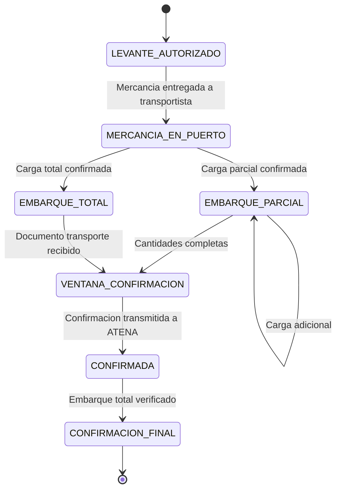
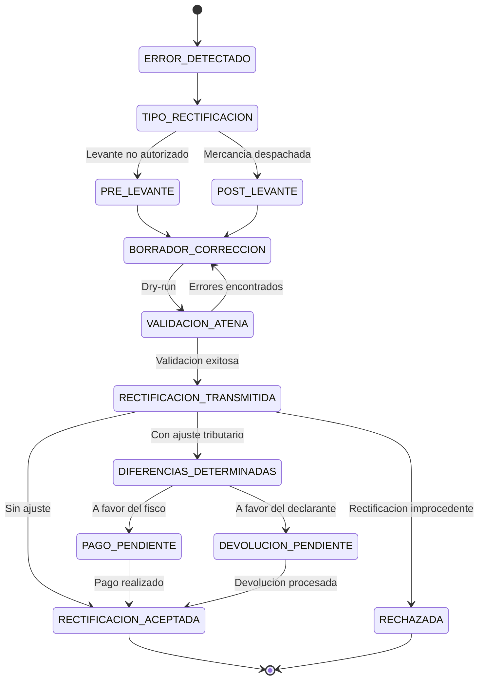
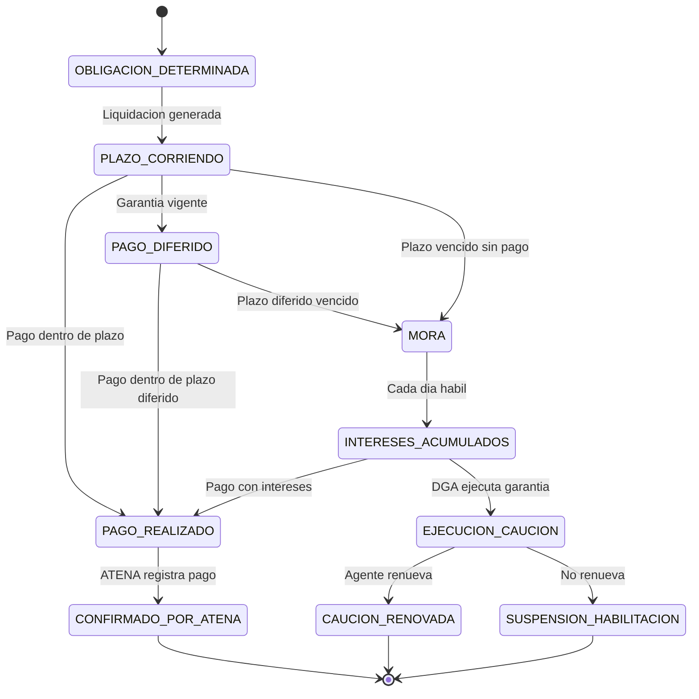
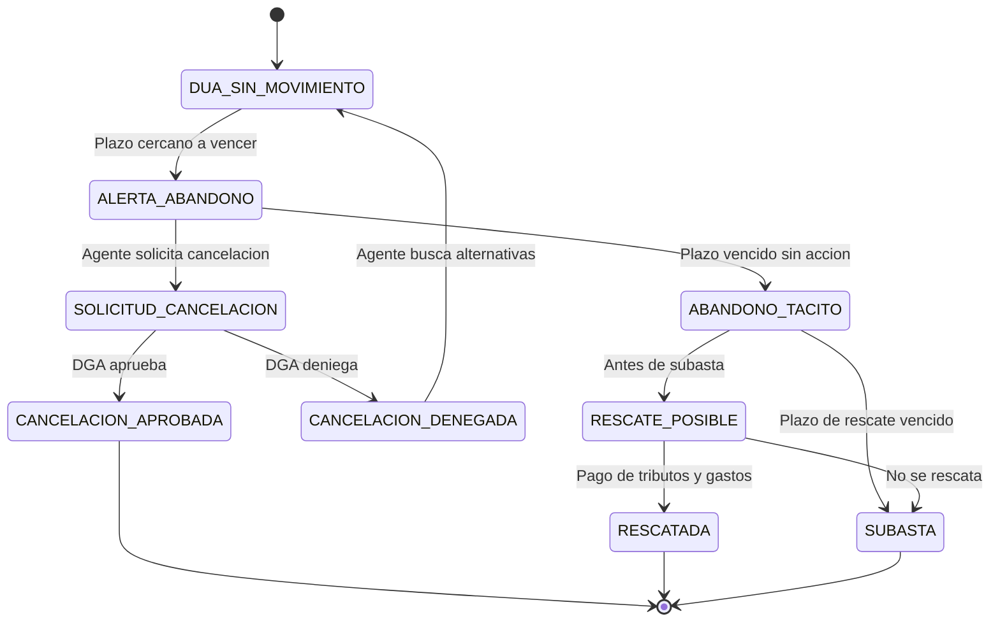

# Categoria C: Ciclo Post-Despacho

Procedimientos que ocurren despues de que la DUA ha sido transmitida y aceptada por ATENA. Estas operaciones cubren desde la confirmacion del embarque hasta la eventual cancelacion o anulacion de una declaracion, incluyendo rectificaciones y pago de tributos. Cada SOP describe tanto las interacciones digitales con la plataforma AduaNext y ATENA como las gestiones presenciales ante la DGA, navieras, bancos y otros actores del comercio exterior.

---

## SOP-C01: Confirmacion de Embarque {#sop-c01}

| Campo         | Valor                                                        |
|---------------|--------------------------------------------------------------|
| **Version**   | 1.0                                                          |
| **Base legal**| Procedimientos de Exportacion DGA, Capitulo 6; LGA Art. 37   |
| **Personas**  | Agente aduanero, Exportador, Naviera/Aerolinea, Depositario  |

> **Problema que resuelve:** Despues de que la mercancia ha sido cargada en el medio de transporte (buque o aeronave), la salida debe ser confirmada en ATENA dentro de una ventana especifica. Si el agente no confirma dentro del plazo, la DUA permanece abierta, generando problemas de cumplimiento, posibles sanciones y discrepancias contables para el exportador.

### Objetivo

Garantizar que toda DUA de exportacion con levante autorizado sea confirmada en ATENA dentro de la ventana establecida, reconciliando cantidades en caso de embarques parciales y cerrando el ciclo de la declaracion.

### Procedimiento

1. **Monitorear DUAs pendientes de embarque.** El agente abre el modulo de seguimiento en AduaNext y filtra las DUAs con estado `LEVANTE_AUTORIZADO` que aun no tienen confirmacion de embarque.

2. **Verificar disponibilidad fisica de la mercancia.** El agente confirma con el depositario (almacen fiscal o zona franca) que la mercancia ha sido retirada y esta en proceso de carga o ya fue entregada al transportista.

3. **Coordinar con el exportador la fecha de carga.** El agente contacta al exportador para confirmar la fecha estimada de carga al medio de transporte, numero de reserva (booking) y datos del buque/vuelo.

4. **Solicitar confirmacion de carga a la naviera o aerolinea.** El agente envia solicitud formal a la naviera o aerolinea para que confirme la carga de la mercancia y emita el documento de transporte.

5. **Recibir el B/L "on board" o AWB emitido.** La naviera entrega el Bill of Lading con notacion "on board" indicando fecha de zarpe, o la aerolinea entrega el Air Waybill con fecha de vuelo. El agente verifica que los datos coincidan con la DUA.

6. **Verificar datos del documento de transporte contra la DUA.** El agente compara: peso bruto, numero de bultos, descripcion de mercancia, consignatario, puerto/aeropuerto de destino. Cualquier discrepancia debe resolverse antes de confirmar.

7. **Coordinar mensaje COARRI EDIFACT (solo maritimo).** Para embarques maritimos, el agente coordina con la naviera la transmision del mensaje COARRI (Container Discharge/Loading Report) al sistema portuario, el cual alimenta a ATENA con la confirmacion de carga.

8. **Registrar datos de embarque en AduaNext.** El agente ingresa en la plataforma: numero de B/L o AWB, fecha de carga, nombre del buque/vuelo, puerto/aeropuerto de salida, y peso/bultos efectivamente embarcados.

9. **Evaluar si el embarque es parcial o total.** AduaNext compara las cantidades embarcadas contra las declaradas en la DUA. Si las cantidades son inferiores, el sistema marca el embarque como parcial y solicita justificacion.

10. **Documentar embarque parcial (si aplica).** En caso de embarque parcial, el agente registra las cantidades pendientes, la razon del despacho parcial y la fecha estimada del siguiente embarque.

11. **Preparar solicitud de confirmacion en ATENA.** AduaNext genera el payload de confirmacion con todos los datos del embarque, incluyendo referencias al documento de transporte y cantidades reconciliadas.

12. **Transmitir confirmacion a ATENA via gRPC.** La plataforma invoca `HaciendaApi.ConfirmDeparture` con los datos de embarque. ATENA valida y responde con el nuevo estado de la DUA.

13. **Verificar respuesta de ATENA.** El agente confirma que ATENA ha registrado la confirmacion exitosamente. Si ATENA rechaza, el agente revisa los errores reportados y corrige antes de retransmitir.

14. **Actualizar estado en AduaNext.** La plataforma actualiza el estado de la DUA a `EMBARQUE_PARCIAL` o `EMBARQUE_TOTAL` segun corresponda, y registra la marca temporal de confirmacion en ATENA.

15. **Monitorear ventana de confirmacion.** AduaNext calcula el tiempo restante en la ventana de confirmacion segun la aduana de salida y alerta al agente si el plazo esta por vencer.

16. **Solicitar extension de ventana (si necesario).** Si el agente no puede confirmar dentro del plazo por causas justificadas (demora del buque, condiciones climaticas, paro portuario), presenta solicitud de extension ante la aduana de salida con documentacion de respaldo.

17. **Reconciliar embarques parciales sucesivos.** Para cada embarque parcial adicional, el agente repite los pasos 8-14, y AduaNext acumula las cantidades embarcadas hasta completar el total declarado.

18. **Confirmar embarque final.** Cuando las cantidades acumuladas igualan las declaradas, AduaNext prepara la confirmacion final que cierra la DUA.

19. **Transmitir confirmacion final a ATENA.** La plataforma invoca `HaciendaApi.ConfirmFinalDeparture`, y ATENA mueve la DUA al estado `CONFIRMACION_FINAL`.

20. **Generar comprobante de cierre para el exportador.** AduaNext genera un reporte de cierre con todos los embarques realizados, documentos de transporte, fechas de confirmacion y estado final en ATENA, y lo envia al exportador.

21. **Archivar documentacion de embarque.** Todos los B/L, AWB, mensajes COARRI y comprobantes de confirmacion se vinculan a la DUA en el repositorio documental de AduaNext con retencion minima de 5 anos.

22. **Registrar en bitacora de auditoria.** AduaNext genera un registro hash-chain (SHA-256) con la confirmacion de embarque, documentos asociados y timestamps, asegurando trazabilidad completa para futuras fiscalizaciones.

### Reglas de negocio

- La ventana de confirmacion tiene un plazo maximo que varia segun la aduana de salida. El agente debe confirmar antes del cierre de la ventana o solicitar extension.
- Los embarques parciales requieren reconciliacion de cantidades. No se puede confirmar embarque final si las cantidades embarcadas no coinciden con las declaradas (salvo rectificacion previa).
- El agente debe conservar copia del B/L "on board" o AWB como respaldo de la confirmacion.
- Si la mercancia no es embarcada dentro del plazo, la DUA puede caer en abandono (ver SOP-C04).
- El mensaje COARRI es obligatorio para embarques maritimos en contenedor y debe ser transmitido por la naviera.

### Diagrama de estados

### Criterios de validacion

- [ ] Todas las DUAs con levante autorizado aparecen en el monitor de seguimiento
- [ ] El sistema alerta cuando la ventana de confirmacion tiene menos de 24 horas restantes
- [ ] Los datos del B/L o AWB coinciden con los de la DUA antes de transmitir
- [ ] Los embarques parciales acumulan cantidades correctamente
- [ ] La confirmacion final solo se permite cuando cantidades embarcadas = cantidades declaradas
- [ ] ATENA responde con estado `CONFIRMACION_FINAL` tras la ultima confirmacion
- [ ] El comprobante de cierre se genera y envia al exportador automaticamente
- [ ] La bitacora de auditoria registra cada paso con hash SHA-256

---

## SOP-C02: Rectificacion (Contra-escritura) {#sop-c02}

| Campo         | Valor                                                                          |
|---------------|--------------------------------------------------------------------------------|
| **Version**   | 1.0                                                                            |
| **Base legal**| CAUCA Art. 57; LGA Art. 59; Reglamento al CAUCA Art. 329-335                   |
| **Personas**  | Agente aduanero, Exportador/Importador, Inspector DGA, Funcionario de Aduana   |

> **Problema que resuelve:** Despues de la transmision de una DUA, pueden detectarse errores en datos como clasificacion arancelaria, valor, peso, cantidad o descripcion de mercancia. Las correcciones pre-levante son relativamente simples, pero las correcciones post-levante (contra-escritura) requieren justificacion formal y pueden desencadenar re-inspeccion, ajustes tributarios e intereses. El agente debe saber cuando la rectificacion es libre, cuando genera penalidades y como ejecutarla correctamente.

### Objetivo

Corregir errores en declaraciones aduaneras de forma oportuna y conforme a la normativa, minimizando el riesgo de sanciones, ajustes tributarios y re-inspecciones innecesarias.

### Procedimiento

1. **Detectar el error en la DUA.** El agente, el exportador o un proceso de auditoria interna de AduaNext identifica una discrepancia entre la DUA transmitida y la documentacion de soporte o la realidad de la mercancia.

2. **Clasificar el tipo de error.** AduaNext categoriza el error: datos de identificacion (nombre, NIT), clasificacion arancelaria, valor aduanero, peso/cantidad, descripcion de mercancia, regimen, datos de transporte, u otros.

3. **Determinar el momento procesal.** El sistema verifica el estado de la DUA en ATENA: si el levante aun no ha sido autorizado (pre-levante) o si la mercancia ya fue despachada (post-levante). Este factor determina el tipo de rectificacion.

4. **Evaluar impacto tributario.** AduaNext calcula la diferencia tributaria entre la DUA original y la corregida: si hay diferencia a favor del fisco, a favor del declarante, o neutral. Esto determina si habra ajuste de tributos, intereses y posible sancion.

5. **Preparar borrador de rectificacion.** El agente elabora la DUA corregida en AduaNext. La plataforma resalta visualmente todas las diferencias entre la version original y la corregida, campo por campo.

6. **Recopilar documentacion de soporte.** El agente reune los documentos que justifican la correccion: factura corregida, certificado de origen enmendado, informe de peso certificado, dictamen de clasificacion, u otros segun el tipo de error.

7. **Redactar justificacion formal (post-levante).** Para rectificaciones post-levante, el agente prepara una justificacion escrita explicando la razon del error, cuando fue detectado y por que la rectificacion es procedente conforme al Reglamento.

8. **Ejecutar validacion previa (dry-run).** AduaNext invoca `HaciendaApi.ValidateRectification` en modo simulacion para verificar que la rectificacion sea formalmente aceptable por ATENA antes de transmitirla oficialmente.

9. **Analizar resultado del dry-run.** El agente revisa las advertencias y errores reportados por la validacion. Si hay rechazos, corrige el borrador y repite la validacion hasta obtener resultado limpio.

10. **Obtener autorizacion del declarante.** Antes de transmitir, el agente obtiene la autorizacion explicita del exportador o importador para proceder con la rectificacion, informandole del posible impacto tributario.

11. **Transmitir rectificacion a ATENA.** AduaNext invoca `HaciendaApi.RectifyDeclaration` con la DUA corregida, la justificacion y los documentos de soporte digitalizados.

12. **Monitorear respuesta de ATENA.** El sistema espera la respuesta de ATENA: aceptacion inmediata, solicitud de informacion adicional, asignacion a revision por funcionario, o rechazo.

13. **Atender requerimiento de informacion adicional (si aplica).** Si ATENA solicita informacion adicional, el agente la prepara y transmite dentro del plazo establecido.

14. **Presentar documentacion fisica ante DGA (post-levante).** Para rectificaciones post-levante, el agente se presenta en la aduana correspondiente con los originales de la documentacion de soporte para revision por el funcionario asignado.

15. **Cooperar con re-inspeccion (si ordenada).** Si la DGA ordena re-inspeccion de la mercancia (cuando esta aun se encuentra bajo custodia), el agente coordina con el depositario el acceso a la mercancia y acompana al inspector durante el reconocimiento.

16. **Recibir resolucion de ATENA.** ATENA emite la resolucion: rectificacion aceptada (con o sin ajuste tributario) o rechazada (con fundamento legal).

17. **Procesar ajuste tributario (si aplica).** Si la rectificacion genera diferencias tributarias a favor del fisco, AduaNext calcula el monto a pagar incluyendo intereses desde la fecha de aceptacion de la DUA original (Art. 61). El agente procede al pago conforme a SOP-C03.

18. **Solicitar devolucion (si aplica).** Si la rectificacion genera diferencias a favor del declarante, el agente prepara la solicitud de devolucion conforme a CAUCA Art. 63, con prescripcion de 4 anos.

19. **Actualizar registros en AduaNext.** La plataforma actualiza la DUA con la version rectificada, mantiene la version original como referencia historica (patron append-only), y registra la resolucion de ATENA.

20. **Notificar al declarante.** AduaNext notifica al exportador o importador el resultado de la rectificacion, incluyendo cualquier ajuste tributario y el plazo de pago si aplica.

21. **Generar registro de auditoria.** El sistema crea un registro hash-chain con ambas versiones de la DUA (original y rectificada), documentos de soporte, justificacion, resolucion de ATENA y resultado tributario.

22. **Evaluar leccion aprendida.** El agente documenta la causa raiz del error para prevenir recurrencias: error de captura, informacion incorrecta del cliente, cambio de criterio de clasificacion, etc.

!!! warning "Solidaridad del agente"
    Conforme al Art. 36 de la LGA, el agente aduanero es solidariamente responsable por las diferencias tributarias resultantes de errores en la declaracion. La rectificacion voluntaria antes de fiscalizacion puede atenuar pero no eliminar esta responsabilidad.

!!! info "Patron append-only"
    AduaNext nunca modifica la DUA original. Cada rectificacion genera un nuevo evento con la version corregida. El historial completo es inmutable y auditable.

### Reglas de negocio

- La declaracion aduanera es en principio definitiva (CAUCA Art. 57). La rectificacion solo procede en los casos establecidos por el Reglamento.
- Las rectificaciones pre-levante son mas simples y generalmente no requieren justificacion formal ni re-inspeccion.
- Las rectificaciones post-levante pueden generar ajustes tributarios, intereses y re-inspeccion.
- La solidaridad del agente (Art. 36 LGA) se extiende a las diferencias determinadas por rectificacion.
- El sistema debe preservar ambas versiones de la DUA (patron append-only), nunca sobrescribir.
- Las diferencias tributarias a favor del fisco generan intereses desde la fecha de aceptacion de la DUA original.
- Las diferencias a favor del declarante son objeto de devolucion conforme a CAUCA Art. 63.

### Diagrama de estados

### Criterios de validacion

- [ ] El sistema identifica y clasifica correctamente el tipo de error
- [ ] La comparacion visual original vs. corregida muestra todas las diferencias
- [ ] El dry-run detecta rechazos antes de la transmision oficial
- [ ] Las diferencias tributarias se calculan correctamente, incluyendo intereses
- [ ] La version original de la DUA se preserva integra (patron append-only)
- [ ] La justificacion formal se genera para rectificaciones post-levante
- [ ] La resolucion de ATENA se registra en el sistema
- [ ] El registro de auditoria contiene ambas versiones con hash SHA-256
- [ ] El exportador/importador recibe notificacion del resultado

---

## SOP-C03: Pago de Tributos y Diferencias {#sop-c03}

| Campo         | Valor                                                                              |
|---------------|------------------------------------------------------------------------------------|
| **Version**   | 1.0                                                                                |
| **Base legal**| LGA Art. 53-61, 66-67; CAUCA Art. 26-35                                            |
| **Personas**  | Agente aduanero, Exportador/Importador, Entidad bancaria, Funcionario de Aduana    |

> **Problema que resuelve:** Las DUAs de exportacion pueden tener tributos minimos, pero los ajustes derivados de verificacion, rectificacion o fiscalizacion generan obligaciones tributarias que deben pagarse dentro de plazos estrictos. El agente es solidariamente responsable (Art. 36 LGA). El pago tardio genera intereses desde la fecha de aceptacion de la DUA (Art. 61). El no pago puede resultar en ejecucion de la caucion (Art. 66), poniendo en riesgo la habilitacion profesional del agente.

### Objetivo

Asegurar el pago oportuno y correcto de todas las obligaciones tributarias aduaneras, calcular intereses cuando aplique, y proteger la caucion del agente mediante el cumplimiento estricto de los plazos legales.

### Procedimiento

1. **Identificar obligacion tributaria.** AduaNext detecta la obligacion tributaria: puede originarse de la DUA misma (DAI, selectivo de consumo, IVA si aplica), de una rectificacion con diferencias (SOP-C02), o de una determinacion por fiscalizacion (SOP-D01).

2. **Calcular tributos base.** El sistema calcula cada tributo aplicable segun la clasificacion arancelaria, el valor aduanero y el regimen declarado: Derechos Arancelarios a la Importacion (DAI), Impuesto Selectivo de Consumo, IVA, y cualquier otro tributo especifico.

3. **Determinar si hay diferencias tributarias.** Si la obligacion proviene de una rectificacion o fiscalizacion, AduaNext calcula la diferencia entre los tributos originalmente pagados y los tributos que debieron pagarse.

4. **Calcular intereses moratorios.** Si el pago es extemporaneo, el sistema calcula intereses desde la fecha de aceptacion de la DUA (Art. 61 LGA), aplicando la tasa vigente publicada por el Banco Central de Costa Rica.

5. **Generar liquidacion detallada.** AduaNext produce un documento de liquidacion con: tributo base, tasa aplicable, valor aduanero, diferencias (si aplica), intereses acumulados, y monto total a pagar.

6. **Verificar disponibilidad de pago diferido.** Si el declarante tiene garantia anual del 20% vigente (Art. 61 bis LGA), el sistema verifica si puede acogerse al pago diferido de hasta 1 mes.

7. **Presentar liquidacion al declarante.** El agente comparte la liquidacion con el exportador o importador, explicando el desglose de tributos, diferencias e intereses, y el plazo de pago.

8. **Obtener conformidad del declarante.** El exportador o importador revisa y acepta la liquidacion. Si hay desacuerdo, el agente explica la base legal y, de persistir, el declarante puede interponer recurso (ver SOP-D03).

9. **Generar referencia de pago para SINPE.** AduaNext genera el codigo de referencia bancaria compatible con el Sistema Nacional de Pagos Electronicos (SINPE) para que el pago se realice electronicamente.

10. **Realizar pago electronico.** El declarante o el agente (segun acuerdo) efectua el pago a traves de la plataforma bancaria electronica, utilizando la referencia SINPE generada.

11. **Realizar pago presencial en banco (alternativa).** Si el pago electronico no es posible, el agente o declarante se presenta en la entidad bancaria autorizada con la boleta de pago generada por AduaNext y realiza el deposito.

12. **Obtener comprobante de pago.** Independientemente del canal, se obtiene el comprobante de pago (recibo bancario o confirmacion electronica) con numero de transaccion, fecha, monto y referencia.

13. **Registrar pago en AduaNext.** El agente ingresa los datos del comprobante de pago en la plataforma: numero de transaccion, fecha de pago, monto pagado, entidad bancaria.

14. **Transmitir confirmacion de pago a ATENA.** AduaNext invoca `HaciendaApi.ConfirmPayment` con la referencia de pago para que ATENA registre el cumplimiento de la obligacion tributaria.

15. **Verificar confirmacion de ATENA.** El sistema confirma que ATENA ha registrado el pago. Si ATENA no confirma, el agente investiga con el banco y con la aduana para resolver la discrepancia.

16. **Presentar comprobante fisico ante DGA (si requerido).** En algunos casos, la aduana puede solicitar la presentacion fisica del comprobante de pago. El agente se presenta con el original y copia.

17. **Monitorear plazos de pago diferido.** Si se utilizo pago diferido, AduaNext monitorea el plazo de 1 mes y alerta al agente 5 dias antes del vencimiento.

18. **Alertar por riesgo de mora.** Si el plazo de pago esta por vencer sin que se haya realizado el pago, AduaNext genera alertas escaladas: al agente, al declarante y al supervisor de cumplimiento.

19. **Calcular intereses actualizados por mora.** Si se incurre en mora, el sistema actualiza automaticamente el calculo de intereses dia a dia hasta la fecha efectiva de pago.

20. **Alertar por riesgo de ejecucion de caucion.** Si la mora persiste y la DGA inicia proceso de ejecucion de caucion (Art. 66 LGA), AduaNext alerta al agente de forma critica. La caucion es la garantia de la habilitacion profesional.

21. **Gestionar renovacion de caucion (si ejecutada).** Si la caucion es ejecutada, el agente debe renovarla inmediatamente para mantener su habilitacion. AduaNext registra el evento y bloquea nuevas operaciones hasta la renovacion.

22. **Generar reporte de cumplimiento tributario.** La plataforma genera un reporte periodico con todas las obligaciones tributarias, pagos realizados, intereses pagados y estado de la caucion, para control del agente y del declarante.

23. **Archivar documentacion de pago.** Todos los comprobantes de pago, liquidaciones y confirmaciones de ATENA se vinculan a la DUA correspondiente con retencion minima de 5 anos.

24. **Registrar en bitacora de auditoria.** AduaNext crea un registro hash-chain con la obligacion, calculo de tributos, pago realizado y confirmacion de ATENA, asegurando trazabilidad completa.

!!! danger "Responsabilidad solidaria del agente"
    Conforme al Art. 36 de la LGA, el agente aduanero es solidariamente responsable por los tributos que resulten de las declaraciones que tramita. El incumplimiento de pago puede resultar en ejecucion de la caucion (Art. 66) y suspension de la habilitacion profesional.

!!! info "Prescripcion"
    La obligacion tributaria aduanera prescribe a los 4 anos contados desde la fecha de aceptacion de la declaracion (CAUCA Art. 62, LGA Art. 62). Sin embargo, la prescripcion se interrumpe por cualquier accion administrativa de cobro.

### Reglas de negocio

- La obligacion tributaria nace en el momento de la aceptacion de la DUA por ATENA (CAUCA Art. 27).
- La determinacion de tributos es por autodeterminacion del agente (CAUCA Art. 32). Errores en la autodeterminacion generan responsabilidad solidaria.
- La prescripcion de la obligacion tributaria es de 4 anos (LGA Art. 62, CAUCA Art. 62).
- El pago diferido requiere garantia anual del 20% del monto estimado de tributos (Art. 61 bis LGA).
- El Estado tiene prioridad sobre otros acreedores en el cobro de tributos aduaneros (Art. 67 LGA).
- Los intereses corren desde la fecha de aceptacion de la DUA, no desde la fecha de determinacion de la diferencia.
- La ejecucion de la caucion obliga a su renovacion inmediata so pena de suspension de habilitacion.

### Diagrama de estados

### Criterios de validacion

- [ ] El sistema calcula correctamente DAI, selectivo de consumo e IVA segun clasificacion arancelaria
- [ ] Los intereses moratorios se calculan desde la fecha de aceptacion de la DUA
- [ ] La referencia SINPE se genera correctamente y es aceptada por el sistema bancario
- [ ] ATENA confirma el registro del pago tras la transmision
- [ ] El pago diferido solo se habilita si existe garantia anual vigente del 20%
- [ ] Las alertas de mora se disparan 5 dias antes del vencimiento del plazo
- [ ] Las alertas de ejecucion de caucion se disparan inmediatamente al detectar el riesgo
- [ ] El reporte de cumplimiento tributario refleja todos los movimientos del periodo
- [ ] La bitacora de auditoria registra cada paso con hash SHA-256

---

## SOP-C04: Cancelacion y Anulacion de DUA {#sop-c04}

| Campo         | Valor                                                                              |
|---------------|------------------------------------------------------------------------------------|
| **Version**   | 1.0                                                                                |
| **Base legal**| LGA Art. 56; CAUCA Art. 94-96                                                      |
| **Personas**  | Agente aduanero, Exportador/Importador, Depositario, Funcionario de Aduana         |

> **Problema que resuelve:** En ocasiones una DUA debe ser cancelada porque el embarque fue cancelado, la mercancia no fue exportada, o las condiciones de la operacion cambiaron. Si la DUA no se cancela formalmente, la mercancia puede caer en abandono tacito (Art. 56 LGA), generando obligaciones tributarias, posible subasta, y dano al historial del agente ante la DGA.

### Objetivo

Cancelar o anular DUAs que no se materializaran, evitando el abandono tacito de mercancia, protegiendo al exportador de obligaciones tributarias innecesarias y manteniendo el historial limpio del agente ante la DGA.

### Procedimiento

1. **Detectar DUAs sin movimiento.** AduaNext monitorea automaticamente todas las DUAs activas y alerta cuando una DUA no registra movimiento (embarque, levante, pago) por un periodo que se acerca al umbral de abandono tacito.

2. **Calcular tiempo restante para abandono.** El sistema calcula el plazo restante antes de que la mercancia caiga en abandono tacito: 15 dias habiles para mercancia no sometida a regimen (Art. 56.a LGA), u otros plazos segun el regimen y tipo de deposito.

3. **Verificar estado de la mercancia con el depositario.** El agente contacta al depositario (almacen fiscal, zona franca o deposito aduanero) para confirmar que la mercancia aun se encuentra bajo custodia y en que condiciones.

4. **Consultar con el exportador/importador.** El agente contacta al declarante para determinar el motivo de la inactividad: embarque cancelado, cambio de destino, problemas con la mercancia, desistimiento de la operacion, u otro.

5. **Evaluar opciones disponibles.** Segun la situacion, el agente determina la accion apropiada: cancelacion voluntaria de la DUA, cambio de regimen, rectificacion con nuevo destino, o dejar que la DUA siga su curso normal.

6. **Documentar motivo de cancelacion.** El agente prepara una explicacion formal del motivo de la cancelacion, respaldada por documentacion: carta del exportador desistiendo de la operacion, cancelacion de booking por la naviera, imposibilidad de cumplir con requisitos fitosanitarios, etc.

7. **Obtener certificacion del depositario.** El depositario emite una constancia certificando que la mercancia aun se encuentra bajo su custodia, no ha sido retirada, y esta disponible para disposicion por la autoridad aduanera.

8. **Preparar solicitud de cancelacion.** AduaNext genera la solicitud formal de cancelacion con todos los datos de la DUA, el motivo documentado, la certificacion del depositario y los documentos de respaldo.

9. **Transmitir solicitud a ATENA.** AduaNext invoca `HaciendaApi.RequestCancellation` con la solicitud de cancelacion. ATENA registra la solicitud y la asigna a un funcionario para revision.

10. **Monitorear estado de la solicitud.** El sistema monitorea la respuesta de ATENA y alerta al agente sobre cualquier cambio de estado o requerimiento adicional.

11. **Presentar documentacion fisica ante aduana.** El agente se presenta en la aduana correspondiente con la solicitud impresa, los documentos de soporte originales y la certificacion del depositario para que el funcionario asignado revise el expediente.

12. **Atender requerimiento de informacion adicional.** Si el funcionario solicita informacion o documentacion adicional, el agente la prepara y presenta dentro del plazo otorgado.

13. **Recibir resolucion de la aduana.** La aduana emite resolucion: cancelacion aprobada (la DUA se cierra sin efecto) o cancelacion denegada (la DUA sigue activa y los plazos continuan corriendo).

14. **Procesar cancelacion aprobada.** Si la cancelacion es aprobada, AduaNext actualiza el estado de la DUA a `CANCELACION_APROBADA`, y el depositario recibe instrucciones sobre la disposicion de la mercancia.

15. **Gestionar cancelacion denegada.** Si la cancelacion es denegada, el agente evalua las alternativas: completar la operacion original, rectificar la DUA, o preparar recurso contra la denegacion (ver SOP-D03).

16. **Monitorear abandono tacito (si no se cancela).** Si la DUA no es cancelada y no hay movimiento, AduaNext alerta cuando la mercancia cae formalmente en abandono tacito conforme al Art. 56 LGA.

17. **Alertar al declarante sobre abandono.** AduaNext notifica al exportador o importador que la mercancia ha caido en abandono tacito y que existe un plazo de rescate antes de que proceda la subasta.

18. **Gestionar rescate de mercancia.** Si el declarante decide rescatar la mercancia, el agente presenta solicitud de rescate ante la aduana antes del dia senalado para la subasta (CAUCA Art. 96), pagando los tributos, intereses y gastos de almacenamiento acumulados.

19. **Coordinar subasta (si no se rescata).** Si la mercancia no es rescatada, AduaNext registra que la mercancia sera subastada por la DGA. El agente documenta el resultado para efectos de cierre del expediente.

20. **Evaluar mercancia no susceptible de abandono.** AduaNext verifica si la mercancia pertenece a las categorias excluidas de abandono: mercancia de contrabando, armas, sustancias controladas u otras que por su naturaleza no pueden ser abandonadas.

21. **Actualizar registros en AduaNext.** La plataforma actualiza el estado final de la DUA: cancelada, abandonada (tacita o voluntariamente), rescatada, o subastada, y cierra el expediente.

22. **Notificar a todas las partes.** AduaNext genera notificaciones al exportador, al depositario y a cualquier otro involucrado sobre el estado final de la DUA y la mercancia.

23. **Registrar en bitacora de auditoria.** Se genera un registro hash-chain con todo el proceso de cancelacion o abandono, incluyendo solicitudes, resoluciones, documentos y resultado final.

24. **Analizar impacto en indicadores del agente.** AduaNext registra la cancelacion o abandono en el perfil de cumplimiento del agente, que puede afectar su calificacion de riesgo ante la DGA para futuras operaciones.

!!! warning "Abandono tacito"
    Conforme al Art. 56 de la LGA, la mercancia que no sea sometida a un regimen aduanero dentro de los plazos establecidos cae en abandono tacito y pasa a disposicion del Estado. El abandono tacito genera obligaciones tributarias y puede resultar en subasta de la mercancia.

!!! info "Rescate de mercancia"
    Conforme al CAUCA Art. 96, el declarante puede rescatar la mercancia abandonada antes del dia senalado para la subasta, pagando los tributos, intereses, multas y gastos de almacenamiento acumulados. Despues de la subasta, el rescate no es posible.

### Reglas de negocio

- El abandono voluntario (cesion explicita al fisco) se rige por CAUCA Art. 94. Es una decision irrevocable.
- El abandono tacito se produce cuando la mercancia no es sometida a regimen dentro de los plazos del Art. 56 LGA: 15 dias habiles para mercancia general.
- El rescate es posible hasta antes del dia de la subasta (CAUCA Art. 96).
- La mercancia producto de contrabando o defraudacion no puede ser abandonada ni rescatada.
- La cancelacion requiere que la mercancia aun este bajo custodia del depositario.
- Si la DUA tenia tributos pagados, la cancelacion puede generar derecho a devolucion.
- El abandono afecta negativamente el perfil de riesgo del agente ante la DGA.

### Diagrama de estados

### Criterios de validacion

- [ ] El sistema detecta automaticamente DUAs sin movimiento y calcula el plazo restante para abandono
- [ ] La alerta de abandono se dispara con al menos 5 dias habiles de anticipacion
- [ ] La solicitud de cancelacion incluye toda la documentacion requerida
- [ ] ATENA registra la solicitud y responde con estado de la resolucion
- [ ] El depositario es notificado del resultado de la cancelacion
- [ ] El sistema alerta sobre el plazo de rescate antes de la subasta
- [ ] El rescate calcula correctamente tributos, intereses y gastos de almacenamiento
- [ ] El perfil de cumplimiento del agente refleja cancelaciones y abandonos
- [ ] La bitacora de auditoria registra todo el proceso con hash SHA-256
