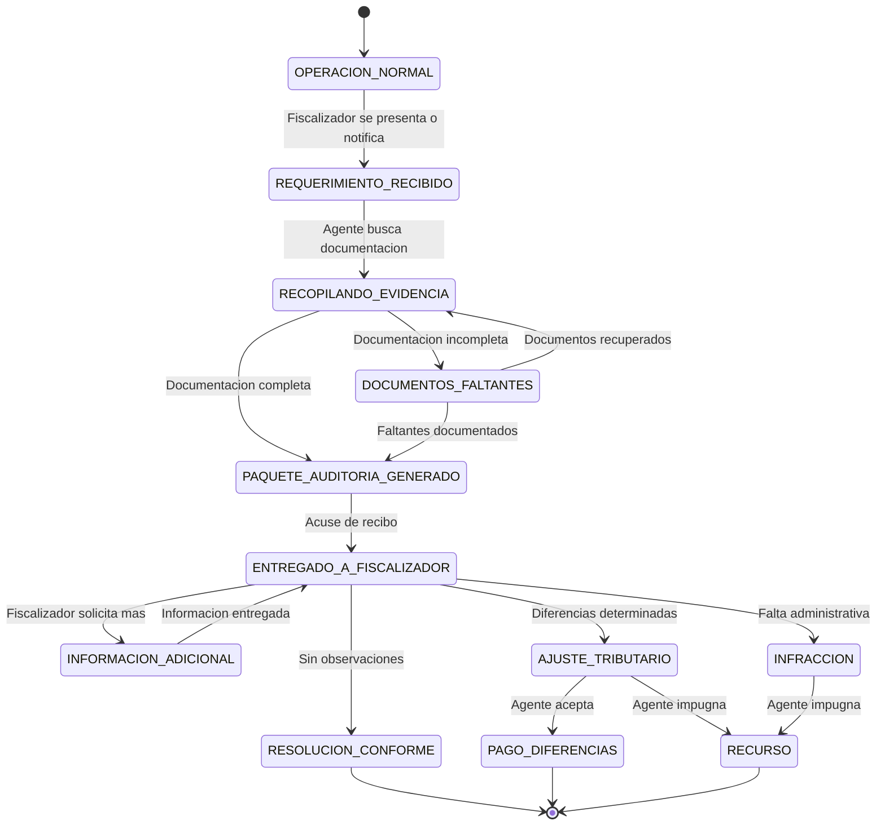
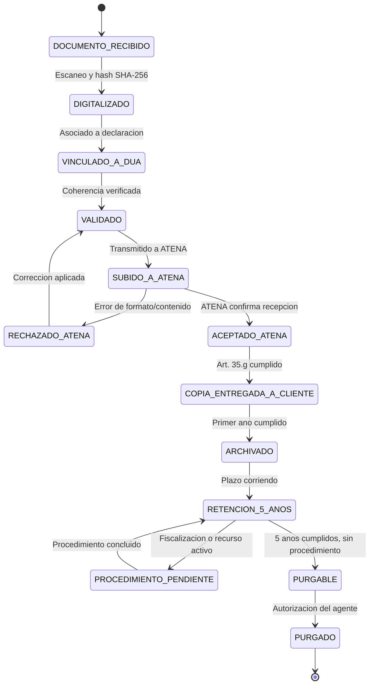
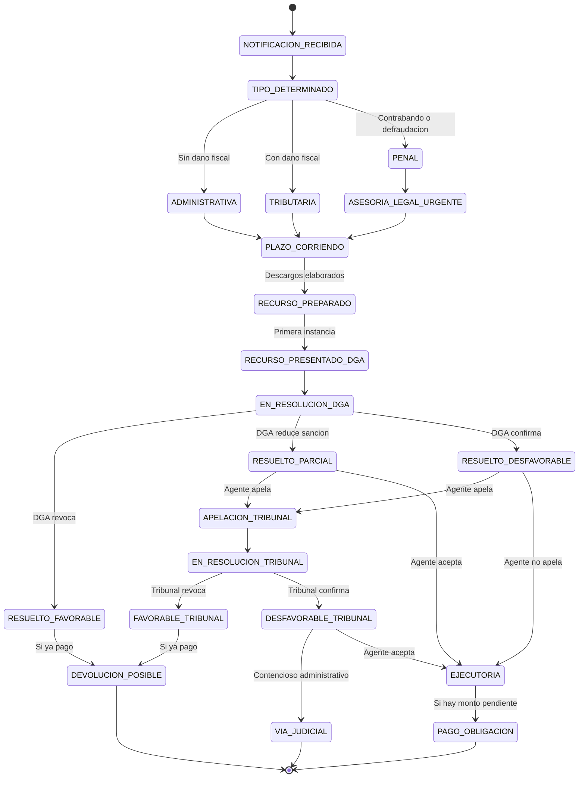

# Categoria D: Compliance Continuo

Procedimientos de cumplimiento regulatorio continuo que todo agente aduanero debe mantener durante toda su vida profesional. A diferencia de las categorias anteriores, que cubren operaciones puntuales, estos SOPs describen obligaciones permanentes: la preparacion para fiscalizaciones, la gestion de documentos de soporte con retencion legal, y la respuesta a infracciones y recursos administrativos. El cumplimiento de estos procedimientos es la base de la supervivencia profesional del agente.

---

## SOP-D01: Control A Posteriori (Fiscalizacion) {#sop-d01}

| Campo         | Valor                                                                                        |
|---------------|----------------------------------------------------------------------------------------------|
| **Version**   | 1.0                                                                                          |
| **Base legal**| LGA Art. 24, 24bis, 30, 59; CAUCA Art. 61-62                                                |
| **Personas**  | Agente aduanero, Fiscalizador DGA, Exportador/Importador, Depositario, Asesor legal          |

> **Problema que resuelve:** La Direccion de Fiscalizacion de la DGA puede auditar CUALQUIER declaracion dentro de los 4 anos posteriores a su aceptacion (CAUCA Art. 62). El fiscalizador puede presentarse sin aviso previo (control permanente) o mediante requerimiento programado (auditoria post-despacho). Debe solicitar registros, libros, facturas, medios electronicos y documentos de clasificacion. Si el agente no puede producir la evidencia solicitada, se configura una infraccion administrativa. Esta es la interaccion mas critica con la DGA: la habilitacion profesional, la caucion y la reputacion del agente estan en juego.

### Objetivo

Mantener al agente permanentemente preparado para cualquier fiscalizacion, con toda la documentacion organizada, digitalmente accesible y respaldada por una cadena de auditoria inmutable, de modo que pueda responder a cualquier requerimiento de la DGA de forma completa, oportuna y profesional.

### Procedimiento

1. **Mantener repositorio documental actualizado.** El agente verifica periodicamente que todas las DUAs procesadas en AduaNext tengan su documentacion de soporte completa y vinculada: facturas comerciales, documentos de transporte, certificados de origen, permisos, y justificaciones de clasificacion.

2. **Verificar integridad de la cadena de auditoria.** AduaNext ejecuta verificacion periodica (semanal) de la integridad de la cadena hash SHA-256 de todas las operaciones. Cualquier inconsistencia genera alerta inmediata al agente.

3. **Recibir requerimiento de fiscalizacion.** El fiscalizador de la DGA se presenta en las instalaciones del agente (control permanente, puede ser sin aviso) o envia requerimiento formal (auditoria programada) solicitando documentacion especifica.

4. **Registrar el requerimiento en AduaNext.** El agente ingresa inmediatamente los datos del requerimiento: numero de oficio, fecha, nombre del fiscalizador, declaraciones solicitadas, plazo otorgado, y tipo de fiscalizacion (permanente o programada).

5. **Verificar competencia del fiscalizador.** El agente verifica que el fiscalizador este debidamente acreditado: identificacion oficial, orden de fiscalizacion firmada por el Director de Fiscalizacion (Art. 24 LGA), y alcance del requerimiento.

6. **Identificar declaraciones solicitadas.** AduaNext busca en su repositorio todas las DUAs correspondientes al rango de fechas, numeros de registro, o criterios especificados en el requerimiento.

7. **Recopilar documentacion de soporte por DUA.** Para cada declaracion solicitada, el sistema reune automaticamente: DUA transmitida, documentos de soporte (factura, B/L, certificados), justificacion de clasificacion arancelaria, calculo de valor, pago de tributos, y cualquier rectificacion.

8. **Verificar completitud documental.** AduaNext genera un reporte de completitud indicando si alguna DUA tiene documentos faltantes. Los faltantes deben resolverse antes de entregar al fiscalizador.

9. **Resolver documentos faltantes.** Si hay documentos faltantes, el agente los solicita al exportador o importador, al depositario, o a otras fuentes. Si son irrecuperables, el agente documenta las gestiones realizadas para obtenerlos.

10. **Generar paquete de auditoria.** AduaNext genera el "paquete de auditoria" con toda la documentacion organizada por declaracion: formato JSON para datos estructurados y formato PDF para entrega fisica. Cada documento incluye su hash SHA-256 y la cadena de trazabilidad.

11. **Preparar respuesta escrita.** El agente redacta la respuesta formal al requerimiento, listando las declaraciones entregadas, los documentos incluidos, y cualquier observacion relevante. La respuesta se firma y sella.

12. **Coordinar visita del fiscalizador (si aplica).** Si el fiscalizador solicita visitar las instalaciones del cliente (exportador o importador), el agente coordina la visita, informa al cliente de sus derechos y obligaciones, y acompana al fiscalizador.

13. **Cooperar plenamente con el fiscalizador.** El agente debe cooperar de forma plena e irrestricta (Art. 30.n LGA). La obstruccion o negativa a proporcionar informacion constituye falta grave. El agente facilita acceso a libros, registros, medios magneticos y documentos electronicos (Art. 24.d LGA).

14. **Entregar paquete de auditoria al fiscalizador.** El agente entrega la documentacion fisica (impresa y empastada) y electronica (USB o medio optico) al fiscalizador, obteniendo acuse de recibo firmado.

15. **Registrar entrega en AduaNext.** El sistema registra la entrega: fecha, documentos entregados, acuse de recibo, y nombre del fiscalizador receptor.

16. **Atender solicitudes de informacion adicional.** Si durante la revision el fiscalizador solicita documentos o explicaciones adicionales, el agente los prepara y entrega dentro del plazo otorgado, registrando cada interaccion en AduaNext.

17. **Documentar declaraciones juradas de ubicacion de documentos.** Si el fiscalizador lo solicita, el agente indica bajo declaracion jurada la ubicacion de los documentos originales (Art. 30.m LGA).

18. **Monitorear plazos de respuesta.** AduaNext monitorea los plazos otorgados por el fiscalizador y genera alertas cuando un plazo esta por vencer, para evitar incumplimientos que configuren infraccion.

19. **Recibir resolucion de la fiscalizacion.** La Direccion de Fiscalizacion emite resolucion: operacion conforme (sin observaciones), ajuste tributario (diferencias determinadas), o infraccion administrativa (documentacion faltante, errores graves).

20. **Registrar resolucion en AduaNext.** El sistema registra la resolucion completa: numero de resolucion, fecha, resultado, montos de ajuste si aplica, y plazo para recurso.

21. **Procesar ajuste tributario (si aplica).** Si la fiscalizacion determina diferencias tributarias, el agente procede conforme a SOP-C03 para el pago de tributos y diferencias.

22. **Evaluar interposicion de recurso (si aplica).** Si el agente considera que la resolucion es incorrecta o desproporcionada, evalua con su asesor legal la interposicion de recurso conforme a SOP-D03.

23. **Actualizar perfil de riesgo.** AduaNext actualiza el perfil de riesgo del agente con el resultado de la fiscalizacion. Resultados adversos pueden incrementar la probabilidad de futuras fiscalizaciones.

24. **Documentar lecciones aprendidas.** El agente documenta las observaciones del fiscalizador, las debilidades detectadas y las acciones correctivas implementadas para prevenir recurrencias.

25. **Mejorar procesos internos.** Con base en los hallazgos de la fiscalizacion, el agente actualiza sus procedimientos internos, plantillas de documentacion y controles de calidad en AduaNext.

!!! danger "Cooperacion obligatoria"
    La cooperacion con el fiscalizador es obligatoria e irrestricta (Art. 30.n LGA). La negativa u obstruccion constituye falta grave que puede resultar en suspension de la habilitacion profesional del agente.

!!! info "Defensa clave: cadena de auditoria"
    La cadena de auditoria hash-chain (SHA-256) de AduaNext es la defensa mas poderosa del agente ante una fiscalizacion. Demuestra que cada decision fue documentada, justificada y preservada de forma inmutable desde el momento de la operacion.

!!! warning "Plazo de prescripcion"
    La DGA puede fiscalizar cualquier declaracion dentro de los 4 anos posteriores a su aceptacion (CAUCA Art. 62). El agente debe conservar toda la documentacion por al menos 5 anos (Art. 30.b LGA), y mas si hay procedimiento pendiente.

### Reglas de negocio

- Todas las operaciones aduaneras estan sujetas a revision a posteriori (LGA Art. 24).
- La DGA puede ejercer control permanente sin aviso previo o programar auditorias formales.
- El agente debe conservar registros por al menos 5 anos despues de la operacion (Art. 30.b LGA), y mas si hay procedimiento pendiente.
- La cooperacion es obligatoria: proporcionar libros, registros, medios magneticos y cualquier informacion solicitada (Art. 24.d, Art. 30.n).
- El agente debe indicar bajo declaracion jurada la ubicacion de documentos originales (Art. 30.m).
- La obstruccion a la fiscalizacion es falta grave.
- El plazo de prescripcion es de 4 anos desde la aceptacion de la declaracion (CAUCA Art. 62).
- La prescripcion se interrumpe por cualquier actuacion administrativa notificada al interesado (LGA Art. 63).

### Diagrama de estados

### Criterios de validacion

- [ ] Toda DUA procesada en AduaNext tiene documentacion de soporte completa y vinculada
- [ ] La verificacion semanal de integridad hash-chain se ejecuta sin errores
- [ ] El paquete de auditoria se genera en menos de 10 minutos para cualquier rango de fechas
- [ ] El formato de exportacion incluye JSON (datos) y PDF (entrega fisica)
- [ ] Cada documento exportado incluye su hash SHA-256 de verificacion
- [ ] El sistema alerta 48 horas antes del vencimiento de plazos de respuesta
- [ ] La resolucion de fiscalizacion se registra con todos sus datos
- [ ] El perfil de riesgo se actualiza automaticamente tras cada fiscalizacion
- [ ] Las lecciones aprendidas se documentan y vinculan a la fiscalizacion

---

## SOP-D02: Gestion de Documentos de Soporte {#sop-d02}

| Campo         | Valor                                                                                        |
|---------------|----------------------------------------------------------------------------------------------|
| **Version**   | 1.0                                                                                          |
| **Base legal**| LGA Art. 30, 32, 35.g; CAUCA Art. 54                                                        |
| **Personas**  | Agente aduanero, Exportador/Importador, Funcionario de Aduana, Fiscalizador                  |

> **Problema que resuelve:** Cada DUA requiere documentos de soporte: factura comercial, lista de empaque, B/L o AWB, certificado de origen, certificados fitosanitarios, permisos VUCE, entre otros. Estos documentos deben preservarse por al menos 5 anos y entregarse al cliente certificados con fecha, sello y firma (Art. 35.g LGA). La perdida de documentos equivale a la imposibilidad de defenderse ante una fiscalizacion, lo cual configura infraccion administrativa. Un sistema de gestion documental robusto es la base del cumplimiento profesional del agente.

### Objetivo

Implementar un ciclo de vida documental completo que asegure la recepcion, digitalizacion, vinculacion a DUA, subida a ATENA, entrega al cliente, archivo seguro y retencion legal de todos los documentos de soporte, cumpliendo con las obligaciones de los articulos 30, 32 y 35.g de la LGA.

### Procedimiento

1. **Recibir documentos del cliente.** El agente recibe los documentos de soporte del exportador o importador: pueden ser originales fisicos, copias certificadas, o documentos electronicos (PDF firmados digitalmente).

2. **Registrar recepcion en AduaNext.** El agente crea una entrada de recepcion documental indicando: remitente, fecha de recepcion, canal (fisico/electronico), cantidad de documentos, y DUA asociada (si ya existe).

3. **Verificar completitud segun regimen.** AduaNext valida que los documentos recibidos cumplan con el catalogo de documentos obligatorios segun el regimen aduanero aplicable.

#### Catalogo de documentos por regimen

| Regimen         | Documentos obligatorios                                                                                    | Base legal         |
|-----------------|------------------------------------------------------------------------------------------------------------|--------------------|
| Exportacion     | Factura comercial, lista de empaque, documento de transporte (B/L o AWB), permisos VUCE (si aplica)        | LGA Art. 30, 35.g  |
| Importacion     | Factura comercial, lista de empaque, B/L o AWB, certificado de origen (si TLC), permisos sanitarios/VUCE   | LGA Art. 30, 35.g  |
| Transito        | Documento de transporte, manifiesto de carga, autorizacion de transito, carta de porte                     | CAUCA Art. 54      |
| Zona franca     | Factura comercial, documento de transporte, autorizacion de regimen, inventario de ingreso                  | LGA Art. 30        |
| Reexportacion   | DUA de importacion original, factura de reexportacion, documento de transporte, inventario de salida        | LGA Art. 30        |

4. **Solicitar documentos faltantes al cliente.** Si la verificacion detecta documentos faltantes, AduaNext genera automaticamente una solicitud al cliente listando los documentos pendientes con su base legal.

5. **Digitalizar documentos fisicos.** El agente escanea todos los documentos fisicos recibidos en formato PDF con resolucion minima de 300 DPI, asegurando legibilidad completa. El nombre del archivo sigue la convencion: `[tipoDoc]-[numeroDUA]-[fecha].pdf`.

6. **Verificar calidad de digitalizacion.** El agente revisa que el escaneo sea legible, completo (todas las paginas), y que no haya cortes ni distorsiones. Los documentos ilegibles se rechazan y se solicita nueva copia al cliente.

7. **Calcular hash de cada documento.** AduaNext calcula el hash SHA-256 de cada documento digitalizado y lo registra en la cadena de auditoria. Este hash permite verificar la integridad del documento en cualquier momento futuro.

8. **Vincular documentos a la DUA.** El agente asocia cada documento a la DUA correspondiente en AduaNext. Un documento puede vincularse a multiples DUAs (por ejemplo, un certificado de origen que ampara varias exportaciones).

9. **Validar coherencia documental.** AduaNext verifica la coherencia entre documentos: que el peso de la factura coincida con la lista de empaque, que el numero de B/L sea consistente, que el valor FOB de la factura coincida con el declarado en la DUA, etc.

10. **Subir documentos a ATENA.** La plataforma invoca `HaciendaApi.UploadDocument` (multipart) para cada documento vinculado a la DUA que requiera transmision a ATENA, obteniendo confirmacion de recepcion de cada uno.

11. **Registrar confirmacion de ATENA.** AduaNext registra el identificador unico asignado por ATENA a cada documento subido, la fecha de recepcion, y el estado de aceptacion.

12. **Resolver rechazos de ATENA.** Si ATENA rechaza un documento (formato invalido, tamano excesivo, tipo no aceptado), el agente corrige el problema y reintenta la subida.

13. **Generar copias certificadas para el cliente.** Conforme al Art. 35.g de la LGA, el agente prepara copias certificadas de todos los documentos de la operacion para entrega al cliente. Cada copia lleva: sello del agente, firma, fecha de certificacion, y leyenda "Copia fiel del original".

14. **Entregar copias al cliente.** El agente entrega las copias certificadas al exportador o importador, obteniendo acuse de recibo firmado. La entrega puede ser fisica o electronica (PDF con firma digital del agente).

15. **Registrar entrega al cliente.** AduaNext registra la fecha de entrega, el canal utilizado, y el acuse de recibo. Este registro es evidencia de cumplimiento del Art. 35.g.

16. **Almacenar originales fisicos.** Los documentos originales fisicos se almacenan en ubicacion segura: archivador ignifugo, con control de acceso, organizado por ano y numero de DUA. El agente registra la ubicacion exacta en AduaNext.

17. **Aplicar politica de retencion.** AduaNext aplica la politica de retencion automatica: documentos activos durante el primer ano, archivados despues del primer ano, retencion obligatoria de 5 anos minimo (Art. 30.b LGA), extension automatica si hay procedimiento pendiente.

18. **Generar alerta de procedimiento pendiente.** Si una DUA esta involucrada en fiscalizacion, recurso o procedimiento judicial, AduaNext bloquea la purga de sus documentos hasta que el procedimiento concluya, sin importar el plazo de retencion.

19. **Verificar integridad periodica.** El sistema ejecuta verificaciones periodicas de integridad: compara los hashes almacenados con los hashes calculados de los documentos, alertando si hay corrupcion o alteracion.

20. **Preservar en medios opticos o magneticos.** Conforme al Art. 32 de la LGA, los documentos electronicos se preservan en medios opticos o magneticos con las mismas condiciones de integridad y accesibilidad que los originales.

21. **Facilitar acceso a autoridades.** Conforme al Art. 32, parrafo 2, la informacion almacenada en medios electronicos debe estar disponible para las autoridades aduaneras en cualquier momento. AduaNext permite exportacion inmediata ante requerimiento.

22. **Gestionar purga de documentos.** Cumplido el plazo de retencion legal (5 anos) y verificado que no hay procedimiento pendiente, AduaNext marca los documentos para purga. La purga requiere autorizacion explicita del agente.

23. **Ejecutar purga con registro.** Al purgar documentos, AduaNext genera un registro de destruccion con: lista de documentos purgados, fecha de destruccion, hash original de cada documento, y justificacion legal (cumplimiento del plazo).

24. **Generar reportes de inventario documental.** La plataforma produce reportes periodicos del estado del repositorio documental: total de documentos, distribucion por regimen, completitud, documentos proximos a vencer retencion, y alertas de integridad.

!!! warning "Retencion obligatoria"
    Los documentos de soporte deben conservarse por al menos 5 anos despues de la operacion (Art. 30.b LGA). Si hay procedimiento pendiente (fiscalizacion, recurso, proceso judicial), la retencion se extiende hasta la conclusion del procedimiento. La destruccion prematura de documentos configura infraccion grave.

!!! info "Visas consulares"
    Conforme al CAUCA Art. 54, las visas consulares NO son requisito para la validez de los documentos de soporte. No se debe solicitar ni exigir visa consular para ninguna operacion aduanera.

!!! info "Medios electronicos"
    El Art. 32 de la LGA autoriza la conservacion de documentos en medios opticos o magneticos. La informacion asi conservada tiene el mismo valor probatorio que el original, siempre que se garantice su integridad, inalterabilidad y accesibilidad.

### Reglas de negocio

- Los documentos deben preservarse por al menos 5 anos o mas si hay procedimiento pendiente (Art. 30.b LGA).
- La preservacion en medios electronicos tiene el mismo valor legal que el original (Art. 32 LGA).
- El agente debe entregar al cliente copias certificadas con fecha, sello y firma (Art. 35.g LGA).
- Las visas consulares NO son requisito (CAUCA Art. 54).
- La informacion debe estar disponible para las autoridades en cualquier momento (Art. 32, parrafo 2).
- No se puede purgar documentacion si hay procedimiento pendiente, sin importar el plazo de retencion.
- Cada documento tiene hash SHA-256 para verificacion de integridad.
- La coherencia entre documentos (factura vs. lista de empaque vs. DUA) debe validarse antes de transmision.

### Diagrama de estados

### Criterios de validacion

- [ ] El catalogo de documentos obligatorios esta configurado por regimen
- [ ] Los documentos faltantes se detectan antes de la transmision de la DUA
- [ ] La digitalizacion cumple con resolucion minima de 300 DPI
- [ ] El hash SHA-256 se calcula y registra para cada documento
- [ ] Las copias certificadas incluyen sello, firma y fecha del agente
- [ ] La entrega al cliente se registra con acuse de recibo
- [ ] La retencion de 5 anos se aplica automaticamente
- [ ] La purga se bloquea si hay procedimiento pendiente
- [ ] La verificacion periodica de integridad detecta documentos corruptos
- [ ] Los reportes de inventario documental se generan bajo demanda

---

## SOP-D03: Respuesta a Infracciones y Recursos {#sop-d03}

| Campo         | Valor                                                                                              |
|---------------|----------------------------------------------------------------------------------------------------|
| **Version**   | 1.0                                                                                                |
| **Base legal**| LGA Art. 24-25; CAUCA Art. 97-105; LGA Art. 62-63                                                 |
| **Personas**  | Agente aduanero, Asesor legal (abogado especialista en derecho aduanero), Exportador/Importador, Funcionario DGA, Tribunal Aduanero |

> **Problema que resuelve:** La DGA puede determinar infracciones administrativas, tributarias o penales contra el agente aduanero. El agente debe conocer los plazos de impugnacion, la autoridad ante la cual recurrir (DGA en primera instancia, Tribunal Aduanero como recurso administrativo final conforme a CAUCA Art. 104, y via judicial posterior), y como proteger su caucion y habilitacion profesional. Una respuesta incorrecta, tardia o mal fundamentada puede escalar un problema menor a una sancion mayor, incluyendo la suspension definitiva de la habilitacion.

### Objetivo

Gestionar de forma oportuna, documentada y juridicamente fundamentada toda notificacion de infraccion, determinacion tributaria o procedimiento administrativo que afecte al agente, preservando sus derechos de defensa, protegiendo su caucion, y manteniendo un registro completo de cada procedimiento.

### Procedimiento

1. **Recibir notificacion de infraccion.** El agente recibe la notificacion de la DGA, que puede ser: fisica (entregada en su oficina o en la aduana), electronica (via ATENA o correo electronico oficial), o por edicto (cuando no se localiza al agente).

2. **Registrar notificacion en AduaNext.** El agente ingresa inmediatamente los datos de la notificacion: numero de resolucion, fecha de notificacion efectiva, autoridad emisora, declaracion(es) involucrada(s), tipo de infraccion, y monto determinado (si aplica).

3. **Calcular plazos de respuesta.** AduaNext calcula automaticamente los plazos legales para cada tipo de recurso: plazo para descargos, plazo para recurso de reconsideracion, plazo para apelacion ante el Tribunal Aduanero. Los plazos se cuentan en dias habiles desde la notificacion efectiva.

4. **Determinar tipo de infraccion.** El agente clasifica la infraccion segun la normativa.

#### Tipos de infraccion

| Tipo                | Descripcion                                                          | Base legal        | Consecuencia principal                              |
|---------------------|----------------------------------------------------------------------|-------------------|------------------------------------------------------|
| Administrativa      | Incumplimiento de obligaciones formales, sin dano fiscal             | CAUCA Art. 98     | Multa, apercibimiento, suspension temporal           |
| Tributaria          | Diferencia en tributos determinados (dano fiscal)                    | CAUCA Art. 99     | Pago de diferencia + intereses + multa               |
| Penal (contrabando) | Introduccion/extraccion clandestina de mercancias                    | CAUCA Art. 100    | Decomiso, multa, prision, inhabilitacion permanente  |
| Penal (defraudacion)| Engano para evadir tributos o eludir controles                       | CAUCA Art. 100    | Pago de lo defraudado + multa + prision              |

5. **Vincular infraccion a declaraciones originales.** AduaNext vincula la infraccion a las DUAs involucradas, reuniendo automaticamente toda la documentacion, cadena de auditoria, documentos de soporte y rectificaciones previas.

6. **Generar paquete de evidencia.** El sistema genera un paquete de evidencia completo para la defensa: DUAs con cadena hash-chain, documentos de soporte, justificaciones de clasificacion, registro de todas las decisiones tomadas, y correspondencia con el cliente.

7. **Evaluar gravedad y riesgo.** El agente evalua el impacto potencial: monto tributario en riesgo, posible afectacion a la caucion, riesgo de suspension de habilitacion, y posibilidad de que la infraccion se califique como penal.

8. **Consultar con asesor legal.** Para infracciones tributarias y siempre para infracciones penales, el agente consulta con un abogado especialista en derecho aduanero. El agente nunca debe responder a una infraccion penal sin asesoria legal.

9. **Preparar escrito de descargos.** El agente y su asesor legal preparan el escrito de descargos, argumentando la defensa con base en la normativa, la evidencia documental y la cadena de auditoria de AduaNext.

10. **Incluir evidencia de la cadena de auditoria.** La cadena hash-chain de AduaNext se incluye como evidencia principal, demostrando la trazabilidad de cada decision, la documentacion completa y la actuacion diligente del agente.

11. **Verificar argumento de prescripcion.** AduaNext verifica si la infraccion o la determinacion tributaria ha prescrito. La prescripcion es de 4 anos desde la aceptacion de la DUA (CAUCA Art. 62, LGA Art. 62). Si ha prescrito, se incluye como argumento principal de defensa.

12. **Verificar interrupcion de prescripcion.** El sistema verifica si la prescripcion ha sido interrumpida por alguna actuacion administrativa previa (LGA Art. 63), lo cual reinicia el conteo del plazo.

13. **Presentar recurso en primera instancia.** El agente presenta el escrito de descargos o recurso de reconsideracion ante la autoridad aduanera que emitio la resolucion (DGA), dentro del plazo legal, con copia para acuse de recibo.

14. **Registrar presentacion en AduaNext.** El sistema registra la fecha de presentacion, autoridad receptora, acuse de recibo, y contenido del recurso. Se calcula automaticamente el plazo para la resolucion por parte de la DGA.

15. **Monitorear estado del recurso.** AduaNext monitorea el estado del recurso: en tramite, solicitud de informacion adicional, resolucion emitida. Se genera alerta si la DGA no resuelve dentro del plazo legal (silencio administrativo positivo o negativo segun la norma).

16. **Atender solicitudes adicionales de la DGA.** Si la DGA solicita informacion o documentacion adicional durante el tramite del recurso, el agente la prepara y presenta dentro del plazo, registrando cada interaccion.

17. **Recibir resolucion de primera instancia.** La DGA emite resolucion: favorable (se revoca la infraccion), parcialmente favorable (se reduce la sancion), o desfavorable (se confirma la infraccion).

18. **Evaluar apelacion ante Tribunal Aduanero.** Si la resolucion es desfavorable, el agente y su asesor legal evaluan la interposicion del recurso ante el Tribunal Aduanero, que es el recurso administrativo final (CAUCA Art. 104).

19. **Presentar recurso ante Tribunal Aduanero.** Si se decide apelar, el agente presenta el recurso ante el Tribunal Aduanero dentro del plazo legal, con toda la documentacion del expediente y los argumentos de defensa.

20. **Monitorear tramite ante Tribunal.** AduaNext registra y monitorea el tramite ante el Tribunal Aduanero: audiencias, solicitudes de prueba, plazos para alegatos, y fecha de resolucion.

21. **Recibir resolucion del Tribunal Aduanero.** El Tribunal emite resolucion final administrativa. Si es favorable, la infraccion se revoca. Si es desfavorable, el agente puede acudir a la via judicial (contencioso administrativo).

22. **Evaluar via judicial.** Si la resolucion administrativa final es desfavorable, el agente y su asesor legal evaluan la viabilidad de un proceso contencioso administrativo ante los tribunales de justicia.

23. **Gestionar pago (si resolucion desfavorable firme).** Si la resolucion queda firme (no se apela o se agotan los recursos), el agente procede al pago conforme a SOP-C03, incluyendo tributos, intereses y multas.

24. **Solicitar devolucion por pago en exceso.** Si la resolucion es favorable y ya se habian pagado los tributos determinados, el agente solicita devolucion conforme a CAUCA Art. 63 (prescripcion de 4 anos para reclamar devolucion).

25. **Actualizar registros y perfil de riesgo.** AduaNext actualiza el registro de infracciones del agente, el perfil de riesgo, y genera un reporte historico de procedimientos para seguimiento.

!!! danger "Infracciones penales"
    Las infracciones penales (contrabando y defraudacion, CAUCA Art. 100) tienen consecuencias que trascienden lo administrativo: decomiso de mercancia, multas elevadas, prision, e inhabilitacion permanente. El agente NUNCA debe responder a una notificacion penal sin asesoria de un abogado especialista en derecho aduanero y penal.

!!! warning "Plazos fatales"
    Los plazos para recurrir son fatales: si el agente no presenta el recurso dentro del plazo, pierde el derecho de impugnacion y la resolucion queda firme. AduaNext debe alertar con suficiente anticipacion para evitar caducidad del derecho.

!!! info "Tribunal Aduanero"
    El Tribunal Aduanero es la instancia administrativa final (CAUCA Art. 104). Sus miembros deben tener al menos Licenciatura y conocimiento especializado en materia aduanera (CAUCA Art. 105). Las resoluciones del Tribunal agotan la via administrativa.

### Reglas de negocio

- La legislacion nacional regula las sanciones aduaneras (CAUCA Art. 101).
- Las controversias de clasificacion arancelaria pueden someterse al Comite Arancelario (CAUCA Art. 103).
- El Tribunal Aduanero es la instancia administrativa final (CAUCA Art. 104); sus miembros deben tener Licenciatura y conocimiento aduanero (Art. 105).
- La devolucion por pago en exceso puede reclamarse dentro de 4 anos (CAUCA Art. 63).
- La prescripcion de 4 anos se interrumpe por cualquier actuacion administrativa notificada al interesado (LGA Art. 63).
- El agente tiene obligacion de cooperar con autoridades judiciales en casos penales (Art. 25 LGA).
- La solidaridad del agente (Art. 36 LGA) se extiende a todas las infracciones derivadas de las declaraciones que tramita.
- No se debe confundir recurso de reconsideracion (ante la misma autoridad) con apelacion (ante Tribunal Aduanero).

### Diagrama de estados

### Criterios de validacion

- [ ] Toda notificacion de infraccion se registra con fecha, autoridad y tipo
- [ ] Los plazos de respuesta se calculan automaticamente en dias habiles
- [ ] La verificacion de prescripcion incluye analisis de interrupciones
- [ ] El paquete de evidencia incluye cadena hash-chain completa
- [ ] Las infracciones penales generan alerta de nivel critico y requieren asesoria legal
- [ ] El recurso de primera instancia se presenta dentro del plazo legal
- [ ] El estado del recurso se monitorea continuamente con alertas de vencimiento
- [ ] La resolucion del Tribunal Aduanero se registra como fin de via administrativa
- [ ] El historial de infracciones y recursos esta accesible para consulta del agente
- [ ] La devolucion por pago en exceso se gestiona dentro del plazo de 4 anos
