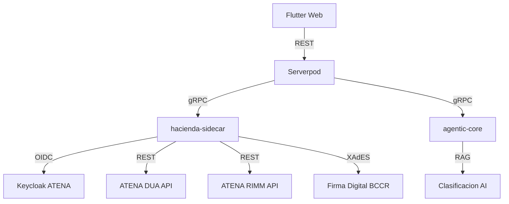

# AduaNext

**Plataforma multi-hacienda de cumplimiento aduanero para Centroamerica**

---

## North Star

> "Un agente aduanero freelance puede preparar, firmar y transmitir una DUA completa a ATENA usando AduaNext, y una pyme puede monitorear el estado en tiempo real."

---

## Documentacion

| Seccion | Descripcion |
|---------|-------------|
| [SOPs](docs/sops/index.md) | 18 Procedimientos Operativos Estandar para despacho aduanero |
| [Normativa](docs/legal/index.md) | Marco legal: LGA, RLGA, CAUCA |
| [Compliance](docs/compliance/index.md) | Auditoria de cumplimiento regulatorio |

## Stack Tecnico

| Componente | Tecnologia |
|-----------|-----------|
| Domain Layer | Dart (Pure, zero I/O) |
| Application Layer | Dart (Use Cases, CQRS) |
| gRPC Sidecar | TypeScript + hacienda-cr SDK |
| Frontend | Flutter Web (Material 3) |
| Backend | Serverpod (Dart) |
| AI Classification | Python (agentic-core) |

## Sistema de Destino

**ATENA** — Sistema del Servicio Nacional de Aduanas, Ministerio de Hacienda de Costa Rica.

!!! warning "Nota importante"
    Esta documentacion NO referencia el sistema TICA (derogado). Toda integracion es con ATENA.

## Arquitectura

## Links

- [:fontawesome-brands-github: Repositorio](https://github.com/vertivolatam/aduanext)
- [SRD Framework](https://github.com/vertivolatam/aduanext/blob/main/srd/SRD.md)
