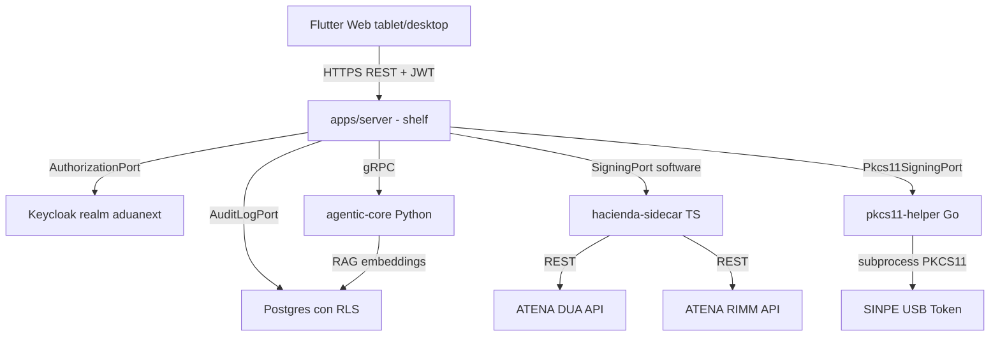

# AduaNext

**Plataforma multi-hacienda de cumplimiento aduanero para Centroamerica**

---

## North Star

> "Un agente aduanero freelance puede preparar, firmar y transmitir una DUA completa a ATENA usando AduaNext, y una pyme puede monitorear el estado en tiempo real."

**Status: 85% compliant** ([audit 2026-04-16](docs/compliance/audit-2026-04-16.md)) — backend production-ready end-to-end, Flutter Web UI completa, hardware QA manual pendiente como unico bloqueador real.

---

## Documentacion

| Seccion | Descripcion |
|---------|-------------|
| [Arquitectura](docs/architecture/index.md) | Stack tecnico + Explicit Architecture + capas |
| [SOPs](docs/sops/index.md) | 18 Procedimientos Operativos Estandar para despacho aduanero |
| [API REST](docs/api/index.md) | Endpoints `/api/v1/*` con auth JWT + rate limiting |
| [Security](docs/security/index.md) | RBAC multi-tenant + firma digital BCCR |
| [Normativa](docs/legal/index.md) | Marco legal: LGA, RLGA, CAUCA |
| [Compliance](docs/compliance/index.md) | Auditorias de cumplimiento regulatorio |

## Stack Tecnico

| Componente | Tecnologia | Estado |
|-----------|-----------|--------|
| Domain Layer | Dart puro, zero I/O | 95% |
| Application Layer | Dart (CQRS + Result) | 40% (7/18 use cases) |
| REST Server | Dart + shelf | 70% |
| gRPC Sidecar | TypeScript + @dojocoding/hacienda-sdk | 95% |
| PKCS#11 Helper | Go + miekg/pkcs11 | 100% (QA manual pendiente) |
| Frontend | Flutter Web (Material 3 + Riverpod + GoRouter) | 70% |
| AI Classification | Python (agentic-core) | Pendiente VRTV-47 |
| Database | PostgreSQL 16 + pgvector, Redis 6 | 100% con RLS multi-tenant |
| Auth | Keycloak OIDC + JWT | 100% |
| Infra | Minikube + Helm + ArgoCD + Harbor | 100% |

## Sistema de Destino

**ATENA** — Sistema del Servicio Nacional de Aduanas, Ministerio de Hacienda de Costa Rica.

!!! warning "Nota importante"
    Esta documentacion NO referencia el sistema TICA (derogado). Toda integracion es con ATENA.

## Arquitectura de Alto Nivel

Ver [arquitectura completa](docs/architecture/index.md) para detalles por capa.

## Segmentos de Usuario (GTM)

1. **Freelance Agents (standalone)** — agentes aduaneros con patente personal, usan AduaNext self-service. Driver: tokens SINPE + onboarding < 5 min.
2. **Pymes Importer-Led** — importadores que contratan un agente freelance autorizado. Driver: monitoreo real-time de DUAs.
3. **Universidades** — convenios con sandbox educativo para formar futuros agentes. Driver: flywheel universidad -> graduate -> freelance.

## Links

- [:fontawesome-brands-github: Repositorio](https://github.com/vertivolatam/aduanext)
- [SRD Framework](https://github.com/vertivolatam/aduanext/blob/main/srd/SRD.md)
- [CLAUDE.md (convenciones)](https://github.com/vertivolatam/aduanext/blob/main/CLAUDE.md)
